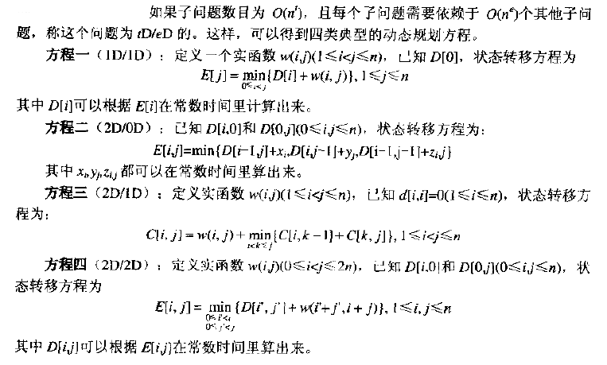
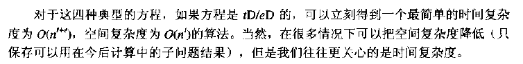

These notes collect dynamic-programming patterns and examples.

Their structure follows a detailed article linked in the references and connects each concept to LeetCode problems.

## Introduction

Dynamic programming resembles mathematical induction: define solutions for small instances and a transition that derives larger states from known ones. In programming problems, the recurrence is often less obvious than the final formula.

---

## Core Concepts

### Bottom-up Recurrence

Bottom-up DP evaluates states in an order that guarantees every dependency is already available.

[Best Time to Buy and Sell Stock](https://leetcode.com/problems/best-time-to-buy-and-sell-stock/)

The global minimum and maximum are insufficient because the purchase must occur before the sale.

Scan once while maintaining the minimum price seen so far. Subtract it from the current price and retain the largest profit.

### Memoized Search

Memoization is the top-down counterpart: recursive, often DFS-shaped evaluation caches subproblem results.

It avoids materializing unreachable or unnecessary states.

[Coin Change](https://leetcode.com/problems/coin-change/)

For denominations $p,q,m$, the recurrence is `coinChange(N) = 1 + min(coinChange(N-p), coinChange(N-q), coinChange(N-m))`.

A branch-and-bound DFS can instead try larger denominations first and prune branches that cannot beat the best solution:

```python
def coinChange(self, coins, amount):
    coins.sort(reverse=True)
    INVALID = 10**10
    self.ans = INVALID

    def dfs(s, amount, count):
        if amount == 0:
            self.ans = count
            return
        if s == len(coins): return

        coin = coins[s]
        for k in range(amount // coin, -1, -1):
            if count + k >= self.ans: break
            dfs(s + 1, amount - k * coin, count + k)
    dfs(0, amount, 0)
    return -1 if self.ans == INVALID else self.ans
```

### State and Transition

A state records the solution to one subproblem.

In the stock example, the minimum price through day N is a state updated as N grows.

In coin change, the minimum coins needed for amount M is a state.

### Optimal Substructure

Different state definitions and transitions can produce very different complexity.

[Longest Increasing Subsequence](https://leetcode.com/problems/longest-increasing-subsequence/)

The direct DP defines `dp[i]` as the longest increasing subsequence ending at `i`, with `dp[i] = max(dp[j] + 1)` for all `j < i` and `A[j] < A[i]`. This costs O(n²).

A better state stores the smallest possible tail value for every subsequence length. Binary search finds the position to replace for each number, reducing complexity to O(n log n).

### Decisions and the Markov Property

A well-defined DP state contains all history needed for future decisions. Once it is known, earlier choices no longer matter independently.

For example, houses in a row cannot be robbed on adjacent positions.

[House Robber](https://leetcode.com/problems/house-robber/)

At house N, either rob it and add its value to the optimum through N-2, or skip it and retain the optimum through N-1.

---

## Classic Models

### Linear Model

In a linear model, state dependencies form a sequence or small fixed-width neighborhood.

[Coin Change](https://leetcode.com/problems/coin-change/)

Let `dp(i)` be the fewest coins for amount i. Then `dp(i) = 1 + min(dp(i-n))` for `n ∈ coins`:

```python
def coinChange(self, coins, amount):
    MAX = float('inf')
    dp = [0] + [MAX] * amount

    for i in xrange(1, amount + 1):
        dp[i] = min([dp[i - c] if i - c >= 0 else MAX for c in coins]) + 1

    return [dp[amount], -1][dp[amount] == MAX]
```

Compare this full bottom-up table with the earlier branch-and-bound search.

### Interval and Grid Models

An interval DP commonly uses `d[i][j]` for the optimum over `[i,j]` and expands shorter intervals into longer ones. Grid problems use the analogous two-dimensional state.

[Minimum Path Sum](https://leetcode.com/problems/minimum-path-sum/)

Its transition is:

$$
dp[i][j] = min(dp[i-1][j], dp[i][j-1]) + grids[i][j]
$$

Example:

```python
def minPathSum(self, grid: List[List[int]]) -> int:
    if not grid:
        return 0

    M = len(grid)
    N = len(grid[0])

    dp = [[0]*N for _ in range(M)]

    dp[0][0] = grid[0][0]

    for i in range(1, M):
        dp[i][0] = grid[i][0] + dp[i-1][0]

    for j in range(1, N):
        dp[0][j] = grid[0][j] + dp[0][j-1]

    for i in range(1, M):
        for j in range(1, N):
            dp[i][j] = min(dp[i-1][j], dp[i][j-1]) + grid[i][j]

    return dp[M-1][N-1]
```

The table can be reduced with the rolling-array technique described later.

### Knapsack Models

#### 0/1 Knapsack

There are N items, one of each type, and capacity V. Item i costs $C_i$ capacity and provides value $W_i$. Maximize total value.

Let `f[i][v]` be the best value using the first i items with capacity v. Either skip item i or take it:

$$
f[i][v] = max(f[i-1][v], f[i-1][v - C_i] +W_i)
$$

Time is O(VN); rolling storage reduces space from O(VN) to O(V).

- [Partition Equal Subset Sum](https://leetcode.com/problems/partition-equal-subset-sum/)

#### Unbounded Knapsack

Each of N item types is available without limit. Item i costs $C_i$ and yields $W_i$.

The direct transition enumerates count k:

$$
f[i][v] = max(f[i-1][v - kC_i] + kWi  | 0 <= k <= v/Ci)
$$

Restricting k to 0 or 1 yields 0/1 knapsack. Reusing the current row removes the explicit count loop:

$$
f[i][v] = max(f[i-1][v],  f[i][v - C_i] +W_i)
$$

Time becomes O(VN).

- [Word Break](https://leetcode.com/problems/word-break/)
- [Combination Sum IV](https://leetcode.com/problems/combination-sum-iv/)

#### Bounded Knapsack

Item type i has a finite count $M_i$, cost $C_i$, and value $W_i$.

The direct transition is:

$$
f[i][v] = max(f[i-1][v - kC_i] + kW_i  | 0 <= k <= M_i)
$$

Time is O(V × ΣM_i), with O(V) rolling storage.

**Optimization:** decompose $M_i$ into binary groups of sizes 1, 2, 4, … and solve the resulting 0/1 problem. Complexity falls to O(V × Σlog M_i). The same binary decomposition idea appears in [Pow(x,n)](https://leetcode.com/problems/powx-n/).

- [Ones and Zeroes](https://leetcode.com/problems/ones-and-zeroes/)
- [Combination Sum II](https://leetcode.com/problems/combination-sum-ii/)

### State Compression

For small problem sizes, encode a set or multi-valued state as digits of an integer; bitmask DP is the most common binary form.

No example is included yet.

### Tree DP

In tree DP, a parent state is computed after all child states, usually through postorder DFS.

Because the input normally exposes only a root and child links, recursive traversal is more natural than constructing an explicit bottom-up leaf order.

[Binary Tree Cameras](https://leetcode.com/problems/binary-tree-cameras/)

Assign each node one of three states and count cameras during postorder traversal.

```python
# Definition for a binary tree node.
# class TreeNode:
#     def __init__(self, x):
#         self.val = x
#         self.left = None
#         self.right = None

class Solution:
    def minCameraCover(self, root):
        # 0 = uncovered, 1 = covered without a camera, 2 = has a camera.
        def dfs(node):
            if not node:
                return 1
            l=dfs(node.left)
            r=dfs(node.right)

            if l==0 or r==0:
                self.sum+=1
                return 2
            elif l==2 or r==2:
                return 1
            else:
                return 0

        self.sum=0
        if dfs(root)==0:
            self.sum+=1

        return self.sum
```

Not every DP that produces a tree is tree DP. For example:

[Minimum Cost Tree From Leaf Values](https://leetcode.com/problems/minimum-cost-tree-from-leaf-values/)

---

## Dependency Graphs and Evaluation Order

Three essential elements are:

- A set or table of distinct subproblems
- A dependency graph between them
- A topological evaluation order expressed by state transitions

Most examples here store that graph implicitly in arrays.





The diagrams above come from the referenced book; concrete examples are easier to follow than its four abstract transition categories.

---

## Common Optimizations

### Rolling Arrays

Sometimes the state and recurrence are correct but the table stores more history than the transition needs.

[Distinct Subsequences](https://leetcode.com/problems/distinct-subsequences/)

A direct solution uses `dp[i][j]` for prefixes of S and T:

```python
def numDistinct(self, s, t):
    """
    :type s: str
    :type t: str
    :rtype: int
    """
    dp = [[0] * (len(s)+1) for _ in range(len(t)+1)]

    for i in range(len(s)+1):
        dp[0][i] = 1

    for i in range(len(t)):
        for j in range(len(s)):
            if t[i] == s[j]:
                dp[i+1][j+1] = dp[i+1][j] + dp[i][j]
            else:
                dp[i+1][j+1] = dp[i+1][j]

    return dp[-1][-1]
```

Because each update only needs the current row's previous cell and the preceding row, reverse iteration compresses the table to one dimension.

```python
def numDistinct(self, s: str, t: str) -> int:
    if not t:
        return 1
    if not s:
        return 0

    m, n = len(s), len(t)
    dp = [0] * (n + 1)
    dp[0] = 1

    for i in range(1, m + 1):
        for j in range(n, 0, -1):
            if s[i - 1] == t[j - 1]:
                dp[j] += dp[j - 1]

    return dp[-1]
```

### Binary-search Optimization for LIS

[Longest Increasing Subsequence](https://leetcode.com/problems/longest-increasing-subsequence/)

The direct O(n²) DP defines `dp[i]` as the best increasing subsequence ending at i.

```java
public int lengthOfLIS(int[] nums) {
	if(nums.length <= 1)
		return nums.length;

	// Length of the best subsequence ending at each position.
	int T[] = new int[nums.length];

	// Fill each position with value 1 in the array
	for(int i=0; i < nums.length; i++)
		T[i] = 1;

	// Mark one pointer at i. For each i, start from j=0.
	for(int i=1; i < nums.length; i++) {
		for(int j=0; j < i; j++) {
			// It means next number contributes to increasing sequence.
			if(nums[j] < nums[i]) {
				// But increase the value only if it results in a larger value of the sequence than T[i]
				// It is possible that T[i] already has larger value from some previous j'th iteration
				if(T[j] + 1 > T[i]) {
					T[i] = T[j] + 1;
				}
			}
		}
	}

	// Find the maximum length from the array that we just generated
	int longest = 0;
	for(int i=0; i < T.length; i++)
		longest = Math.max(longest, T[i]);

	return longest;
}
```

Maintaining the smallest tail for each subsequence length allows binary search and O(n log n) time:

```python
def lengthOfLIS(self, nums):
    tails = [0] * len(nums)
    size = 0
    for x in nums:
        i, j = 0, size
        while i != j:
            m = (i + j) / 2
            if tails[m] < x:
                i = m + 1
            else:
                j = m
        tails[i] = x
        size = max(i + 1, size)
    return size
```

### Other Optimizations

Additional patterns can be added as they arise.

---

## Worked Problems

### Perfect Squares

[Perfect Squares](https://leetcode.com/problems/perfect-squares/)

This is coin change where denominations are perfect squares: `dp(i) = 1 + min(dp(i-n))` for square n.

```java
class Solution {
    public int numSquares(int n) {
        int[] dp = new int[n + 1];
        Arrays.fill(dp, Integer.MAX_VALUE);
        for (int i = 0; i * i <= n; i++){
            dp[i * i] = 1;
        }
        for (int i = 1; i <= n; i++){
            for (int j = 1; j * j <= i; j++){
                dp[i] = Math.min(dp[i], dp[i - j * j] + 1);
            }
        }
        return dp[n];
    }
}
```

Number theory is faster. Lagrange's four-square theorem guarantees at most four squares. Removing factors of 4 preserves the answer count, and a reduced value congruent to 7 modulo 8 requires four squares.

```java
class Solution {
    public int numSquares(int n){
        while (n % 4 == 0){
            n = n/4;
        }
        // Four-square case.
        if (n % 8 == 7){
            return 4;
        }
        // One- or two-square case.
        for (int i = 0; i * i <= n; i++){
            int j = (int)Math.sqrt(n - i * i);
            if (i * i + j * j == n){
                int res = 0;
                if (i > 0){
                    res += 1;
                }
                if (j > 0){
                    res += 1;
                }
                return res;
            }
        }
        // Otherwise three squares are required.
        return 3;
    }
}
```

### Target Sum

[Target Sum](https://leetcode.com/problems/target-sum/)

A breadth-first DP maps every reachable partial sum to its number of assignments and can prune sums that cannot reach the target with the remaining values:

```text
def findTargetSumWays(self, nums, S):
    """
    :type nums: List[int]
    :type S: int
    :rtype: int
    """
    poss_dict = {0:1}

    num_sum = sum(nums)

    for num in nums:
        temp = {}
        for pos in poss_dict:
            if not pos-num_sum <= S <= pos+num_sum:
                continue
            if pos+num in temp:
                temp[pos+num] += poss_dict[pos]
            else:
                temp[pos+num] = poss_dict[pos]
            if pos-num in temp:
                temp[pos-num] += poss_dict[pos]
            else:
                temp[pos-num] = poss_dict[pos]
        poss_dict = temp
        num_sum -= num

    if S in poss_dict:
        return poss_dict[S]
    else:
        return 0
```

An algebraic transformation yields a 0/1 subset-sum formulation. Partition A into positive set M and negative set N so that `sum(M)-sum(N)=S`. Since `sum(M)+sum(N)=sum(A)`, the positive subset must sum to `(sum(A)+S)/2`.

For `[2,5,6,8]` and target 7, `-2-5+6+8=7`. Counting suitable positive subsets is a 0/1 knapsack problem:

```java
class Solution {
    public int findTargetSumWays(int[] nums, int s) {
        int sum = 0;
        for (int n : nums)
            sum += n;
        return sum < s || (s + sum) % 2 > 0 ? 0 : subsetSum(nums, (s + sum) >>> 1);
    }

    public int subsetSum(int[] nums, int s) {
        int[] dp = new int[s + 1];
        dp[0] = 1;
        for (int n : nums)
            for (int i = s; i >= n; i--)
                dp[i] += dp[i - n];
        return dp[s];
    }
}
```

---

## References

- [http://www.cppblog.com/menjitianya/archive/2015/10/23/212084.html](http://www.cppblog.com/menjitianya/archive/2015/10/23/212084.html)
- [https://oi-wiki.org/dp/](https://oi-wiki.org/dp/)
- [https://www.1point3acres.com/bbs/forum.php?mod=viewthread&tid=542696](https://www.1point3acres.com/bbs/forum.php?mod=viewthread&tid=542696)
