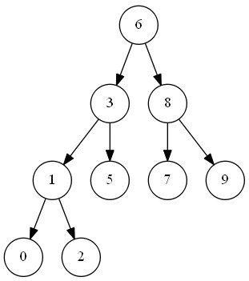
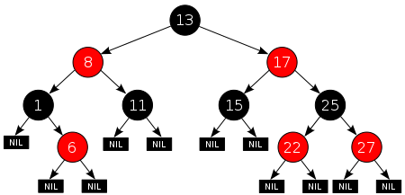
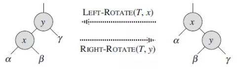
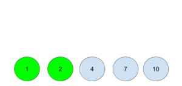
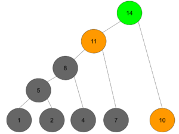

import Gallery from "@/components/Gallery.astro";

## Introduction

Tree problems revolve around construction and search. Different tree structures support different search operations, while traversal is the general case of visiting every node.

Construction organizes data for efficient insertion, removal, update, and lookup.

Search includes general traversals and operations specific to a particular tree type.

---

## Common Applications

- XML document structure
- Router lookup tables
- Database indexes
- Filesystem directories
- Decision trees

---

## Tree Types

### Binary Search Tree

A binary search tree (BST) maintains an ordering invariant at every node:

- Every value in the left subtree is no greater than the node value.
- Every value in the right subtree is no less than the node value.



- [Insert into a Binary Search Tree](https://leetcode.com/problems/insert-into-a-binary-search-tree/)
- [Range Sum of BST](https://leetcode.com/problems/range-sum-of-bst/)
- [Kth Smallest Element in a BST](https://leetcode.com/problems/kth-smallest-element-in-a-bst/)

The first is insertion; the other two exploit the ordering invariant for search.

Simple unbalanced insertion is naturally recursive:

```python
def insertIntoBST(self, root, val):
    if root.val > val:
        if not root.left:
            root.left = TreeNode(val)
        else:
            self.insertIntoBST(root.left, val)
    else:
        if not root.right:
            root.right = TreeNode(val)
        else:
            self.insertIntoBST(root.right, val)
    return root
```

Range Sum of BST can use depth-first or breadth-first traversal while pruning subtrees excluded by the value range:

```text
def rangeSumBST(self, root, L, R):
    ans = 0
    stack = [root]
    while stack:
        node = stack.pop()
        if node:
            if L <= node.val <= R:
                ans += node.val
            if L < node.val:
                stack.append(node.left)
            if node.val < R:
                stack.append(node.right)
    return ans
```

The kth-smallest problem uses inorder traversal, discussed below.

### Red–Black Tree

A red–black tree augments a BST with color invariants that keep it approximately balanced, guaranteeing O(log n) worst-case lookup, insertion, and deletion.

Its invariants are:

- Every node is red or black.
- The root is black.
- Every NIL leaf is black.
- A red node has black children.
- Every path from a node to a descendant NIL leaf contains the same number of black nodes.



Left and right rotations restructure the tree so recoloring after insertion or deletion can restore all five invariants.



Full insertion and deletion are beyond these notes. Consider instead a problem that benefits from an ordered balanced tree.

See [Count of Range Sum](https://leetcode.com/problems/count-of-range-sum/).

[Count of Smaller Numbers After Self](https://leetcode.com/problems/count-of-smaller-numbers-after-self/) can be solved by scanning right to left and inserting into an augmented BST that tracks how many stored values are smaller.

For Count of Range Sum, prefix sums turn each range into a difference between two prefix values. The problem becomes counting later values whose difference from the current prefix falls within `[lower, upper]`. Scan while maintaining an ordered structure; a balanced tree is preferable for large inputs.

### Huffman Tree

A Huffman tree minimizes weighted path length. Huffman coding assigns shorter bit strings to frequent symbols and longer strings to rare symbols, minimizing expected encoded length while remaining lossless.

See [Huffman coding](https://en.wikipedia.org/wiki/Huffman_coding). A related LeetCode problem is:

[Minimum Time to Build Blocks](https://leetcode.com/problems/minimum-time-to-build-blocks)

Long build times correspond to high-frequency symbols: they should receive shallower paths and begin earlier. While one worker handles a long block, another branch can spend time splitting workers and complete shorter blocks. For `blocks = [1,2,4,7,10]` and split cost 3:

Heapify the durations and combine the two smallest first.



The first pair takes `split + max(1,2) = 5`; repeat this Huffman-like combination.

<Gallery
  images={[
    { src: "../../../assets/wp-content/uploads/2020/01/Huffman_1.png", caption: "" },
    { src: "../../../assets/wp-content/uploads/2020/01/Huffman_2.png", caption: "" },
    { src: "../../../assets/wp-content/uploads/2020/01/Huffman_3.png", caption: "" },
  ]}
/>

The tree is built bottom-up but executed top-down: split a worker, assign the longest block to one branch, continue splitting the other branch, and eventually build the shortest block there.



Implementation:

```text
def minBuildTime(self, blocks, split):
    heapq.heapify(blocks)
    while True:
        if len(blocks) == 1:
            return blocks[0]
        a, b = heapq.heappop(blocks), heapq.heappop(blocks)
        # as b is great or eqaul to a, so no need to max(a,b) + split
        heapq.heappush(blocks, b+split)
```

---

## Search and Traversal

### Breadth-first and Depth-first Traversal

#### Breadth-first Search

BFS visits a tree level by level from the root.

It is a natural choice when the answer depends on depth or relationships among nodes at the same level.

- [Binary Tree Zigzag Level Order Traversal](https://leetcode.com/problems/binary-tree-zigzag-level-order-traversal/)
- [Symmetric Tree](https://leetcode.com/problems/symmetric-tree/)
- [Minimum Depth of Binary Tree](https://leetcode.com/problems/minimum-depth-of-binary-tree/)

The first two operate explicitly on levels. For minimum depth, BFS stops at the first leaf and avoids exploring deeper nodes unnecessarily.

Example BFS for minimum depth:

```text
def minDepth(self, root):
    if not root:
        return 0
    
    node_list = [root]
    depth = 1
    
    while node_list:
        temp = []
        for node in node_list:
            if not node.left and not node.right:
                return depth
            if node.left:
                temp.append(node.left)
            if node.right:
                temp.append(node.right)
        depth += 1
        node_list = temp
```

A recursive solution also works:

```text
def minDepth(self, root: TreeNode) -> int:
    if root is None:
        return 0
    if root.left is None and root.right is None:
        return 1
    if not root.left:
        return 1 + self.minDepth(root.right)
    if not root.right:
        return 1 + self.minDepth(root.left)
    return 1 + min(self.minDepth(root.left), self.minDepth(root.right))
```

#### Depth-first Search

DFS follows a branch as deeply as possible and backtracks after exhausting a node's children.

It naturally retains path context and is often implemented recursively.

- [Path Sum II](https://leetcode.com/problems/path-sum-ii/)
- [Lowest Common Ancestor of a Binary Tree](https://leetcode.com/problems/lowest-common-ancestor-of-a-binary-tree/)

Path Sum II benefits from DFS because the recursion stack already represents the current root-to-leaf path. For LCA, recurse into both subtrees; if each side finds one target, the current node is their lowest common ancestor:

```text
def lowestCommonAncestor(self, root, p, q):
    if not root: return None
    if p == root or q == root:
        return root
    left = self.lowestCommonAncestor(root.left, p , q)
    right = self.lowestCommonAncestor(root.right, p , q)
        
    if left and right:
        return root
    if not left:
        return right
    if not right:
        return left
```

#### Comparison

BFS stores a frontier that may contain an entire wide level, while DFS stores a path whose size is proportional to tree height.

Many problems permit either approach, but one usually expresses the required state more directly or uses less memory.

- [Maximum Depth of N-ary Tree](https://leetcode.com/problems/maximum-depth-of-n-ary-tree/)
- [Sum Root to Leaf Numbers](https://leetcode.com/problems/sum-root-to-leaf-numbers/)
- [Remove Invalid Parentheses](https://leetcode.com/problems/remove-invalid-parentheses/)

All three can use BFS or DFS.

Maximum depth can count BFS levels or take the longest DFS path.

Root-to-leaf numbers follow the same choice.

Remove Invalid Parentheses may have several minimal solutions. The following implementations demonstrate DFS and BFS.

```text
def removeInvalidParentheses(self, s):
    def dfs(s):
        mi = calc(s)
        if mi == 0:
            return [s]
        ans = []
        for x in range(len(s)):
            if s[x] in ('(', ')'):
                ns = s[:x] + s[x+1:]
                if ns not in visited and calc(ns) < mi:
                    visited.add(ns)
                    ans.extend(dfs(ns))
        return ans
        
    def calc(s):
        a = b = 0
        for c in s:
            a += {'(' : 1, ')' : -1}.get(c, 0)
            b += a < 0
            a = max(a, 0)
        return a + b

    visited = set([s])    
    return dfs(s)
```

```text
def removeInvalidParentheses(self, s):
    def isvalid(s):
        ctr = 0
        for c in s:
            if c == '(':
                ctr += 1
            elif c == ')':
                ctr -= 1
                if ctr < 0:
                    return False
        return ctr == 0
    level = {s}
    while True:
        valid = filter(isvalid, level)
        if valid:
            return valid
        level = {s[:i] + s[i+1:] for s in level for i in range(len(s))}
```

### Binary-tree Traversal Orders

Binary trees define three standard depth-first orders:

- [Preorder Traversal](https://leetcode.com/problems/binary-tree-preorder-traversal/)
- [Inorder Traversal](https://leetcode.com/problems/binary-tree-inorder-traversal/)
- [Postorder Traversal](https://leetcode.com/problems/binary-tree-postorder-traversal/)

Related problems include:

- [Construct Binary Tree from Preorder and Postorder Traversal](https://leetcode.com/problems/construct-binary-tree-from-preorder-and-postorder-traversal/)
- [N-ary Tree Preorder Traversal](https://leetcode.com/problems/n-ary-tree-preorder-traversal/)
- [Kth Smallest Element in a BST](https://leetcode.com/problems/kth-smallest-element-in-a-bst/)

Inorder traversal of a BST yields values in sorted order, so the kth visited node is the kth smallest:

```text
def kthSmallest(self, root, k):
    i=0
    stack=[]
    node=root
    while node or stack:
        while node:
            stack.append(node)
            node=node.left
        node=stack.pop()
        i+=1
        if i==k:
            return node.val
        node=node.right
```

---

## Other Patterns

### Converting a Tree to a Graph

When traversal frequently needs parent links, add a parent pointer or treat tree edges as an undirected graph.

- [Redundant Connection](https://leetcode.com/problems/redundant-connection/)
- [All Nodes Distance K in Binary Tree](https://leetcode.com/problems/all-nodes-distance-k-in-binary-tree/)

These are discussed further in the graph notes.

### Dynamic Programming on Trees

Tree APIs usually expose the root and child links rather than a leaf list and parent links. Bottom-up dynamic programming is therefore commonly expressed as postorder DFS or memoized recursion.

- [Unique Binary Search Trees](https://leetcode.com/problems/unique-binary-search-trees/)
- [House Robber III](https://leetcode.com/problems/house-robber-iii/)
- [Binary Tree Cameras](https://leetcode.com/problems/binary-tree-cameras/)

See [Algorithm Notes: Dynamic Programming](https://littlepotato.me/2018/12/09/algorithm-note-dynamic-programing/#lwptoc14).

---

## References

- [https://segmentfault.com/a/1190000016329895](https://segmentfault.com/a/1190000016329895)
- [https://www.zybuluo.com/pastqing/note/314050](https://www.zybuluo.com/pastqing/note/314050)
- [https://www.jianshu.com/p/ff4b93b088eb](https://www.jianshu.com/p/ff4b93b088eb)
- [https://zh.wikipedia.org/wiki/%E7%BA%A2%E9%BB%91%E6%A0%91](https://zh.wikipedia.org/wiki/%E7%BA%A2%E9%BB%91%E6%A0%91)
- [https://medium.com/analytics-vidhya/what-is-huffman-coding-ea36379da63e](https://medium.com/analytics-vidhya/what-is-huffman-coding-ea36379da63e)
