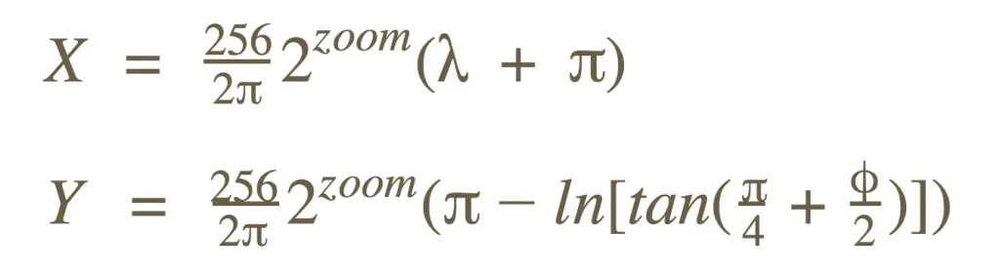
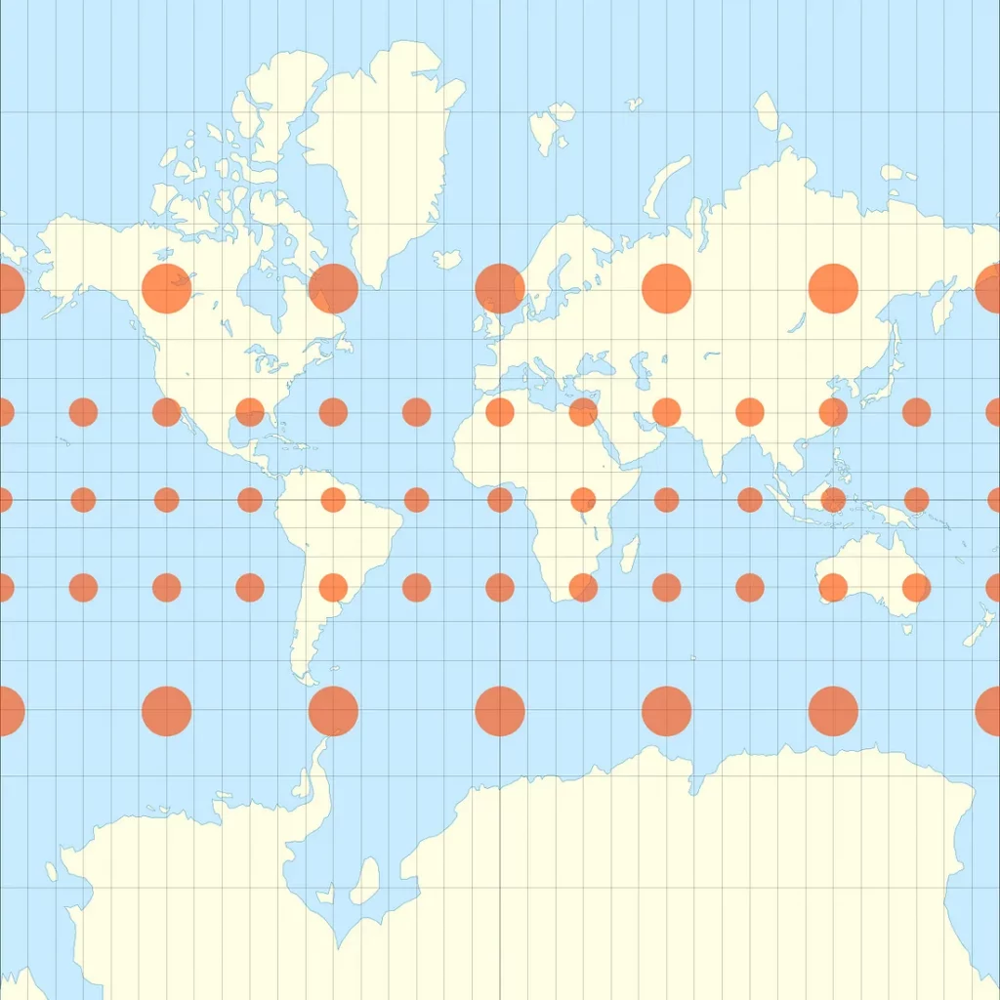
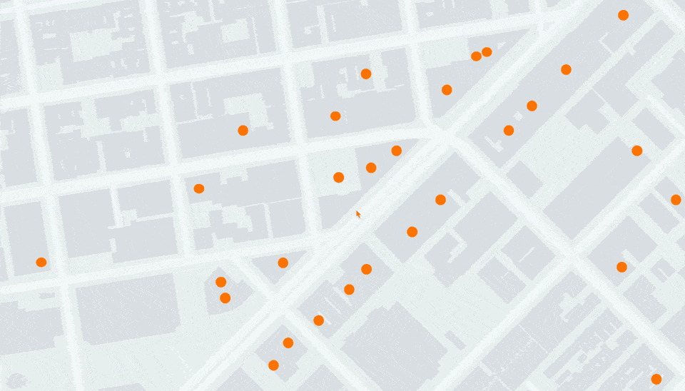
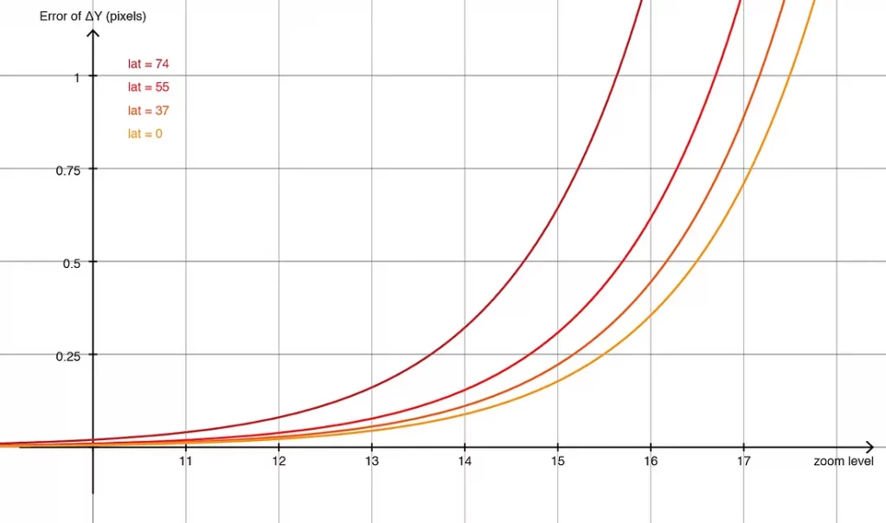
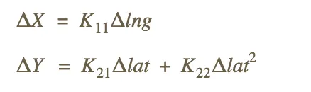
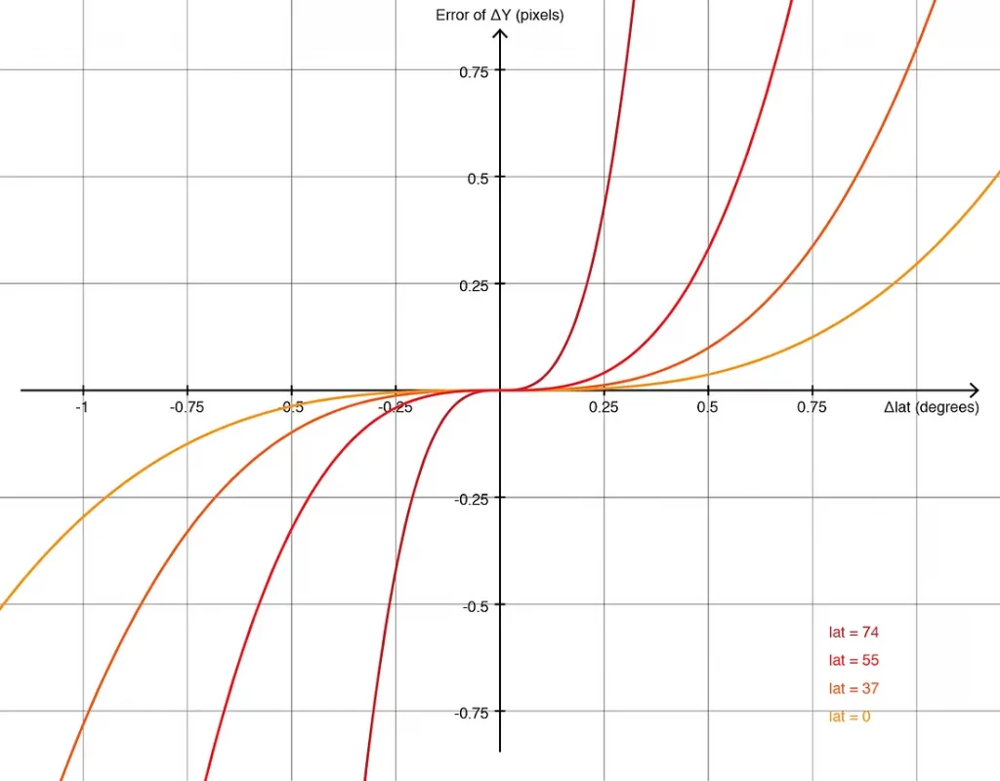
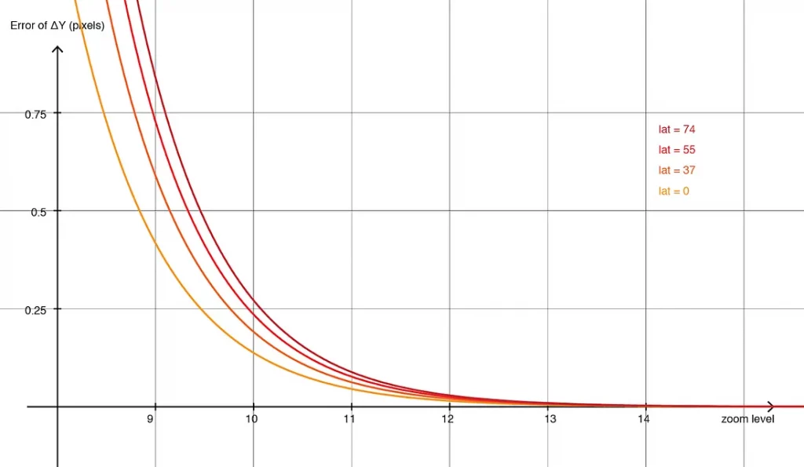
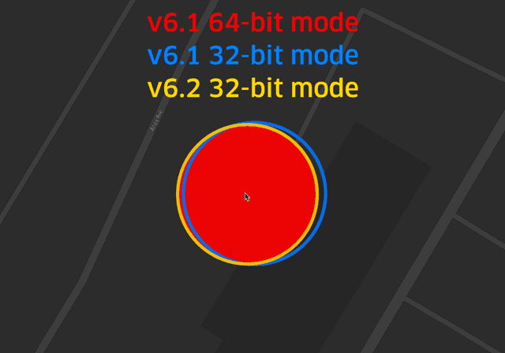

deck.gl is an open-source, WebGL-powered framework for exploratory visualization of large datasets. For a work project, I modified deck.gl to support an EPSG:4326 projected view; the resulting code is available in [deck.gl with EPSG:4326](https://github.com/BranZhang/deck.gl). While working through the source, I encountered this logic:

```js
get projectionMode() {
    if (this.isGeospatial) {
        // I modified
        return PROJECTION_MODE.WEB_MERCATOR;
        // deck.gl source code
        // return this.zoom < 12
        //   ? PROJECTION_MODE.WEB_MERCATOR
        //   : PROJECTION_MODE.WEB_MERCATOR_AUTO_OFFSET;
    }
    return PROJECTION_MODE.IDENTITY;
}
```

At zoom level 12 and above, deck.gl switches its global projection mode from `WEB_MERCATOR` to `WEB_MERCATOR_AUTO_OFFSET`. This automatic-offset mode is effectively deck.gl's “flat Earth” mode, and it can make geospatial rendering up to 48 times faster. The following sections explain how it works.

## The Challenge of Projecting Web Mercator in a Shader

At runtime, deck.gl's `MapView` uses Web Mercator to place geographic features on screen. For every frame and at the current interactive zoom level, it transforms each `[longitude, latitude, altitude]` coordinate to `[X, Y]` on the Mercator plane:



The mapping from latitude to Y is nonlinear. It requires expensive trigonometric and logarithmic operations for every coordinate in what may be a very large dataset—because the Earth is not flat.



Unlike many mapping libraries, such as Mapbox GL JS, deck.gl does not perform this processing on the CPU. Its target workloads contain large numbers of frequently changing points, so CPU-side Web Mercator projection would impose a serious performance cost. Instead, deck.gl sends coordinates to the GPU and transforms them in the vertex shader.

Passing geographic positions to a WebGL shader introduces another problem: floating-point precision. The WebGL reference card lists these guarantees:

|         | FP Range                          | FP Mangitude Range                | FP Precision             | Integer Range                     |
| ------- | --------------------------------- | --------------------------------- | ------------------------ | --------------------------------- |
| highp   | (-2<sup>62</sup>, 2<sup>62</sup>) | (2<sup>-62</sup>, 2<sup>62</sup>) | Relative 2<sup>-16</sup> | (-2<sup>16</sup>, 2<sup>16</sup>) |
| mediupm | (-2<sup>14</sup>, 2<sup>14</sup>) | (2<sup>-14</sup>, 2<sup>14</sup>) | Relative 2<sup>-10</sup> | (-2<sup>10</sup>, 2<sup>10</sup>) |
| lowp    | (-2, 2)                           | (2<sup>-8</sup>, 2)               | Absolute 2<sup>-8</sup>  | (-2<sup>8</sup>, 2<sup>8</sup>)   |

Consider `[-122.4000588, 37.7900699]`. Converting it to 32-bit floating point produces `[-122.40006256103516, 37.790069580078125]`, a real-world positional difference of 0.3325 meters.

At a broad overview scale everything looks normal, but zooming in exposes the precision loss. Points deform and visibly “jump” when the viewport changes even slightly.





## Emulated 64-bit Floating Point

To mitigate the problem, deck.gl v3 introduced emulated 64-bit precision. Each number is split into two parts before being sent to the GPU:

_highPart = Math.fround(x)
lowPart = x – highPart_

A sequence of 32-bit operations then emulates 64-bit arithmetic, at the cost of many additional GPU cycles. One emulated 64-bit division expands to 11 32-bit arithmetic operations, while an emulated `mat4 × vec4` multiplication requires 1,952. The details are outside this article's scope, but the implementation is available in [luma.gl](https://github.com/visgl/luma.gl).

Although emulated 64-bit matrix arithmetic produces nearly perfect results, it severely reduces runtime performance. The generated shaders are so large that some older graphics drivers cannot compile them, while others take several seconds and temporarily freeze the browser.

## A Cheaper Alternative: Offset Coordinates

As a cheaper alternative to emulated fp64, deck.gl v5 introduced the `LNGLAT_OFFSETS` coordinate system. Instead of `[lng, lat]`, each location is represented as `[Δlng, Δlat]` relative to a fixed origin. In the shader, a linear approximation converts the longitude and latitude deltas into pixel deltas on the Mercator plane:



The constants `K[i][j]` are derived at the origin's latitude using a second-order Taylor expansion.



The approximation error grows with distance from the origin, but within ±0.1 degrees—enough to cover a city—it is usually imperceptible. At this local scale, the Earth can be treated as flat. Small deltas retain sufficient precision in 32-bit floats, eliminating expensive emulated 64-bit arithmetic. With no trigonometric functions involved, the shader runs very quickly.

This coordinate system has significant drawbacks. Applications must preprocess source positions into offsets, and a fixed origin only guarantees acceptable error within a limited geographic area. Large datasets may need to be tiled in advance.

## Automatic Offsets Around the Viewport

High-load, precision-sensitive map applications would benefit from both the convenience of `LNGLAT` and the performance of `LNGLAT_OFFSETS`. The solution is simple: instead of using a fixed origin, express every coordinate as an offset from the viewport center and process it on the GPU.

A dynamic origin works because the viewport has finite dimensions. Points far enough from the center to accumulate substantial error are clipped by the screen boundary. Better still, the geographic area covered by the viewport shrinks exponentially as zoom increases, counteracting the scale amplification of projection error.



Comparing this chart with the 32-bit Web Mercator chart suggests a hybrid system. Below a zoom threshold, use the normal projection. Above it, use the flat, offset-based mode with the viewport center as the origin. At every zoom level, choose the mode with lower error.

For each frame, deck.gl checks the zoom and selects the appropriate projection. Switching modes only updates a small number of uniforms and adds almost no CPU or GPU cost.

## Results

### Precision

The new hybrid coordinate system (yellow) achieves accuracy comparable to the 64-bit mode (red) while using only 32-bit arithmetic. The legacy 32-bit mode (blue) is unstable at the same zoom.



### Performance

The hybrid system is faster than the legacy 32-bit mode and up to 48 times faster than the old 64-bit mode.

| Mode          | Zoom Level | FPS  | Compare with 64-bit |
| ------------- | ---------- | ---- | ------------------- |
| 64-bit        | 11         | 1.9  | 1X                  |
| Legacy 32-bit | 11         | 16.4 | 9X                  |
| New 32-bit    | 11         | 15.7 | 8X                  |
| 64-bit        | 14         | 1.9  | 1X                  |
| Legacy 32-bit | 14         | 59.5 | 31X                 |
| New 32-bit    | 14         | 91.7 | 48X                 |

## References

- [Native Support for Alternate Geospatial CRS (EPSG:4326)?](https://github.com/visgl/deck.gl/discussions/6216)
- [How (sometimes) assuming the Earth is “flat” helps speed up rendering in deck.gl](https://medium.com/vis-gl/how-sometimes-assuming-the-earth-is-flat-helps-speed-up-rendering-in-deck-gl-c43b72fd6db4)
- [luma.gl](https://github.com/visgl/luma.gl)
