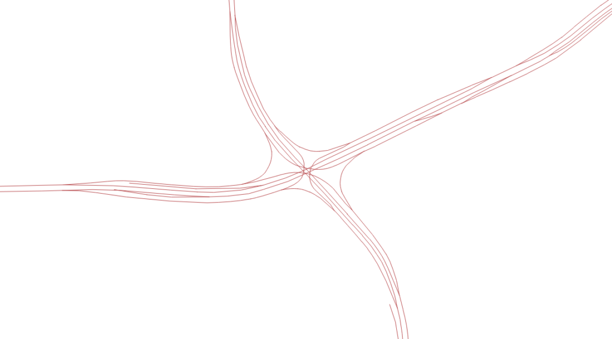

import Embed from "@/components/Embed.astro";
import Gallery from "@/components/Gallery.astro";

## Introduction

Building interchanges in [Cities: Skylines](https://store.steampowered.com/app/255710/Cities_Skylines/) is both important and tedious. That prompted the idea of automatically generating 3D interchange geometry from existing 2D road-map data.

The Yan'an East Road Interchange illustrates the difference between a flat map and a 3D representation:

<Gallery
  images={[
    { src: "../../../assets/content-images/uploads/2019/07/gis-3-2-577x1024.png", caption: "1. Flat view from Apple Maps" },
    { src: "../../../assets/content-images/uploads/2019/07/gis-3-1-1-577x1024.png", caption: "2. 3D view from Baidu Maps" },
  ]}
/>

Importing road geometry like the second image into the game would be useful. The question is how to derive it from data like the first image.

## Formulating the Problem

The planimetric road coordinates are known. Which road attributes can constrain their vertical coordinates?

Anyone who has edited complex OpenStreetMap roads may have encountered the attribute describing their stacking order.

- If east–west road A is elevated above ground-level north–south road B, A has the higher layer.
- If east–west road C is a tunnel below ground-level north–south road D, C has the lower layer.

OSM calls this tag [`layer`](https://wiki.openstreetmap.org/wiki/Layer); in the imported database it appears as `z_order`. Its most direct purpose is telling a renderer how overlapping roads should be drawn.

The vertical ordering, combined with several engineering assumptions, can determine an elevation or at least a feasible range for each road node.

The additional constraints are:

- Vertically adjacent roads require a minimum clearance, assumed to be 4 meters.
- The grade between adjacent nodes on a road must remain below a fixed value, assumed to be 6%.
- Ground-level roads have elevation 0.
- Elevated roads have elevation of at least 4 meters.

One more assumption is needed:

- Terrain elevation is zero throughout the interchange, so topography is ignored.

Treating every road-node elevation as an unknown yields a system of linear inequalities.

The constraints alone do not select one solution, so introduce an objective:

- Keep every road in the interchange as low as possible to reduce construction cost.

The task is now a standard linear program: minimize the objective subject to the constraints.

## Data Preparation

### Acquiring Data

OSM data is easy to download. I selected interchanges in Shanghai, Johannesburg, and Seattle as test cases, although the final experiments only covered Shanghai's Yan'an East Road and Xinzhuang interchanges.



### Filtering and Processing

Each optimization covers one interchange and excludes unrelated roads, such as ordinary streets passing beneath it. The source data therefore needs to be filtered and extracted.

Filtering must account for differences between motorway and urban-expressway classifications.

### Node Categories

The optimization solves elevations at road nodes. For convenience, nodes are divided into four categories:

- **Cross Point ($CP$):** two roads cross in plan view but not in 3D. One planar intersection therefore corresponds to two elevation variables, one for each road.
- **Touch Point ($TP$):** a point where a ramp joins a main carriageway and belongs to both roads.
- **End Point ($EP$):** a road endpoint.
- **Normal Point ($NP$):** any other node.

Only the first three categories are optimization variables. Normal-point elevations can be interpolated afterward.

## Implementation

### Spatial Relationships

PostGIS performs all spatial relationship calculations. See the [PostGIS 2.4 manual](https://postgis.net/docs/manual-2.4/) for details. Functions used include:

- Road intersections: `ST_Intersection()`
- Duplicate-point removal: `ST_RemoveRepeatedPoints()`; using the PostGIS function avoids precision problems in a manual SQL implementation
- Line merging: `ST_LineMerge()`
- Shared-point tests: `ST_Touches()`

### Constraints

_The following notation may be imperfect; corrections are welcome._

- A ground-level road has elevation 0, while an elevated road has elevation of at least 3. Tunnels are not considered yet.

$$
\begin{cases}  Height(P_i) = 0,  & Type(road_i) = Bridge \\  Height(P_i) >= 3, & Type(road_i) <> Bridge  \end{cases}
$$

- Grade between adjacent points must not exceed the specified limit. Here, $LENGTH$ is distance along the road curve, not straight-line distance.

$$
\mid Height(P_i) - Height(P_{i+1})\mid * LENGTH <= MAX\_SLOPE
$$

- A plan-view crossing between roads at different levels corresponds to two points with identical horizontal coordinates and different elevations. `z_order` identifies the upper and lower point.

$$
Height(CP_{high}) - Height(CP_{low}) >= MIN\_ELEVATION
$$

### Objective Function

To keep every road as low as possible, minimize the sum of all node elevations:

$$
S=\sum_{i=1}^m\Height(CP_m)+\sum_{i=1}^n\Height(TP_n)+\sum_{i=1}^p\Height(EP_p)+\sum_{i=1}^q\Height(NP_q)
$$

### Solving the Linear Program

The implementation uses Google's [OR-Tools](https://developers.google.com/optimization/) library. See its [Linear Optimization](https://developers.google.com/optimization/lp) documentation.

Create a linear solver:

```python
from ortools.linear_solver import linear_solver_pb2, pywraplp

# Create the linear solver with the GLOP backend.
solver = pywraplp.Solver('road_3D', pywraplp.Solver.GLOP_LINEAR_PROGRAMMING)
```

Define variables and their bounds:

```python
for _n in range(0, len(cross_points)):
    cp_list.append(solver.NumVar(0, solver.infinity(), 'cp_{id:02d}'.format(id=_n)))

for _n in range(0, len(touch_points)):
    tp_list.append(solver.NumVar(0, solver.infinity(), 'tp_{id:02d}'.format(id=_n)))

for _n in range(0, len(end_points)):
    ep_list.append(solver.NumVar(0, solver.infinity(), 'ep_{id:02d}'.format(id=_n)))
```

Express the constraints; for example, bound the grade between two points:

```python
constraint = solver.Constraint(-distance * MAX_SLOPE, distance * MAX_SLOPE)
constraint.SetCoefficient(cp_list[m], 1)
constraint.SetCoefficient(cp_list[n], -1)
```

Define and minimize the objective:

```python
objective = solver.Objective()
objective.SetMinimization()

for _n in range(0, len(cross_points)):
    objective.SetCoefficient(cp_list[_n], 1)

for _n in range(0, len(touch_points)):
    objective.SetCoefficient(tp_list[_n], 1)

for _n in range(0, len(end_points)):
    objective.SetCoefficient(ep_list[_n], 1)
```

Solve:

```python
solver.Solve()

# Print one result.
print(cp_list[_n].solution_value())
```

### Artificial Dips

The model has a flaw. Consider three consecutive points A, B, and C. Roads beneath A and C force both to 4 meters, while nothing passes beneath B. What elevation should B receive?

Common sense suggests 4 meters, but the objective pushes B as low as the grade constraint permits, producing an artificial dip in the road profile.

The current workaround is a post-processing pass that detects and corrects these dips after optimization.

## Result

After solving, the data is merged, interpolated, and exported. The current workflow stores it in PostgreSQL and writes KML for inspection in Google Earth.

<Embed src="//codepen.io/anon/embed/RwyGxrm?height=500&theme-id=1&slug-hash=RwyGxrm&default-tab=result" height={500} title="CodePen Embed RwyGxrm" />

## Known Problems

- Some z-values are incorrect because of artificial dips, real interchanges that violate the assumed clearance or grade limits, or implementation bugs that leave values at zero.
- Every calculation assumes flat terrain, which is not true in the real world.
- Without knowing the Cities: Skylines data format, the generated geometry cannot yet be imported into the game.

I'm too lazy to fix these issues for now.

Project: [BranZhang/intersection-3d-rebuild](https://github.com/BranZhang/intersection-3d-rebuild)
