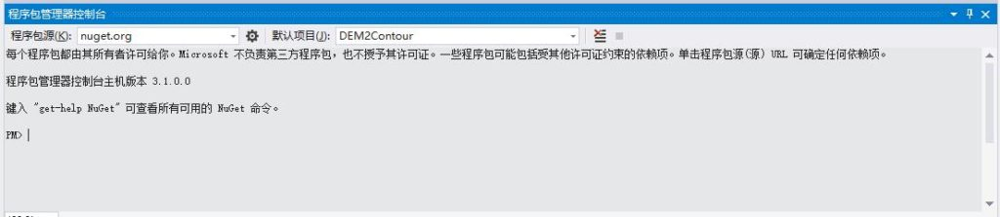
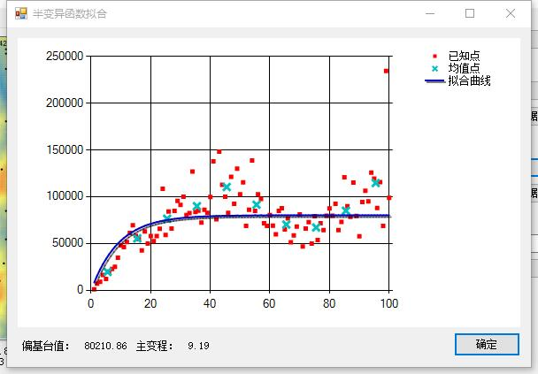
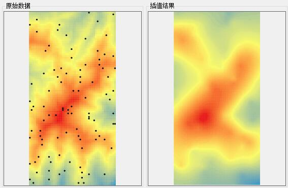

Following the mathematical explanation in Part 1, this article focuses on implementing the algorithm in C#.

## Download

[Kriging interpolation and DEM contour generation](/downloads/kriging-interpolation-dem-contours.zip)

---

## Algorithm Overview

1. Calculate the distance and semivariance for every pair of known points.
2. Bin the results and calculate representative mean points for model fitting.
3. Select a variogram model. I use an exponential model for implementation convenience.
4. Fit the exponential model to the representative points to obtain the partial sill $c$ and practical range $r$.
5. Use the fitted model and the elevations of known points to estimate the elevation at an unknown location.

---

## Implementation Challenges in C#

The first difficulty was understanding the algorithm itself. Once that was resolved, the remaining challenges were fitting a model to discrete points in C# and implementing the required matrix operations efficiently.

Several C# numerical libraries can solve these problems, including the open-source **Math.NET** and the commercial **ILNumerics**. I chose **Math.NET**.

For installation instructions, see [Math.NET Numerics](https://www.nuget.org/packages/MathNet.Numerics/%20Math.NET%20Numerics).

In Visual Studio, open **Tools → NuGet Package Manager → Package Manager Console**:



Run `Install-Package MathNet.Numerics` and wait for the package to install.

---

## Implementation

### Calculating Pairwise Distance and Semivariance

The semivariance of a point pair is:

$$
Semivariogram(distance_h)={1\over2}∗(value_i-value_j)^2
$$

This produces a set of points whose x-coordinate is $distance_h$ and whose y-coordinate is $Semivariogram(distance_h)$.

Divide the points into roughly ten bins along the x-axis—the number can be adjusted for the dataset—and calculate the mean x- and y-coordinate within each bin. The resulting ten representative points summarize the full set.

Using too many raw points can reduce both fitting quality and efficiency.

### Fitting the Representative Points

I based the fitting method on an article titled “Linear and Nonlinear Least-Squares with Math.NET.” The original link and a Chinese translation are no longer available, but the title may still be searchable.

I extracted its Gauss–Newton fitting implementation, which primarily consists of the `GaussNewtonSolver` and `PowerModel` classes. Other fitting algorithms included with the sample code may also work.

The following image shows my DEM:


I sampled random points from a known DEM and interpolated from those samples, making it possible to compare the estimates with the original raster values.

The semivariogram fit for the sampled points is shown below:



The red points are the initially filtered results. Roughly 100 random samples produced about 9,900 pairwise semivariance values before filtering. The blue crosses are a second reduction, with one mean point calculated for each 10-unit interval. The dark-blue curve is fitted to those crosses.

**When I interpolated the same samples in ArcGIS, its fitted model differed from mine. The partial sill was nearly identical, but my practical range was only about half of ArcGIS's result. Applications that require accurate estimates should improve the fitting procedure.**

### Estimating an Unknown Elevation from the Fitted Model

Refer to Part 1 for definitions of the mathematical parameters used below.

First define the covariance function:

```csharp
private double CalCij(double x1, double y1, double x2, double y2)
{
	double distance = Math.Sqrt(
		Math.Pow(x1 - x2, 2) + Math.Pow(y1 - y2, 2));
	if (distance == 0)
	{
		return formula_c;
	}
	else
	{
		return formula_c* Math.Exp(-distance / formula_r);
	}
}
```

This calculates $C_{ij}$ between two points, where $c_{ij}=c-r(h_{ij})$. Here, $r(h_{ij})$ is the fitted model value and $c$ is a parameter of that model.

Construct matrix $K$:

```csharp
// size is the number of known points.
var K = new DenseMatrix(size, size);
for (int m = 0; m < size; m++)
		for (int n = 0; n < size; n++)
			K[m, n] = CalCij(
			 pointList[m].X,
			 pointList[m].Y,
			 pointList[n].X,
			 pointList[n].Y);
```

Calculate the inverse $K^{-1}$:

```csharp
Kn = K.Inverse();
```

To estimate the elevation at the unknown coordinate $(m,n)$:

1. Calculate vector $D$:

```csharp
var D = new DenseVector(size);
for (int p = 0; p < size; p++)
	D[p] = CalCij(randomPointList[p].point.X,
		randomPointList[p].point.Y, m, n);
```

2. Calculate $λ(i)$, the weight of known point $i$ for the current unknown point:

```csharp
var namuta = Kn.LeftMultiply(D);
```

3. Calculate the weighted elevation $Z(x_i)$:

```csharp
for (int q = 0; q < size; q++)
	interpolationDEMData[m, n] +=
		namuta[q] * randomPointList[q].altitudeValue;
```

The estimated elevation at $(m,n)$ is now stored in the `interpolationDEMData` array.

The interpolation result is shown below:



The result is reasonably accurate when compared with the original data.
