import Gallery from "@/components/Gallery.astro";

Recent [Mapbox GL JS](https://github.com/mapbox/mapbox-gl-js) releases added 3D rendering for road interchanges. With lane-level HD map data, Mapbox can represent interchanges, elevated roads, tunnels, hatched areas, and related features. This article examines the implementation from the perspectives of styling, data, and rendering.

## Preview

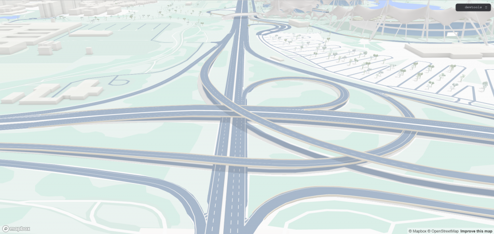

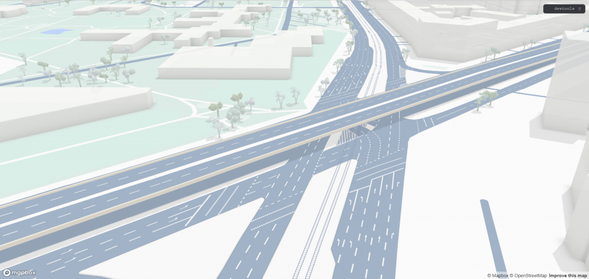

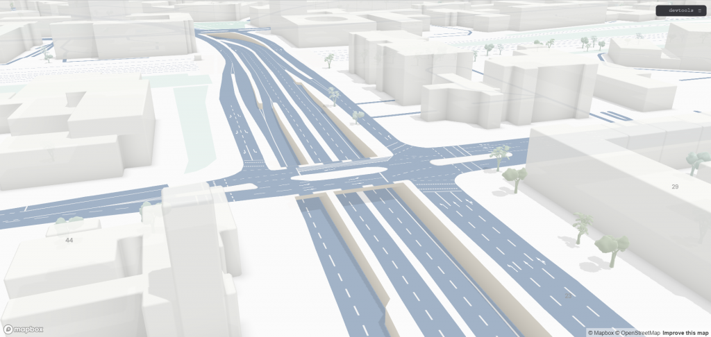

The dataset is available through this [preview](https://console.mapbox.com/studio/tilesets/mapbox.hd-road-v1/#16.23/48.220481/11.629958), which worked when this article was published but may not remain public. The sample covers Munich, Germany; perhaps the HD map feature was developed for BMW.

## Data Model

The preview reveals how the HD map dataset is organized. It is delivered as Mapbox Vector Tiles (MVT), although it is **not yet clear** whether `hd-roads` adheres strictly to the current MVT specification or carries additional data. It contains the following main layers.

### hd_road_centerlines

The centerline of each traffic lane. This layer is not used for rendering and excludes emergency lanes; it is better suited to displaying navigation routes.

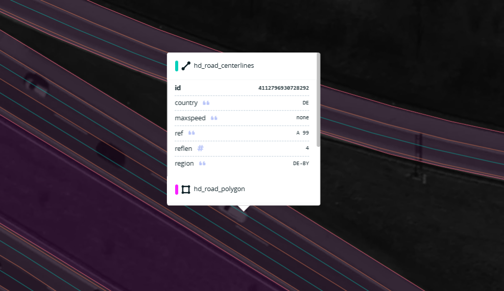

### hd_road_elevation

This unusual layer contains both polygons and points and is clearly not rendered directly. Its name suggests that it carries road-elevation information; its exact role is discussed later.

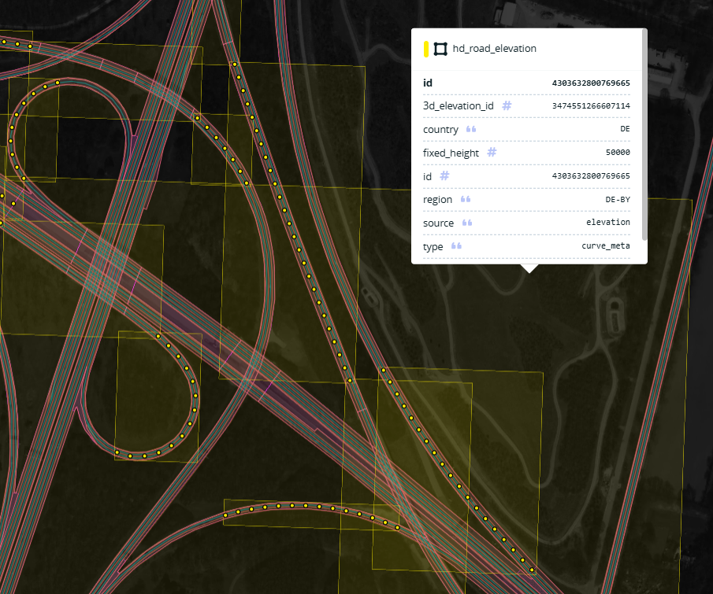

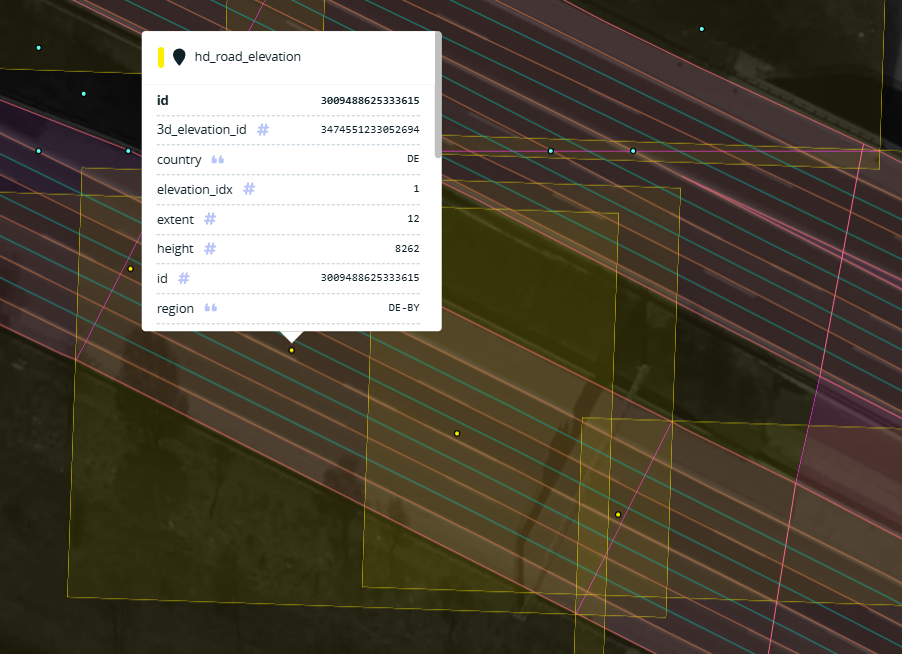

### hd_road_line

Lane boundary lines. Adjacent lanes share one boundary feature, and emergency-lane boundaries are included. They can be rendered as solid or dashed lines.

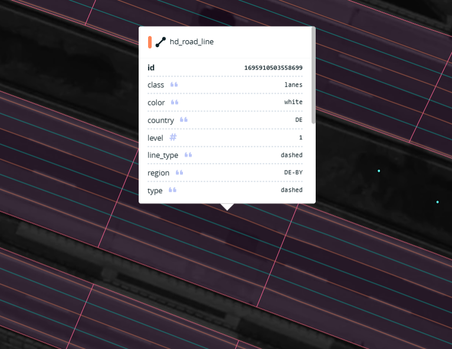

### hd_road_point

This layer contains several point-feature types, including roadside vegetation and road symbols.

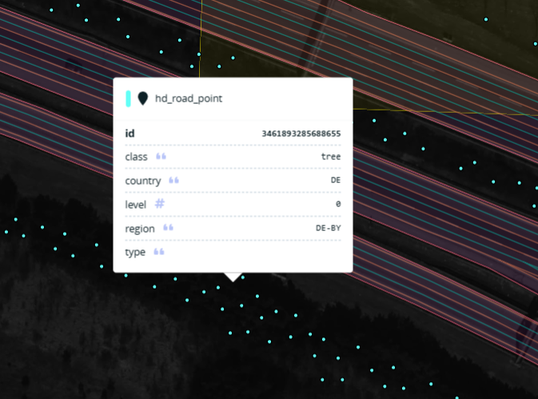

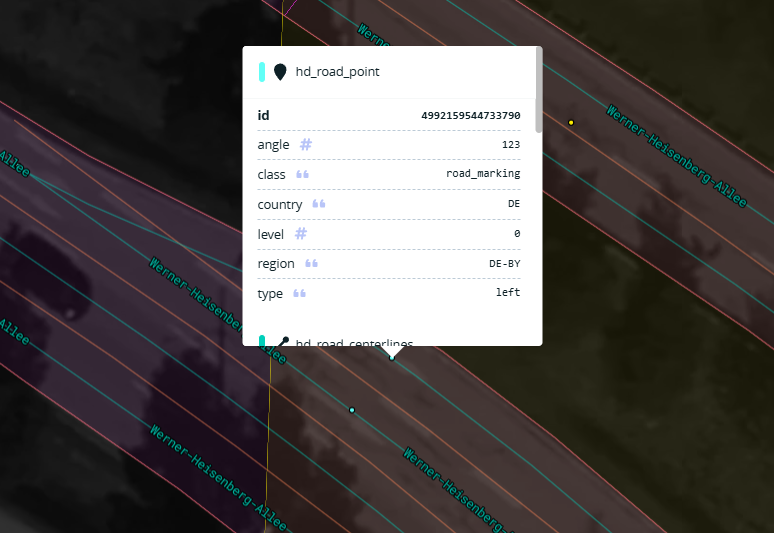

### hd_road_polygon

This polygon layer covers traffic lanes, emergency lanes, hatched areas, and other road surfaces. In simple terms, it contains nearly everything directly associated with the road except the trees.

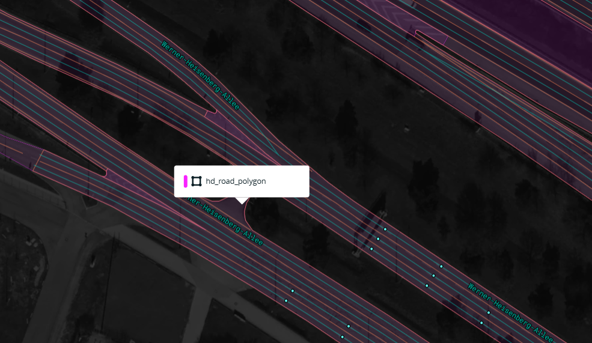

## Map Style

The full example is available in `debug/3d-intersections.html`. For implementation analysis, the more focused cases in the `test` directory are easier to study. One test style produces the following output:

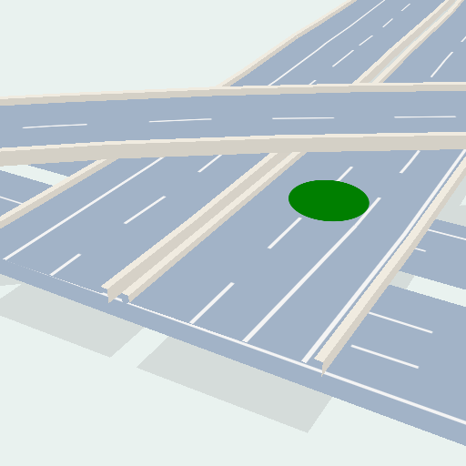

The corresponding style is shown below, with unrelated sections omitted:

```json
{
	"version": 8,
	"sources": {
		"hd-roads": {
			"type": "vector",
			"tileSize": 512,
			"maxzoom": 18,
			"tiles": ["local://tiles/3d-intersections/{z}-{x}-{y}.mvt"]
		},
		"geojson": {
			"type": "geojson",
			"data": {
				"type": "FeatureCollection",
				"features": [
					{
						"type": "Feature",
						"properties": {
							"zLevel": 1
						},
						"geometry": {
							"type": "MultiPoint",
							"coordinates": [[11.5406, 48.1763]]
						}
					}
				]
			}
		}
	},
	"layers": [
		{
			"id": "fake-road-shade",
			"type": "fill",
			"source": "hd-roads",
			"source-layer": "hd_road_polygon",
			"filter": [
				"all",
				["match", ["get", "class"], ["road", "bridge"], true, false]
			],
			"paint": {
				"fill-color": "rgb(214, 221, 219)"
			}
		},
		{
			"id": "road-base",
			"type": "fill",
			"source": "hd-roads",
			"source-layer": "hd_road_polygon",
			"filter": ["all", ["match", ["get", "class"], ["road"], true, false]],
			"layout": {
				"fill-elevation-reference": "hd-road-base"
			},
			"paint": {
				"fill-color": [
					"interpolate",
					["linear"],
					["zoom"],
					16,
					"hsl(212, 25%, 80%)",
					18,
					"hsl(212, 25%, 71%)"
				]
			}
		},
		{
			"id": "road-base-bridge",
			"type": "fill",
			"source": "hd-roads",
			"source-layer": "hd_road_polygon",
			"filter": ["all", ["match", ["get", "class"], ["bridge"], true, false]],
			"layout": {
				"fill-elevation-reference": "hd-road-base"
			},
			"paint": {
				"fill-color": [
					"interpolate",
					["linear"],
					["zoom"],
					16,
					"hsl(212, 25%, 80%)",
					18,
					"hsl(212, 25%, 71%)"
				]
			}
		},
		{
			"id": "road-hatched-area",
			"type": "fill",
			"source": "hd-roads",
			"source-layer": "hd_road_polygon",
			"filter": [
				"all",
				["match", ["get", "class"], ["hatched_area"], true, false]
			],
			"layout": {
				"fill-elevation-reference": "hd-road-markup"
			},
			"paint": {
				"fill-opacity": ["interpolate", ["linear"], ["zoom"], 15, 0, 16, 1],
				"fill-pattern": [
					"match",
					["get", "color"],
					["yellow"],
					"hatched-pattern-yellow",
					"hatched-pattern"
				]
			}
		},
		{
			"id": "solid-lines",
			"type": "line",
			"source": "hd-roads",
			"source-layer": "hd_road_line",
			"filter": [
				"all",
				["match", ["get", "class"], ["lanes"], true, false],
				[
					"match",
					["get", "line_type"],
					["solid", "solid_half_arrow", "half_arrow_solid", "arrow_solid"],
					true,
					false
				]
			],
			"layout": {
				"line-elevation-reference": "hd-road-markup"
			},
			"paint": {
				"line-color": [
					"match",
					["get", "color"],
					["yellow"],
					"hsl(54, 100%, 65%)",
					"hsl(0, 0%, 96%)"
				],
				"line-width": [
					"interpolate",
					["exponential", 1.5],
					["zoom"],
					15,
					0,
					18,
					1.5,
					19,
					3,
					22,
					10
				]
			}
		},
		{
			"id": "double-lines",
			"type": "line",
			"source": "hd-roads",
			"source-layer": "hd_road_line",
			"slot": "",
			"filter": [
				"all",
				["match", ["get", "class"], ["lanes"], true, false],
				["match", ["get", "line_type"], ["double"], true, false]
			],
			"layout": {
				"line-elevation-reference": "hd-road-markup"
			},
			"paint": {
				"line-color": [
					"match",
					["get", "color"],
					["yellow"],
					"hsl(54, 100%, 65%)",
					"hsl(0, 0%, 96%)"
				],
				"line-width": [
					"interpolate",
					["exponential", 1.5],
					["zoom"],
					15,
					0,
					18,
					1.5,
					19,
					3,
					22,
					10
				],
				"line-gap-width": 2
			}
		},
		{
			"id": "dashed-lines",
			"type": "line",
			"source": "hd-roads",
			"source-layer": "hd_road_line",
			"filter": [
				"all",
				["match", ["get", "class"], ["lanes"], true, false],
				[
					"match",
					["get", "line_type"],
					[
						"dashed",
						"arrow_dashed",
						"long_dashed",
						"short_dash",
						"solid_dashed"
					],
					true,
					false
				]
			],
			"layout": {
				"line-elevation-reference": "hd-road-markup"
			},
			"paint": {
				"line-color": [
					"match",
					["get", "color"],
					["yellow"],
					"hsl(54, 100%, 65%)",
					"hsl(0, 0%, 96%)"
				],
				"line-width": [
					"interpolate",
					["exponential", 1.5],
					["zoom"],
					15,
					0,
					18,
					1,
					19,
					3,
					22,
					6
				],
				"line-dasharray": [
					"step",
					["zoom"],
					["literal", [14, 14]],
					20,
					["literal", [18, 18]]
				]
			}
		},
		{
			"id": "circle",
			"type": "circle",
			"source": "geojson",
			"layout": {
				"circle-elevation-reference": "hd-road-markup"
			},
			"paint": {
				"circle-radius": 40,
				"circle-color": "green",
				"circle-pitch-alignment": "map"
			}
		}
	]
}
```

Together with several related styles, this file shows that a 3D interchange is assembled from the following layers.

### fake-road-shade

This layer renders the road-surface polygons as a simple shadow—a clever and inexpensive effect.

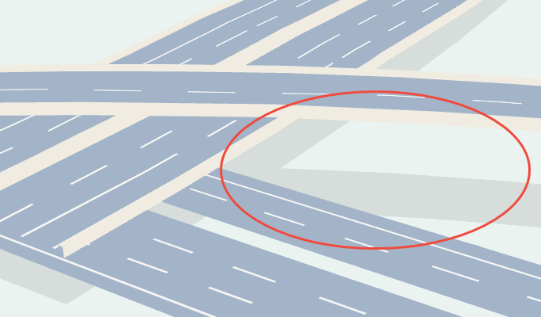

### road-base, road-base-bridge

The gray road surfaces come from `road-base` and `road-base-bridge`. Both use the road polygons from the source.

`road-base` lies on the ground as an ordinary 2D polygon. `road-base-bridge` is elevated in 3D, with `fill-elevation-reference` set to `hd-road-base` in its layout. This property is the key to the 3D effect.

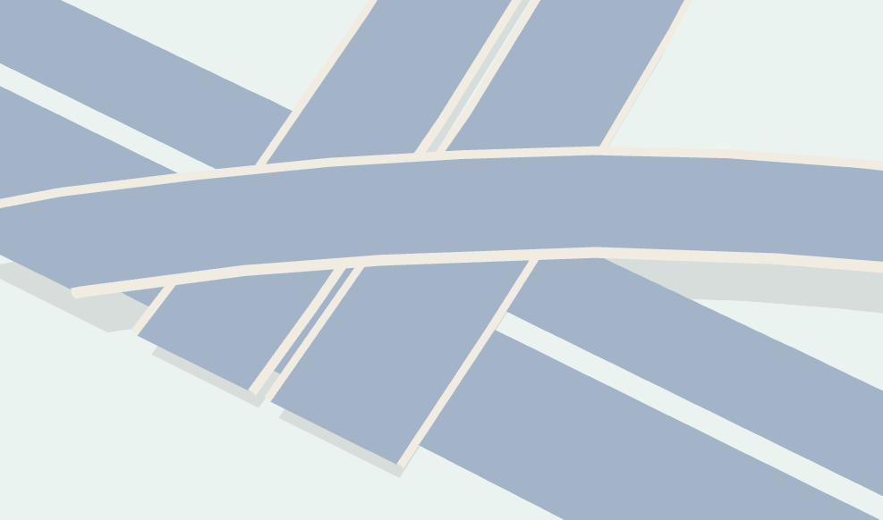

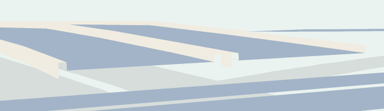

### road-hatched-area

Hatched road areas are rendered with `fill-pattern`, which requires a striped texture and does not provide control over the pattern's orientation.

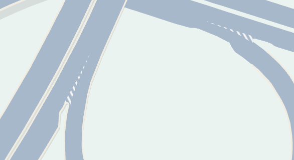

### solid-lines, double-lines, dashed-lines

Lane dividers, lane-edge markings, and similar linework.

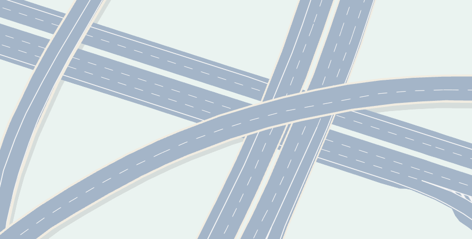

---

The style also contains lane-direction indicators, tunnels, and other features that follow patterns similar to the layers above.

## Rendering Implementation

After examining the style's sources and layers, the most unusual pieces are the `hd_road_elevation` dataset and the various `*-elevation-reference` properties.

In `src/data/bucket/fill_bucket.ts`, the bucket reads `fill-elevation-reference` into `elevationMode`.


For a source whose `elevationMode` is not `none`, geometry is created from `elevationFeatures`.

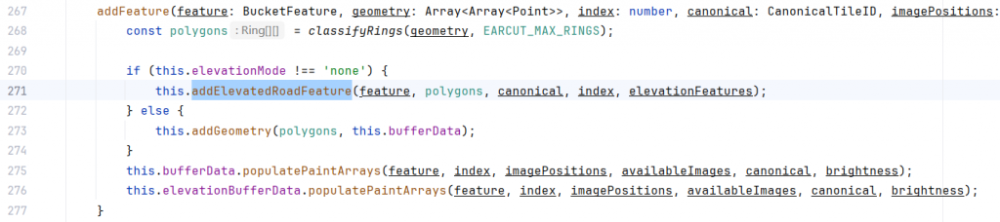

Not every elevation feature participates in a given feature's calculation. Around line 304, the code uses `3d_elevation_id` to retrieve the corresponding `tiledElevation` data.


Returning to the data model, `hd_road_line` joins to `hd_road_elevation` through `3d_elevation_id` and obtains its height data from that layer.

<Gallery
  images={[
    { src: "../../../assets/content-images/uploads/2025/05/image-24.png", caption: "" },
    { src: "../../../assets/content-images/uploads/2025/05/image-23.png", caption: "" },
  ]}
/>

An individual `elevationFeatures` record contains both point coordinates and heights in its vertex array.

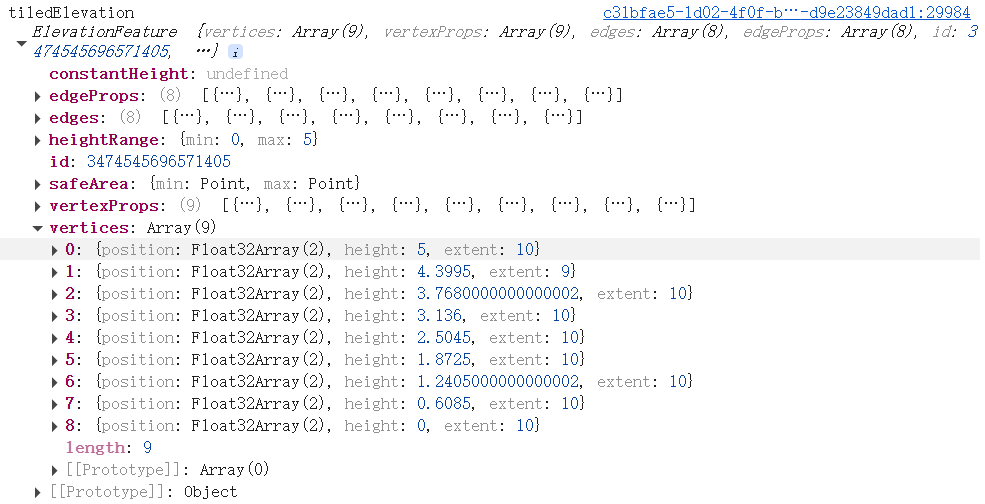

In `3d-style/elevation/elevation_feature.ts`, the code calculates the height at a requested position with linear interpolation.


## Summary

Mapbox v2 formally introduced terrain rendering and a 3D elevation foundation for map overlays. Point, line, and polygon features could then be positioned in three dimensions. Mapbox's HD map visualization builds on similar mechanisms, with the construction of `hd_road_elevation` serving as the core of accurate 3D road reconstruction.

I look forward to seeing what Mapbox builds next for HD map visualization.
