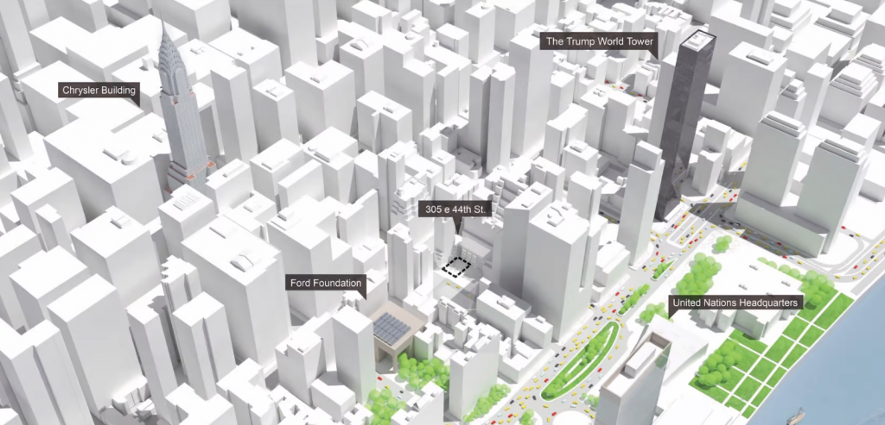
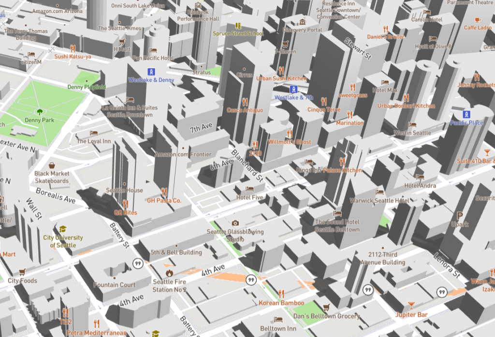

import Embed from "@/components/Embed.astro";
import Gallery from "@/components/Gallery.astro";

Sunlight and shadow analysis is a common requirement. How can a comparable effect be implemented on a map?



## Choosing a Framework

### Cesium

Cesium has built-in shadow support: set the `Viewer` option `shadows` to `true`. The default result, however, has severe aliasing, as shown below. Adjusting properties of the [ShadowMap](https://cesium.com/learn/cesiumjs/ref-doc/ShadowMap.html) class can improve the quality.

<Gallery
  images={[
    { src: "../../../assets/wp-content/uploads/2022/12/cesium_1-1.png", caption: "Default result" },
    { src: "../../../assets/wp-content/uploads/2022/12/cesium_2-1.png", caption: "size = 10240" },
    { src: "../../../assets/wp-content/uploads/2022/12/cesium_3-1.png", caption: "size = 10240 softShadows = true" },
  ]}
  caption="Building shadows in Cesium"
/>

```js
const viewer = new Cesium.Viewer("cesiumContainer", {
  shadows: true
});

viewer.shadowMap.size = 10240;
viewer.shadowMap.softShadows = true;
```

Judging from their properties, Cesium's [ShadowMap](https://cesium.com/learn/cesiumjs/ref-doc/ShadowMap.html) and Three.js's [LightShadow](https://threejs.org/docs/index.html?q=light#api/en/lights/shadows/LightShadow) are very similar. Both fundamentally work by rendering a shadow map. Higher shadow quality therefore comes with a greater performance cost.

### Mapbox

Although Mapbox is highly extensible for 3D rendering, there are few mature 3D-visualization plugins built directly on it. More often, established WebGL frameworks provide Mapbox integration, as deck.gl does. Threebox, originally developed by Peter Liu, was no longer maintained; a Microsoft engineer [forked it](https://github.com/jscastro76/threebox) and continued development, focusing mainly on Mapbox GL JS v2 support.

At the time, Threebox was not well suited to production use. It contained substantial hard-coded behavior, and using it effectively required familiarity with Mapbox, the Threebox source, and Three.js.

Its building-shadow implementation was also incompatible with Mapbox GL JS v2. The rest of this article explains how to restore that feature.

## How the BuildingShadows Layer Works

Threebox's `BuildingShadows` layer uses a different technique to render building shadows.

Consider its vertex and fragment shaders:

```cpp
// vertexShader

uniform mat4 u_matrix;
uniform float u_height_factor;
uniform float u_altitude;
uniform float u_azimuth;
attribute vec2 a_pos;
attribute vec4 a_normal_ed;
attribute lowp vec2 a_base;
attribute lowp vec2 a_height;
void main() {
    float base = max(0.0, a_base.x);
    float height = max(0.0, a_height.x);
    float t = mod(a_normal_ed.x, 2.0);
    vec4 pos = vec4(a_pos, t > 0.0 ? height : base, 1);
    float len = pos.z * u_height_factor / tan(u_altitude);
    pos.x += cos(u_azimuth) * len;
    pos.y += sin(u_azimuth) * len;
    pos.z = 0.0;
    gl_Position = u_matrix * pos;
}

// fragmentShader

void main() {
    gl_FragColor = vec4(0.0, 0.0, 0.0, 0.7);
}
```

The color calculation is trivial; the important part is the vertex calculation. It first constructs this vertex:

vec4(a_pos, t > 0.0 ? height : base, 1)

This is the original vertex of the extruded building. The shader then calculates the shadow length:

pos.z * u_height_factor / tan(u_altitude)

It combines that length with the shadow direction to calculate the projected vertex position:

pos.x += cos(u_azimuth) * len;<br />
pos.y += sin(u_azimuth) * len;

The value of `u_azimuth` is the solar azimuth calculated from the specified local time and the building's geographic location.



## Supporting Mapbox GL JS v2

Why did this code stop working with Mapbox? The problem lies in how it reads building-layer data. During the v2 upgrade, Mapbox changed the data supplied to shaders to reduce memory usage for `fill-extrusion` layers, packing vertex positions and normals into a single attribute. See the relevant [commit](https://github.com/mapbox/mapbox-gl-js/commit/cef95aa0241e748b396236f1269fbb8270f31565) for details.

The fix is therefore to apply the corresponding vertex-shader changes to Threebox's `BuildingShadows` implementation.

## Final Result

Combining the building shadows with Mapbox's map light and skybox produces the following result.

<Embed src="//codepen.io/anon/embed/poZzoNO?height=650&theme-id=1&slug-hash=poZzoNO&default-tab=result" height={650} title="CodePen Embed poZzoNO" />

This building-shadow implementation is tightly coupled to Mapbox and its visual quality falls short of Cesium's, but it is simple and has a relatively small performance cost.
