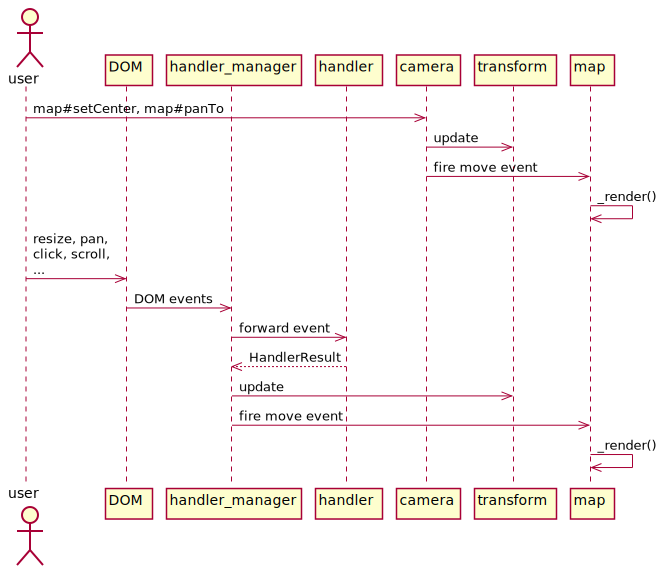
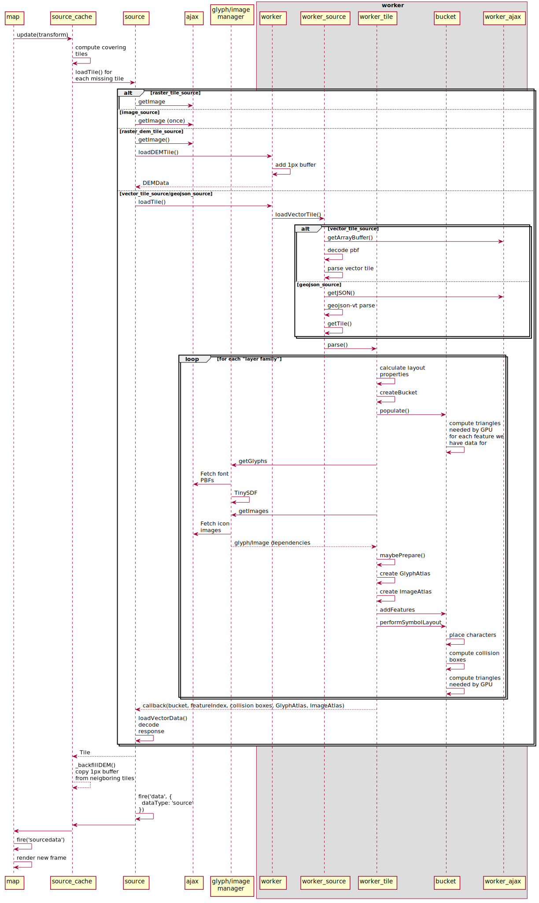

**This article is based on [“Life of a Tile” from maplibre/maplibre-gl-js](https://github.com/maplibre/maplibre-gl-js/blob/main/docs/life-of-a-tile.md). Source links below point to Mapbox GL JS v1.13.2.**

The lifecycle of a tile in Mapbox can be divided into three parts:

- **Event loop:** responds to user interaction and updates internal map state such as the viewport and camera.
- **Tile loading:** asynchronously requests the tiles, images, glyphs, and other data required by the current view.
- **Render loop:** draws the current map state to the screen.

Ideally, the event and render loops run at 60 frames per second, while expensive work such as tile loading runs asynchronously in Web Workers.

---

## Event Loop

### Transform

[Transform](https://github.com/mapbox/mapbox-gl-js/blob/release-v1.13.2/src/geo/transform.js) stores the current view state, including pitch, zoom, bearing, and bounds. Two parts of the code update it directly:

- Methods such as [Camera#panTo](https://github.com/mapbox/mapbox-gl-js/blob/release-v1.13.2/src/ui/camera.js#L211) and [Camera#setCenter](https://github.com/mapbox/mapbox-gl-js/blob/release-v1.13.2/src/ui/camera.js#L173) on [Camera](https://github.com/mapbox/mapbox-gl-js/blob/release-v1.13.2/src/ui/camera.js), the parent class of [Map](https://github.com/mapbox/mapbox-gl-js/blob/release-v1.13.2/src/ui/map.js).
- [HandlerManager](https://github.com/mapbox/mapbox-gl-js/blob/release-v1.13.2/src/ui/handler_manager.js), which receives DOM events and forwards them to interaction handlers under [src/ui/handler](https://github.com/mapbox/mapbox-gl-js/tree/release-v1.13.2/src/ui/handler). Their changes are combined into a [HandlerResult](https://github.com/mapbox/mapbox-gl-js/blob/release-v1.13.2/src/ui/handler_manager.js#L70) and trigger rendering. [HandlerInertia](https://github.com/mapbox/mapbox-gl-js/blob/release-v1.13.2/src/ui/handler_inertia.js) adds inertial behavior after gestures such as a fast drag.

### Camera and HandlerManager

After changing `transform`, both `Camera` and `HandlerManager` can emit events such as <mark>`move`</mark>, <mark>`zoom`</mark>, <mark>`movestart`</mark>, and <mark>`moveend`</mark>. These events—along with style changes, completed data loads, and others—schedule [Map#_render()](https://github.com/mapbox/mapbox-gl-js/blob/release-v1.13.2/src/ui/map.js#L2439) to draw a frame.

---

## Tile Loading

[Map#_render()](https://github.com/mapbox/mapbox-gl-js/blob/release-v1.13.2/src/ui/map.js#L2439) follows two paths depending on `map._sourcesDirty`. When it is true, `_render()` first asks every source whether new data is needed. The false case is covered in the render-loop section.

### Tile Selection and Requests

Every source has a corresponding `SourceCache`. Calling [SourceCache#update(transform)](https://github.com/mapbox/mapbox-gl-js/blob/release-v1.13.2/src/source/source_cache.js#L474) determines the tile IDs that should cover the viewport and requests any missing tiles. If the exact tile is unavailable, Mapbox uses a lower-zoom tile covering the same region as a fallback.

### Loading and Parsing

Missing tiles are loaded through `Source#loadTile(tile, callback)`. Each source type follows a different path.

#### [RasterTileSource](https://github.com/mapbox/mapbox-gl-js/blob/release-v1.13.2/src/source/raster_tile_source.js)

[src/util/ajax](https://github.com/mapbox/mapbox-gl-js/blob/release-v1.13.2/src/util/ajax.js) issues a `getImage` request and maintains a queue that limits concurrent requests.

#### [RasterDEMTileSource](https://github.com/mapbox/mapbox-gl-js/blob/release-v1.13.2/src/source/raster_dem_tile_source.js)

Like the raster source, this first requests image data and then sends `loadDEMTile` to a worker. Reading pixels requires drawing the image to a canvas, an expensive step performed in the worker when `OffscreenCanvas` is available and on the main thread otherwise.

Inside the worker, [RasterDEMTileWorkerSource#loadTile](https://github.com/mapbox/mapbox-gl-js/blob/release-v1.13.2/src/source/raster_dem_tile_source.js#L42) loads raw RGB values into [DEMData](https://github.com/mapbox/mapbox-gl-js/blob/release-v1.13.2/src/data/dem_data.js) and fills a one-pixel border to prevent edge flicker. The result is then returned to the main thread.

#### [VectorTileSource](https://github.com/mapbox/mapbox-gl-js/blob/release-v1.13.2/src/source/vector_tile_source.js)

The main thread sends `loadTile` or `reloadTile` to a worker. [Worker#loadTile](https://github.com/mapbox/mapbox-gl-js/blob/release-v1.13.2/src/source/worker.js#L99) receives it and delegates to [VectorTileWorkerSource#loadTile](https://github.com/mapbox/mapbox-gl-js/blob/release-v1.13.2/src/source/vector_tile_source.js#L184).

[VectorTileWorkerSource#loadTile](https://github.com/mapbox/mapbox-gl-js/blob/release-v1.13.2/src/source/vector_tile_source.js#L184) then:

- Fetches binary data with [ajax#getArrayBuffer()](https://github.com/mapbox/mapbox-gl-js/blob/release-v1.13.2/src/util/ajax.js#L261).
- Decodes Protocol Buffers with [pbf](https://github.com/mapbox/pbf).
- Parses vector-tile data with [@mapbox/vector-tile#VectorTile](https://github.com/mapbox/vector-tile).
- Passes the result to a new [WorkerTile](https://github.com/mapbox/mapbox-gl-js/blob/release-v1.13.2/src/source/worker_tile.js).

The worker calls [WorkerTile#parse()](https://github.com/mapbox/mapbox-gl-js/blob/release-v1.13.2/src/source/worker_tile.js#L66) and processes the result for the tile ID:

- For every source layer in the vector tile, and every visible style layer using it:
  - `recalculateLayers` evaluates layout properties.
  - `style.createBucket` creates the appropriate bucket type. Bucket implementations live under [src/data/bucket/*](https://github.com/mapbox/mapbox-gl-js/tree/release-v1.13.2/src/data/bucket) and share the [Bucket](https://github.com/mapbox/mapbox-gl-js/blob/release-v1.13.2/src/data/bucket.js) base class.
  - [Bucket#populate()](https://github.com/mapbox/mapbox-gl-js/blob/release-v1.13.2/src/data/bucket.js#L78) consumes the source-layer features and prepares per-frame data for GPU upload, such as buffers containing triangulated geometry.
- Most layer types are now triangulated, but some require resources prepared on the main thread:
  - Font PBFs requested through `getGlyphs`.
    - [GlyphManager](https://github.com/mapbox/mapbox-gl-js/blob/release-v1.13.2/src/render/glyph_manager.js) manages the global glyph cache. For a missing character, it either draws the glyph to a canvas with [tiny-sdf](https://github.com/mapbox/tiny-sdf) or requests the corresponding glyph PBF.
  - Icons and patterns requested through `getImages({type: 'icon' | 'pattern'})`.
    - [ImageManager](https://github.com/mapbox/mapbox-gl-js/blob/release-v1.13.2/src/render/image_manager.js) manages these caches and requests missing images over the network.

When [WorkerTile#maybePrepare()](https://github.com/mapbox/mapbox-gl-js/blob/release-v1.13.2/src/source/worker_tile.js#L178) determines that all resources are ready, [potpack](https://github.com/mapbox/potpack) packs glyphs, icons, and patterns into square atlases suitable for GPU upload. These are stored in [GlyphAtlas](https://github.com/mapbox/mapbox-gl-js/blob/release-v1.13.2/src/render/glyph_atlas.js) and [ImageAtlas](https://github.com/mapbox/mapbox-gl-js/blob/release-v1.13.2/src/render/image_atlas.js). For each waiting layer, [StyleLayer#recalculate()](https://github.com/mapbox/mapbox-gl-js/blob/release-v1.13.2/src/style/style_layer.js#L198) then runs, followed by:

- `addFeatures` on buckets waiting for pattern resources.
- [performSymbolLayout()](https://github.com/mapbox/mapbox-gl-js/blob/release-v1.13.2/src/symbol/symbol_layout.js#L150) on symbol buckets. It computes layout properties at the current zoom, positions symbols according to glyph shapes, stores triangulated symbol geometry, and calculates collision boxes for text and icon placement.

The buckets, feature index, collision boxes, glyph atlas, and image atlas are returned to the main thread.

#### [GeojsonSource](https://github.com/mapbox/mapbox-gl-js/blob/release-v1.13.2/src/source/geojson_worker_source.js)

This path is almost identical to `VectorTileSource`: it sends `loadTile` or `reloadTile` to a worker. `GeoJSONWorkerSource` extends `VectorTileWorkerSource` but overrides <mark>`loadVectorData`</mark>, so it reads GeoJSON directly instead of fetching and parsing PBF vector tiles. [geojson-vt](https://github.com/mapbox/geojson-vt) converts the data to a tile-like representation, allowing the same `getTile` workflow to supply the main thread.

> This design applies tile-based LOD to GeoJSON and lets the low-level renderer target one vector-tile-like representation instead of maintaining separate paths for vector tiles and GeoJSON.

#### [ImageSource](https://github.com/mapbox/mapbox-gl-js/blob/release-v1.13.2/src/source/image_source.js)

Mapbox determines a sufficiently high-zoom tile whose bounds contain the `ImageSource` coordinates. `loadTile()` returns true only while the main thread requests that tile; the image itself was already requested when a layer using the source was added.

---

When vector or GeoJSON source data returns to the main thread, [Tile#loadVectorData](https://github.com/mapbox/mapbox-gl-js/blob/release-v1.13.2/src/source/tile.js#L140) stores it in the tile's buckets.

### Preparing to Render

After the missing tile has loaded, control returns to [SourceCache](https://github.com/mapbox/mapbox-gl-js/blob/release-v1.13.2/src/source/source_cache.js):

- [SourceCache#_backfillDEM](https://github.com/mapbox/mapbox-gl-js/blob/release-v1.13.2/src/source/source_cache.js#L274) copies edge pixels from neighboring DEM tiles to prevent boundary artifacts.
- The source emits `data {dataType: 'source'}`. The event bubbles through `SourceCache`, `Style`, and `Map`, becomes `sourcedata`, calls `Map#_update()`, schedules `Map#triggerRepaint()`, and ultimately invokes `Map#_render()` for a new frame—the same rendering path triggered by a camera change.

---

## Render Loop

When `_sourcesDirty` is false, `Map#_render()` draws the next frame directly on the main thread:

- [Style#update()](https://github.com/mapbox/mapbox-gl-js/blob/release-v1.13.2/src/style/style.js#L381) calls <mark>`recalculate()`</mark> on every layer to update paint values for the current zoom and transition state.
- [SourceCache#update(transform)](https://github.com/mapbox/mapbox-gl-js/blob/release-v1.13.2/src/source/source_cache.js#L474) requests new tiles through the path described above.
- [Painter#render(style)](https://github.com/mapbox/mapbox-gl-js/blob/release-v1.13.2/src/render/painter.js#L357) renders the current style:
  - It calls `SourceCache#prepare(context)` for every source.
  - For every tile in each source:
    - [Tile#upload(context)](https://github.com/mapbox/mapbox-gl-js/blob/release-v1.13.2/src/source/tile.js#L241) calls [Bucket#upload(context)](https://github.com/mapbox/mapbox-gl-js/blob/release-v1.13.2/src/data/bucket.js#L82) for each layer bucket, uploading vertex attributes required for drawing.
    - [Tile#prepare(imageManager)](https://github.com/mapbox/mapbox-gl-js/blob/release-v1.13.2/src/source/tile.js#L261) uploads image textures such as patterns and icons.
  - Layers are drawn through four passes using `renderLayer()` implementations under [src/render/draw_*](https://github.com/mapbox/mapbox-gl-js/blob/release-v1.13.2/src/render):
    - **Offscreen:** custom, hillshade, and heatmap layers precompute and cache data in offscreen framebuffers.
    - **Opaque:** fill and background layers render opaquely from top to bottom.
    - **Translucent:** other layer types render from bottom to top.
    - **Debug:** collision boxes, tile boundaries, and other diagnostics render above the map.
  - Each `renderLayer()` iterates over visible tiles, binds textures, and uses shaders from [src/shaders](https://github.com/mapbox/mapbox-gl-js/blob/release-v1.13.2/src/shaders). [Program#draw()](https://github.com/mapbox/mapbox-gl-js/blob/release-v1.13.2/src/render/program.js#L123) configures GPU state and shader uniforms, then [gl.drawElements()](https://github.com/mapbox/mapbox-gl-js/blob/release-v1.13.2/src/render/program.js#L179) draws the tile for that layer.
- If more rendering work remains, the repaint cycle continues. Otherwise, rendering completes and the map emits `idle`.
