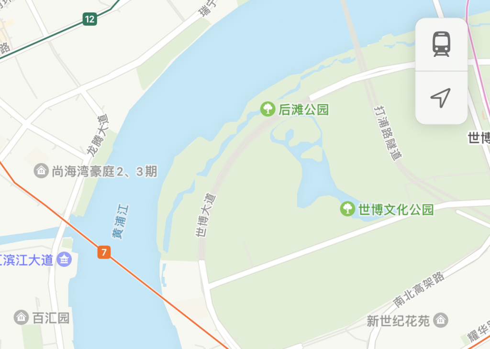
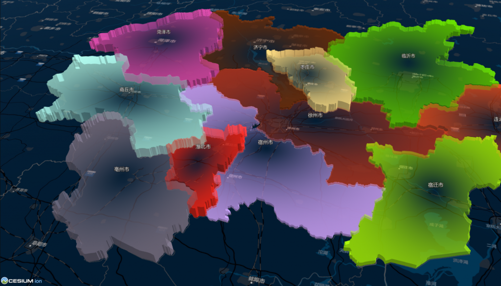
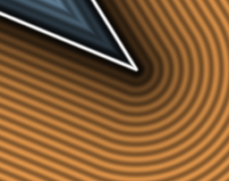

import Embed from "@/components/Embed.astro";
import Gallery from "@/components/Gallery.astro";

Gradients create smooth transitions between colors. They often encode the intensity of a field—a value that varies continuously across 2D space—such as temperature, elevation, or traffic flow along a route. Heatmaps are a common cartographic gradient, and sufficiently fine hypsometric tinting can also approximate one.

<Gallery
  images={[
    { src: "../../../assets/wp-content/uploads/2022/12/image-9.png", caption: "Heatmap" },
    { src: "../../../assets/wp-content/uploads/2022/12/image-8.png", caption: "Elevation-based hypsometric tinting" },
    { src: "../../../assets/wp-content/uploads/2022/12/image-7.png", caption: "Line gradient" },
  ]}
  caption="Common map gradients"
/>

Gradients can also create shadows by transitioning from gray to transparent, giving a 2D map more depth. In the iOS map screenshot below, the control in the upper-right uses a drop shadow to separate it from the map. The water bodies also have subtle inward shadows along their shorelines to distinguish water from land.



CSS gradients are also used in maps. A common technique draws a radial gradient to a canvas and overlays that canvas on the map. The resulting circular gradient can represent a buffer around a point.

The limitation is that CSS radial gradients are circular or rectangular. They do not conform to irregular polygons. In the following example, circular gradients are placed over administrative areas but do not match their boundaries.



Desktop GIS applications can produce polygon-conforming gradients. QGIS calls this effect a **shapeburst fill** and uses it to highlight an area or shade the interior edge of a water body.

<Gallery
  images={[
    { src: "../../../assets/wp-content/uploads/2022/12/image-13.png", caption: "Water-body shadow" },
    { src: "../../../assets/wp-content/uploads/2022/12/image-11-1024x569.png", caption: "Area highlight" },
  ]}
  caption="Applications of shapeburst fills"
/>

## Related Concepts

Several related techniques are useful when investigating polygon gradients.

### Drop shadow

A drop shadow makes an object appear raised above its background. It is common in graphical interfaces such as windows and menus and helps text or icons remain visually distinct. The example below demonstrates CSS `drop-shadow()`.

<Embed src="//codepen.io/anon/embed/MWBWPZv?height=550&theme-id=1&slug-hash=MWBWPZv&default-tab=result" height={550} title="CodePen Embed MWBWPZv" />

`drop-shadow` follows irregular silhouettes better than `box-shadow`.

### Signed Distance Field

For signed distance functions for different shapes, see [2D distance functions](https://iquilezles.org/articles/distfunctions2d/).

The following demo visualizes the SDF of a polygon. The essential operation is finding the shortest distance from every screen position to the object. Closed-form expressions work for regular shapes, but evaluating arbitrary polygons this way becomes expensive.

<Embed src="https://www.shadertoy.com/embed/wdBXRW?gui=true&t=10&paused=true&muted=false" height={400} />

The distance for each point is calculated as follows.

```cpp
float sdPolygon( in vec2[N] v, in vec2 p )
{
    float d = dot(p-v[0],p-v[0]);
    float s = 1.0;
    for( int i=0, j=N-1; i<N; j=i, i++ )
    {
        vec2 e = v[j] - v[i];
        vec2 w =    p - v[i];
        vec2 b = w - e*clamp( dot(w,e)/dot(e,e), 0.0, 1.0 );
        d = min( d, dot(b,b) );
        bvec3 c = bvec3(p.y>=v[i].y,p.y<v[j].y,e.x*w.y>e.y*w.x);
        if( all(c) || all(not(c)) ) s*=-1.0;  
    }
    return s*sqrt(d);
}
```

SDFs also have many applications in lighting and shadows, which could be explored separately.

### Straight Skeleton

One intuitive definition of a polygon's straight skeleton is:

> Raise an inward-facing plane from every boundary edge at the same angle, such as 45 degrees. Their intersections form the ridges of a roof whose walls are the original polygon. Projecting all ridges and vertices of that roof back onto the original plane produces the straight-skeleton edges and vertices.

What does this have to do with gradients? Applying linear interpolation across the faces generated by the straight skeleton creates a polygon-conforming gradient.

<Gallery
  images={[
    { src: "../../../assets/wp-content/uploads/2022/12/image-14.png", caption: "Polygon straight skeleton" },
    { src: "../../../assets/wp-content/uploads/2022/12/image-15.png", caption: "Gradient fill" },
  ]}
/>

Straight skeletons have other GIS applications, including extracting a polygon centerline for label placement. The roof analogy also points directly to generating 3D building roofs or terrain-like surfaces.

## Implementation

I ultimately chose the straight-skeleton approach. It handles complex polygons, including holes and concave boundaries, better than the alternatives. SDF evaluation is inefficient for large datasets, while canvas shadow effects are too constrained for general map rendering.




Straight skeletons also have drawbacks. Reflex vertices with interior angles greater than 180 degrees can produce very long skeleton edges. Like stroking a wide line, the implementation must choose how to join corners. The comparison shows that an SDF produces rounded corners, while the straight-skeleton result has sharp joins.

The output can be modified to approximate rounded joins. For each reflex boundary vertex, construct perpendiculars to the incident edges and intersect them with the internal angle bisector. This creates the light-blue polygon shown below—not necessarily a triangle—which identifies the region that must be rounded. Subdivide that region and recalculate its vertex values.

<Gallery
  images={[
    { src: "../../../assets/wp-content/uploads/2022/12/image-18.png", caption: "Straight-skeleton output" },
    { src: "../../../assets/wp-content/uploads/2022/12/image-19.png", caption: "Splitting a reflex corner" },
  ]}
/>

The approach is not complete. In particular, when a sharp join reaches the opposite edge, the output can appear to have a missing section.

## Final Result

The map on the right adds an inward shadow to the `water` layer; compare it with the unshaded map on the left.

<Embed src="//codepen.io/anon/embed/LYBEexG?height=550&theme-id=1&slug-hash=LYBEexG&default-tab=result" height={550} title="CodePen Embed LYBEexG" />

The algorithm is not yet stable, and water shadows may fail to load after panning the map.

## Further Work

- Algorithmic performance, probably a major obstacle to implementing this effect in Mapbox.
- Library stability. Existing JavaScript straight-skeleton libraries have known problems. Compiling CGAL to WebAssembly may be an alternative.
- Vector-tile integration: how can the effect remain continuous after geometry is clipped into tiles?

## References

- [SHAPEBURST FILL STYLES IN QGIS 2.4](https://nyalldawson.net/2014/06/shapeburst-fill-styles-in-qgis-2-4/)
- [Implementing the Straight Skeleton of a Simple Planar Polygon (Chinese)](https://dsa.cs.tsinghua.edu.cn/~deng/cg/project/2009f/2009f-2-a.pdf)
- [using straight skeletons to render strokes, tint bands and antialiasing](https://github.com/mapbox/mapbox-gl-js/issues/6816)
