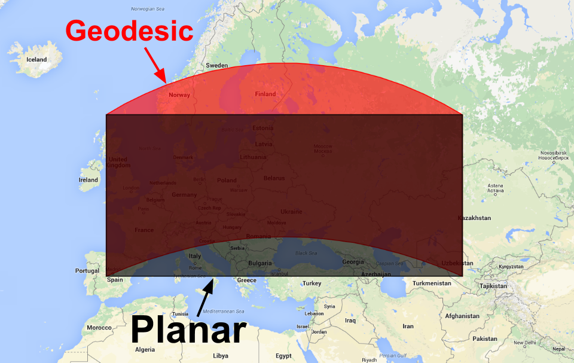
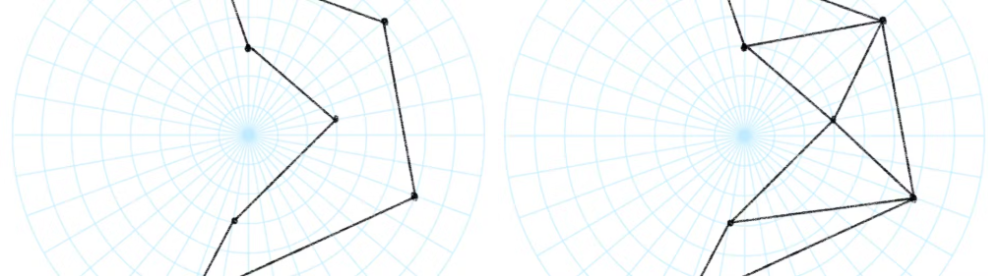
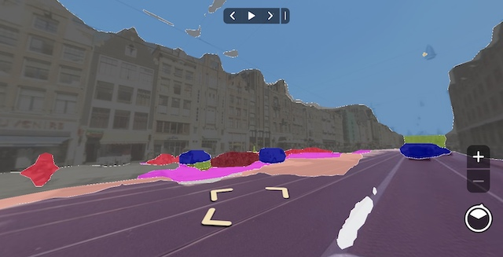
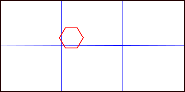
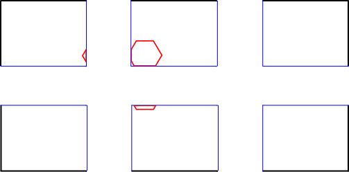
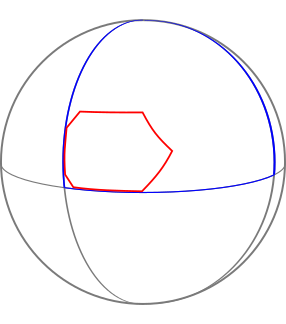
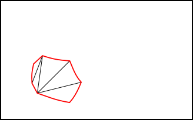
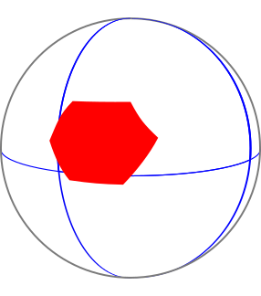

import Gallery from "@/components/Gallery.astro";

Drawing a polygon on a spherical surface is substantially harder than drawing it on a plane. The underlying problem is closely related to reconstructing an undistorted view from a panoramic image.

The difference begins with the concept of a geodesic: the shortest path between two points on a curved surface.

At small scales, planar and geodesic edges can be treated as equivalent. As a polygon grows, the distinction matters both analytically and visually. This article focuses on rendering large polygons correctly.

<Gallery
  images={[
    { src: "../../../assets/wp-content/uploads/2025/02/bad_triangulation.avif", caption: "Incorrect CesiumJS triangulation of a polygon that wraps around the world" },
    { src: "../../../assets/wp-content/uploads/2025/02/good_triangulation.avif", caption: "Correct triangulation in CesiumJS" },
  ]}
/>

## Rendering Polygons in Cesium

Rendering geometry requires decomposing it into triangles to create a mesh. Triangulation of an arbitrary simple polygon is well defined in 2D. CesiumJS uses **earcut**, which is fast enough for real-time triangulation in the browser.

The vertices must first be projected to a 2D plane. Cesium traditionally used a plane tangent to the ellipsoid. This works well for polygons with limited geographic extent because distortion remains small near the tangent point.

No single plane can represent every point on an ellipsoid or sphere. Distortion increases with distance from the tangent point. For extents greater than 180 degrees, tangent-plane projection necessarily fails because positions wrap back over themselves in 2D.

One direct solution is to use multiple tangent planes. The polygon must be split along the boundaries of each projection region to create a seamless mesh. Splitting during geometry construction can be expensive because every polygon edge must be tested against every split plane. After triangulation, however, the pieces are recombined during geometry batching, so steady-state rendering performance remains unchanged.

Extent checks can avoid splitting small polygons, but each additional projection region adds another split operation and more construction cost.

Even if each region is limited to 90 degrees, up to three splits are required along the x-, y-, and z-axes.

Perhaps Cartesian partitioning is the limitation. A cube map, for example, is a familiar way to project a 3D sphere into 2D regions for skyboxes and environment maps.

The problem is that not every projection is conformal: many fail to preserve local shape and relative angles. Area distortion is acceptable for this purpose, but preserving shape is essential for triangulation, clipping, winding-order tests, and determining whether a pole lies inside the polygon.

Stereographic projection is particularly useful because it requires very few polygon splits. It projects 3D Cartesian positions from one pole onto a plane tangent at the opposite pole.

Numerical precision in trigonometric functions near small angles means that each polar projection is reliable over the appropriate hemisphere. Splitting at the equator ensures that every edge uses the correct arc. Only one split, at the `z=0` plane, is required.

Stereographic coordinates also reduce difficult spherical operations to relatively simple vector mathematics. Angular sums around the origin can determine whether a pole lies inside the polygon and can produce the correct map bounding rectangle.

With the projection handled correctly, the polygon renders as intended.

<Gallery
  images={[
    { src: "../../../assets/wp-content/uploads/2025/02/enclosing_pole_before.avif", caption: "Incorrect polar polygon" },
    { src: "../../../assets/wp-content/uploads/2025/02/enclosing_pole_after.avif", caption: "Correctly rendered polygon" },
  ]}
/>

## Rendering Annotations in MapillaryJS

MapillaryJS visualizes panoramic imagery, point clouds, and spatial annotations. It encounters the same need to transform geometry between spherical and planar spaces.

<Gallery
  images={[
    { src: "../../../assets/wp-content/uploads/2025/02/polygon-equirectangular-panorama.jpg", caption: "An equirectangular panorama is a distorted 2D projection in which straight lines in 3D appear curved" },
    { src: "../../../assets/wp-content/uploads/2025/02/polygon-undistorted.jpg", caption: "Rendering the panorama on a sphere restores straight lines in undistorted 3D space" },
  ]}
/>

MapillaryJS colors image segments according to their segmentation class. The fill is a shaded 3D mesh placed in front of a conventional image or, for a panorama, inside the image sphere in the viewer's undistorted 3D space.

An image segment is defined as a polygon in the distorted 2D projection. Creating the mesh requires triangulating that polygon.

This is straightforward for an ordinary image but more complex for an equirectangular 360-degree panorama. Undistortion changes the spatial relationship between polygon vertices.

Triangulating directly in the distorted projection can produce invalid triangles. After conversion to undistorted 3D space, a triangle may extend outside the intended polygon boundary. Yet triangulation must operate in 2D and cannot simply run on the 3D image sphere, so an intermediate representation is required.

The method must also be efficient: one image may contain hundreds or thousands of polygons and tens of thousands of vertices, all while the viewer remains responsive.

Suppose a simple hexagon is detected in a panorama. The goal is to display it correctly and efficiently in undistorted 3D space.

<Gallery
  images={[
    { src: "../../../assets/wp-content/uploads/2025/02/polygon-on-real-image.png", caption: "A hexagon detected in the distorted equirectangular projection" },
    { src: "../../../assets/wp-content/uploads/2025/02/polygon-on-undistorted-image.png", caption: "The same polygon changes shape in undistorted 3D space" },
  ]}
/>

Divide the distorted projection into regions small enough that all points in a region lie in front of its projection plane. A 2 × 3 grid ensures that no region covers more than 120 degrees on the sphere, safely below 180 degrees.

Clip the polygon to each region, reducing one triangulation problem to six independent subproblems. In this example, the hexagon intersects three regions and produces three clipped pieces.

Each clipped polygon is unprojected onto the sphere and then projected onto a plane whose normal points toward the center of that grid cell. This ensures that every point lies in front of the plane.

The projected piece can now be triangulated in 2D and filled with color.

Combining triangles from every region yields the complete mesh, which can be rendered correctly in undistorted 3D space.

A simplified algorithm is:

1. Divide the source image into an x × y rectangular grid, with x ≥ 3 and y ≥ 2, so each region covers at most 120 degrees of the sphere.
2. Create an empty array of triangles in 3D coordinates.
3. For each region:
   - Clip the polygon to the region in distorted 2D coordinates.
   - Unproject those coordinates into undistorted 3D positions.
   - Project the 3D positions onto a plane in front of the camera whose principal axis passes through the region center.
   - Triangulate the projected 2D coordinates.
   - Use the triangle indices to append the corresponding undistorted 3D positions.
4. Render the assembled array of 3D triangles.

## Summary

Correctly rendering polygons on a 3D spherical surface requires both geometrically valid triangulation and real-time performance, especially for large or complex shapes. CesiumJS and MapillaryJS solve the problem in different coordinate systems, but both split a large polygon into smaller pieces that can be safely projected and triangulated.

## References

- [Polygon Triangulation on the Sphere](https://mapillary.github.io/mapillary-js/docs/theory/polygon-triangulation/)
- [Large Polygons in CesiumJS](https://cesium.com/blog/2023/10/19/large-polygons-in-cesiumjs/)
- [Geodesic vs. Planar Geometries | Google Earth Engine](https://developers.google.com/earth-engine/guides/geometries_planar_geodesic)
