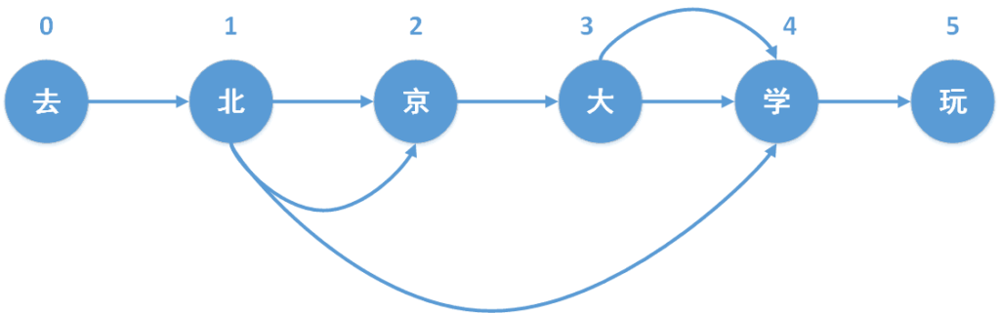

## Introduction

I had already worked with several word-segmentation tools, primarily MMSEG and Jieba. Rather than treating segmentation as a black-box API, this article examines the underlying algorithms and lays the groundwork for a simple implementation.

## Algorithms

### MMSEG

MMSEG is based on dictionary-driven string matching. It scans the input using strategies such as forward or reverse maximum matching and minimum-word segmentation. Practical systems often combine several strategies, or use one primary strategy with several fallbacks, while incorporating part-of-speech and word-frequency information through simple statistical models.

MMSEG scans a sentence from left to right, generates multiple candidate chunks of three words, and chooses the best candidate using four ambiguity-resolution rules:

- Maximize the total length of the candidate chunk
- Maximize average word length
- Minimize the variance of word lengths
- Maximize the frequency of single-character words in the candidate

#### Forward Maximum Matching

Scan from left to right and greedily select the longest dictionary word beginning at the current position. A character that cannot form a word becomes a token by itself. The underlying assumption is that longer words tend to carry more specific meaning.

#### Reverse Maximum Matching

This follows the same principle but starts at the end of the sentence and uses a reverse dictionary whose entries are stored backward. The input is reversed, segmented with forward maximum matching against that dictionary, and then restored to its original order.

#### Bidirectional Maximum Matching

This combines forward and reverse maximum matching. If both passes produce the same segmentation, that result is accepted; otherwise, a minimum-segmentation rule resolves the disagreement.

### Jieba

According to the [project documentation](https://github.com/fxsjy/jieba), Jieba performs three main steps:

- Scan efficiently with a prefix dictionary and construct a directed acyclic graph (DAG) containing all possible words in the sentence.
- Use dynamic programming to find the maximum-probability path and thus the most likely segmentation according to word frequencies.
- Recognize out-of-vocabulary words with a character-based hidden Markov model and the Viterbi algorithm.

## Key Implementation Details

Both MMSEG and Jieba enumerate dictionary-based partitions of an input sentence. Their main difference is how they choose the best sequence of words after generating those candidates. The following sections examine Jieba in more detail.

### Prefix Dictionary

Unlike MMSEG's trie-based dictionary, Jieba's Python implementation stores prefixes in a standard mapping. This design has also been discussed in the project's issues.

For an introduction to tries, see [The Trie Data Structure (Chinese)](http://dongxicheng.org/structure/trietree/). Why a trie performs worse than Jieba's mapping in this case requires further investigation.

### Constructing the Directed Acyclic Graph

The DAG is constructed as follows.

Iterate over every position $k$ from the beginning of the text. Start with a fragment containing only the character at $k$, then check whether the fragment exists in the prefix dictionary:

1. If the fragment exists:
   1. If its frequency is greater than zero, append end position $i$ to the list keyed by $k$.
   2. If its frequency is zero, the fragment is a valid prefix but not a complete dictionary word, so continue extending it.
2. If the fragment does not exist, no longer word can begin with that sequence, so stop extending it.
3. Increment the end position, form the slice `[k:i+1]`, and repeat the lookup.

### Finding the Maximum-Probability Path

Finding the maximum-probability path through the DAG is a dynamic-programming problem. See [Algorithm Notes: Dynamic Programming](https://littlepotato.me/archives/280) for background. The solution requires defining an optimal subproblem and a recurrence.

The optimal subproblem is the maximum probability from the start to a specified node. The recurrence is:

`best[current] = max(best[previous] + probability(previous → current))`

### Handling Out-of-Vocabulary Words with an HMM

In specialized domains such as map data, vocabulary changes slowly and dictionary-based segmentation is often reliable. In user-generated content such as reviews and second-hand listings, however, new words appear faster than a dictionary can be updated. Missing them degrades segmentation and therefore search quality. Discovering new words is also valuable for recommendation systems.

Hidden Markov models are too broad to cover here and are discussed separately in “Notes on HMMs.”

## References

- [Speech and Language Processing, 2nd Edition (Chinese)](https://book.douban.com/subject/30195974/)
- [Overview of Chinese Word Segmentation and Jieba's Principles (Chinese)](https://www.cnblogs.com/cyandn/p/10891608.html)
- [Jieba, Part 2: Prefix Dictionaries and Dynamic Programming (Chinese)](https://www.cnblogs.com/zhbzz2007/p/6084196.html)
- [Jieba, Part 3: HMM-based Recognition of Unknown Words (Chinese)](https://www.cnblogs.com/zhbzz2007/p/6092313.html)
