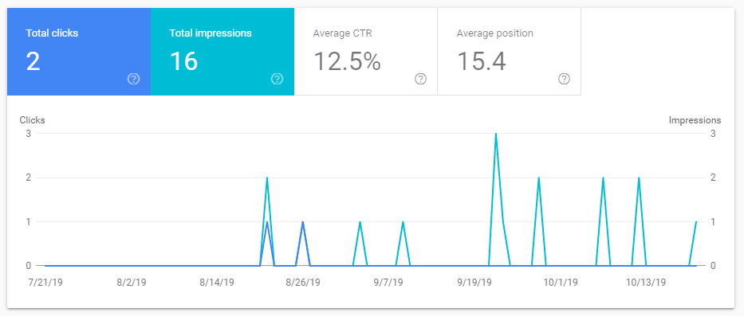

## Introduction

Running this blog made SEO one of many site responsibilities. Studying it also provides a practical view of how search engines work and how page data affects retrieval.

Many techniques described in SEO books are excessive for a personal blog, so these are study notes rather than a checklist applied to this site.

The notes focus on general web search and on what publishers can do through content and site structure, rather than on vertical-search data or proprietary ranking implementation.

## Search-engine Fundamentals

A search engine crawls pages, extracts useful information, builds an index, and incorporates that data into retrieval and ranking.

### Ranking

After receiving a query, the engine retrieves candidate pages and ranks them by relevance, authority, popularity, and other signals.

Page content is the primary relevance signal, supplemented by titles, descriptions, navigation, links, and structured metadata.

### Search Intent

Intent covers both interpreting what the user wants and selecting the pages most likely to satisfy it.

Matching requires language processing for synonyms and ambiguity. Choosing among relevant pages also uses link analysis: citations from other pages can serve as evidence of authority, although modern ranking is more nuanced than raw link count.

### Ranking Factors

Positive signals may include descriptive titles, meaningful anchor text, crawlable structure, and site-quality metrics. Inaccessibility, duplicate content, and repeated titles or tag keywords can hurt indexing and ranking.

### Vertical Search

Vertical search targets a specific domain such as images, video, shopping, blogs, or maps.

Modern “universal search” blends these vertical results into general web results.

## Goals and Audience

### Define the Goal

SEO may aim to build brand value, increase qualified traffic, or improve return on investment.

### Define the Scenario and Audience

Different goals and audiences require different strategies.

Organic discovery depends primarily on useful content. Reputation management for a person or company may instead involve social profiles, news coverage, and consistent entity information.

Users in different regions, industries, and demographic groups may describe the same need with different queries.

## Technical Preparation

### Information Architecture

An unnecessarily complex architecture can prevent crawlers from discovering and understanding content.

Technical concerns include stable URLs, tracking parameters, unnecessary URL punctuation, JavaScript-rendered content, and content hidden behind interactive controls.

Structural concerns include clear page topics, useful internal links, descriptive anchor text, and shallow navigation depth.

These technologies are not forbidden; their crawlability and indexing consequences must simply be understood.

### Analytics

Server logs and webmaster tools reveal traffic, search queries, crawl behavior, and popular pages.

## Keyword Research

### Keyword Value

One useful question is:

> How many people who search for this term will reach your site and leave disappointed?

Good SEO represents the actual content instead of pursuing irrelevant traffic.

### The Long Tail

Long-tail queries are individually less frequent but collectively substantial and often less competitive. One proposed research process is:

1. Select 10–50 high-frequency seed queries.
2. Search for them across major engines.
3. Extract distinctive text from the top 10–30 results.
4. Remove stop words and filter phrases by length.
5. Remove terms already present in the research database.
6. Rank the remaining phrases by frequency and relevance.

The result identifies relevant long-tail topics that may be easier to address well.

## SEO-friendly Site Checklist

The main technical and editorial practices are:

- Provide an XML sitemap.
- Organize information and categories clearly.
- Keep important pages within a shallow link structure.
- Ensure JavaScript does not hide essential content from crawlers.
- Use subdirectories and subdomains deliberately.
- Keep URLs concise and descriptive.
- Write accurate titles and metadata.
- Describe image and video assets appropriately.
- Avoid unnecessary duplicate content.

## Google Search Console

Google Search Console and Bing Webmaster Tools let publishers submit site information and inspect sitemaps, impressions, click-through rates, queries, indexing, and crawl problems.

For example, Search Console provides the queries that most often lead users to the site.

## Understanding SEO Plugins

Currently, this blog uses [Rank Math](https://s.rankmath.com/home), a feature-rich free plugin that exposes settings and scores each article against an SEO checklist.

It previews search-result appearance and checks fields and heuristics such as keyword placement and content length. I do not rewrite articles merely to satisfy these scores.

The checklist nevertheless reveals the plugin authors' model of search relevance and can provide ideas when designing a retrieval system.

## Reading List

- [The Art of SEO (Chinese edition)](https://book.douban.com/subject/24722613/)
- [SEO in Practice (Chinese)](https://book.douban.com/subject/5348144/)
