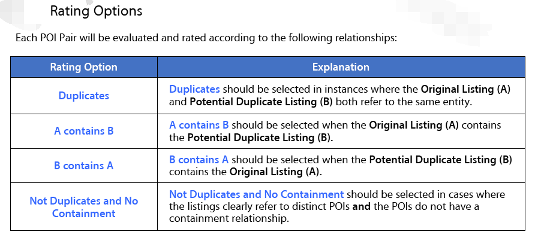

import Embed from "@/components/Embed.astro";
import Gallery from "@/components/Gallery.astro";

## Introduction

Maintaining this blog introduced me to SEO, while search-labeling projects introduced me to relevance judgments. My work on vertical-search algorithms connects both topics to retrieval-system design.

These three areas form one feedback loop, which this article attempts to outline.

## How the Areas Relate

<Embed src="https://www.lucidchart.com/documents/embeddedchart/dc0239ef-83ef-40ba-a9e5-bd002273b45b" height={480} />

Some parts of the loop are less visible in particular industries. Map search, for example, depends heavily on names and addresses. Addresses leave little room for optimization, but business names still influence discovery.

A restaurant in an alley 300 meters from Xidan Joy City might append “Xidan Joy City Branch” rather than the obscure alley name. That improves local-search recall, although changing a real business name solely for SEO carries obvious costs.

## Search Engines

From a user's perspective, a search engine collects documents or products and finds them from a query.

For a developer, the pipeline includes acquisition, cleaning, indexing, retrieval, and ranking. Data cleaning intersects with SEO: useful publisher-supplied metadata can improve results, while manipulative optimization can push irrelevant results upward unless detected.

Understanding SEO is therefore valuable when designing data-cleaning and anti-spam rules.

## SEO

SEO is less prominent in vertical search but still exists. Improving descriptive data can be done by the publisher or inferred by the engine. Understanding abusive tactics helps the engine clean data, adjust ranking, and avoid poor results.

### White-hat SEO

White-hat practices improve accessibility, content, and metadata for long-term value without attempting to deceive the engine.

### Black-hat SEO

Black-hat SEO uses deceptive techniques for short-term ranking gains.

Keyword stuffing, for example, attempts to exploit term-based relevance features.

## Search-labeling Platforms

Search labeling can be divided into three broad task types:

1. **Data-quality labeling:** verify the accuracy and consistency of records.
2. **Ideal-result labeling:** given a query and context, select the appropriate results directly.
3. **Result-quality judgment:** rate results returned by the current engine.

### Data-quality Labeling

Quality covers attribute correctness, schema compliance, conflicts, duplicates, and relationships between records.

Whether data comes from specialists or crawlers, it must be cleaned before indexing.

Automated rules are stable but grow difficult to maintain. Machine-learning methods need sufficient labeled data. Human review remains valuable, especially for map data where correctness expectations are high.

Map records can be duplicates, but one record can also contain another spatially or logically—for example, a shopping center and its south entrance.

Duplicate records can be merged or one can be demoted to avoid redundant top results. Containment may instead require grouped presentation: a query for “shopping mall” should return distinct malls, not one mall followed by every shop inside it.

### Ideal-result Labeling

Annotators receive a query and context and choose appropriate results. The output can pin answers for frequent queries or become a test and training set.

This works especially well in vertical domains with manageable datasets and clear intent, such as map search, where judgments can immediately improve high-value queries.

### Result-quality Judgment

Here annotators receive both the query and an engine-produced result and rate their match.

The improvement is less immediate than selecting ideal results, but each task is easier because it judges one query–result pair instead of searching the entire corpus.

<Gallery
  images={[
    { src: "../../../assets/wp-content/uploads/2019/10/rating_search.png", caption: "Straight-line distance from the user as a map-search relevance factor" },
    { src: "../../../assets/wp-content/uploads/2019/10/rating_search3.png", caption: "Viewport-relative distance can follow the screen boundary rather than a circle" },
  ]}
/>

The diagrams show two distance models for map-search relevance: one centered on the user's physical location and one centered on the current map viewport, with different distance-growth behavior.

#### Choosing the Center

Distance should reflect intent. If a user pans to People's Square and searches for cafés, results should be centered on the viewport rather than the user's current physical location.

A query such as “People's Square café” requires the engine to infer the same target location from text.

#### Distance Growth

For user-centered search, straight-line distance from a known point is efficient; computing travel time for every candidate may be too expensive.

For viewport-centered search, the exact target may be anywhere on screen. Treat matching features inside the viewport as equally local, then degrade relevance by distance outside the viewport boundary.

## Summary

A useful labeling platform is more than a right-or-wrong form. Its task definitions must connect directly to desired ranking improvements. Conversely, the details of a labeling workflow often reveal the relevance features and product assumptions of the search engine it supports.
