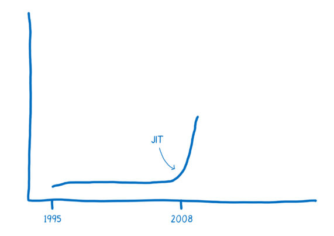
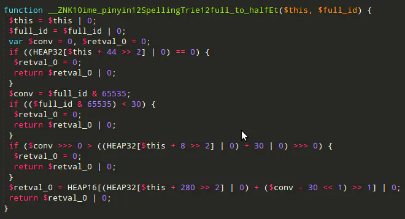
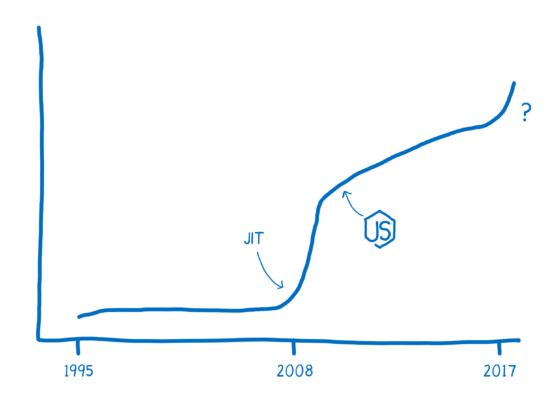
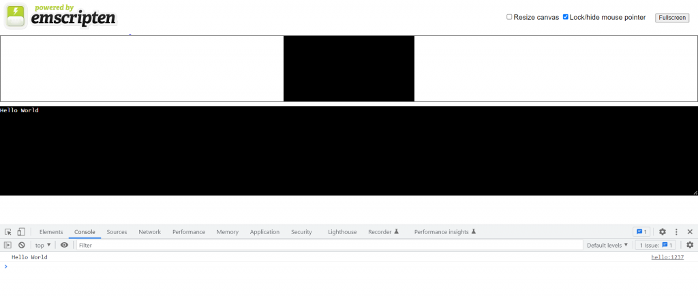
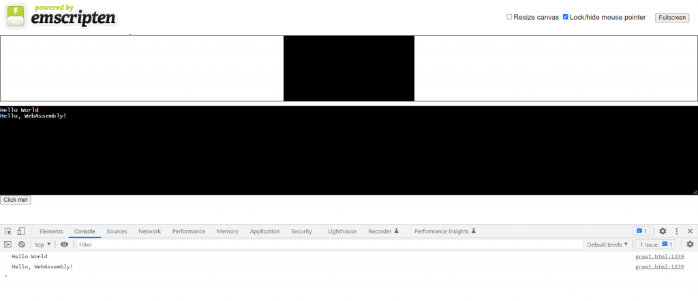
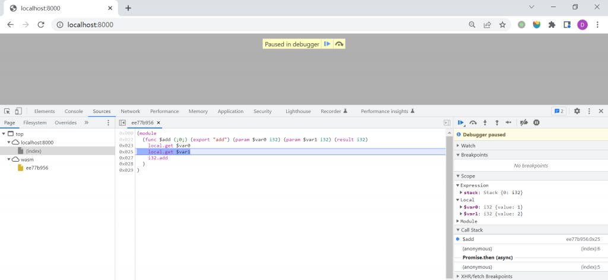

[WebAssembly](https://webassembly.org/) (Wasm) is a portable binary instruction format designed for safe and efficient execution. [MDN](https://developer.mozilla.org/en-US/docs/WebAssembly) describes it as:

> A compact, low-level compilation target that runs in modern browsers at near-native speed and interoperates with JavaScript.

Languages with an appropriate compiler can target Wasm and run in the browser. Mozilla, Google, Microsoft, and Apple collaborated on the design, and Firefox, Chrome, Edge, and Safari converged on support in 2017—an unusual degree of agreement around a technology that was not yet standardized.


On December 5, 2019, WebAssembly became a W3C Recommendation alongside the web's established core technologies.

## Before WebAssembly

JavaScript was created in 1995 to make HTML pages dynamic, not to serve as a high-performance systems target. As the web expanded into image processing, video, and 3D rendering, browser vendors competed to execute it faster.

### The Browser Performance Race

Chrome's 2008 release popularized JIT compilation through [V8](https://v8.dev/). Apple followed with JavaScriptCore/Nitro, Mozilla with TraceMonkey, and Microsoft with Chakra.

A JIT identifies hot code, compiles it to machine instructions, caches the result, and may run an optimizing compiler for the hottest paths. See [A crash course in just-in-time compilers](https://hacks.mozilla.org/2017/02/a-crash-course-in-just-in-time-jit-compilers/).

JavaScript performance improved rapidly:



Faster engines enabled richer media, games, and server-side JavaScript. JIT is not free: compiled code consumes memory, and optimization depends on stable type assumptions that dynamic JavaScript can violate. Consider:

```js
function arraySum(arr) {
  var sum = 0;
  for (var i = 0; i < arr.length; i++) {
    sum += arr[i];
  }
}
```

Optimizing `sum += arr[i]` requires assumptions about whether the operation is numeric addition or string concatenation. The engine guards those assumptions and discards optimized code when a different type appears, a process called **deoptimization** or bailing out:

```js
arr = [1, "hello"];
```

Repeated optimization and deoptimization can erase the expected benefit.

High-performance applications therefore motivated execution formats beyond ordinary JavaScript.

### Google's NaCl and PNaCl

Google open-sourced [Native Client](https://developer.chrome.com/docs/native-client/nacl-and-pnacl/) in 2008 and enabled it in Chrome 14. NaCl ran an AOT-compiled safe subset of native code inside a sandbox and communicated with JavaScript through PPAPI. Performance approached native applications, but architecture-specific binaries harmed portability.

Portable Native Client (PNaCl) instead distributed platform-independent [LLVM IR](https://llvm.org/docs/LangRef.html), with final compilation occurring for the target machine.

PNaCl anticipated several WebAssembly ideas, but browser-native code remained controversial and the ecosystem did not converge on Google's plugin interface.

Chrome removed PNaCl support in 2018 in favor of WebAssembly.

### Mozilla's asm.js

At Mozilla, Alon Zakai created [Emscripten](https://emscripten.org/) to compile C and C++ programs, including game engines, into JavaScript.

Unlike a conventional native compiler, the original Emscripten operated as a source-to-source compiler targeting JavaScript.

Its browser compatibility led to [asm.js](http://asmjs.org/) in 2013 and Firefox's OdinMonkey optimization path.

asm.js is a statically typed, allocation-disciplined subset of JavaScript designed for predictable JIT optimization. For example, this C function:

```c
int f(int i) {
  return i + 1;
}
```

can become:

```js
function f(i) {
  i = i | 0;
  return (i + 1) | 0;
}
```

The `|0` coercions make integer types explicit and let specialized engines skip much inference. Because asm.js remains valid JavaScript, it can run in any browser, albeit more slowly without dedicated optimization.

Its text format is large and slow to parse, and generated type annotations make it unreadable:



Even heavily optimized asm.js remains constrained by JavaScript syntax and execution semantics.

### Other Attempts

Other attempts included Dartium, a browser with a native Dart VM. Google abandoned the browser strategy in 2015; Dart later found a major role in Flutter.

### WebAssembly's Synthesis

WebAssembly combined lessons from NaCl/PNaCl and asm.js:

- A compact binary format that decodes quickly and executes efficiently
- A portable compilation target suitable for many source languages and LLVM-based toolchains
- Emscripten support and, historically, an asm.js fallback
- Natural JavaScript and Web API interoperability without a separate plugin API

The project was named WebAssembly in 2015, shipped across major browsers in 2017, and became a W3C standard in 2019.



## Getting Started

Many languages compile to Wasm; the official [developer guide](https://webassembly.org/getting-started/developers-guide/) lists available toolchains. The following example focuses on [C/C++](https://developer.mozilla.org/en-US/docs/WebAssembly/C_to_wasm), with corresponding guides available for [Rust](https://developer.mozilla.org/en-US/docs/WebAssembly/Rust_to_wasm) and [Go](https://github.com/golang/go/wiki/WebAssembly).

### Compiling C/C++ to WebAssembly

Install the [Emscripten SDK](https://emscripten.org/) using its [setup documentation](https://emscripten.org/docs/getting_started/downloads.html), then verify the environment:

```text
$ emcc --check
emcc (Emscripten gcc/clang-like replacement + linker emulating GNU ld) 3.1.24 (68a9f990429e0bcfb63b1cde68bad792554350a5)
shared:INFO: (Emscripten: Running sanity checks)
```

Create `hello.c`:

```c
#include <stdio.h>

int main() {
    printf("Hello World\n");
    return 0;
}
```

Compile it with `emcc`:

```text
$ emcc hello.c -o hello.html
```

This generates:

- `hello.wasm`: the WebAssembly binary
- `hello.js`: JavaScript glue code that loads and calls the module
- `hello.html`: a development page displaying the result

The page must be served over HTTP because browser security rules prevent the required module fetches from a `file://` page.

Start a local server with npm:

```text
$ npx serve .
```

or Python:

```text
$ python3 -m http.server
```

Open `hello.html`:



The C program's output now appears in the browser.

Functions can also be exported for JavaScript. Emscripten keeps `main()` by default; mark another function with `EMSCRIPTEN_KEEPALIVE` in `greet.c`:

```c
#include <stdio.h>
#include <emscripten/emscripten.h>

int main() {
    printf("Hello World\n");
    return 0;
}

#ifdef __cplusplus
#define EXTERN extern "C"
#else
#define EXTERN
#endif

EXTERN EMSCRIPTEN_KEEPALIVE void greet(char* name) {
    printf("Hello, %s!\n", name);
}
```

Export the `ccall` runtime method and keep the runtime alive:

```text
$ emcc -o greet.html greet.c -s NO_EXIT_RUNTIME=1 -s EXPORTED_RUNTIME_METHODS=ccall
```

Add a button to the generated page:

```html
<button id="mybutton">Click me!</button>
```

Call `greet()` through the exported `ccall` method:

```js
document.getElementById("mybutton").addEventListener("click", () => {
  const result = Module.ccall(
    "greet", // name of C function
    null, // return type
    ["string"], // argument types
    ["WebAssembly"] // arguments
  );
});
```

> Exporting `cwrap` as well creates a reusable JavaScript wrapper around a C function, whereas `ccall` performs one direct call.

Clicking the button prints the greeting on the page and in the console.



## WebAssembly Text Format

The compact `.wasm` binary is not convenient to inspect. WebAssembly therefore defines both a [binary format](https://webassembly.github.io/spec/core/binary/index.html) and the editable, assembly-like [WebAssembly Text Format](https://webassembly.github.io/spec/core/text/index.html), commonly stored as `.wat`.

Example:

```text
(module
  (func $add (param $lhs i32) (param $rhs i32) (result i32)
    local.get $lhs
    local.get $rhs
    i32.add)
  (export "add" (func $add))
)
```

A Wasm module is represented by nested S-expressions. This module defines the equivalent of `i32 add(i32 lhs, i32 rhs)` and exports it as `add`. See [Understanding WebAssembly text format](https://developer.mozilla.org/en-US/docs/WebAssembly/Guides/Understanding_the_text_format).

Save it as `add.wat` and use [WABT](https://github.com/WebAssembly/wabt)'s [wat2wasm](https://webassembly.github.io/wabt/doc/wat2wasm.1.html) to compile it:

```text
$ wat2wasm add.wat -o add.wasm
```

Load the module and call `add()`:

```js
fetchAndInstantiate("add.wasm").then(function (instance) {
  console.log(instance.exports.add(1, 2)); // "3"
});

// fetchAndInstantiate() found in wasm-utils.js
function fetchAndInstantiate(url, importObject) {
  return fetch(url)
    .then(response => response.arrayBuffer())
    .then(bytes => WebAssembly.instantiate(bytes, importObject))
    .then(results => results.instance);
}
```

When served from an HTML page, the console prints 3. Chrome DevTools can also [debug Wasm modules](https://developer.chrome.com/blog/wasm-debugging-2020/).



## WebAssembly Outside the Browser

WebAssembly's portability, sandboxing, and efficiency also make it useful outside browsers. [WASI](https://wasi.dev/), the WebAssembly System Interface, defines capabilities for those environments.

Running a WASI module requires a compatible runtime such as [Wasmtime](https://wasmtime.dev/), [Wasmer](https://wasmer.io/), or [WasmEdge](https://wasmedge.org/). Their SDKs embed Wasm modules in many host languages.

## References

- [WebAssembly official site](https://webassembly.org/)
- [WebAssembly | MDN](https://developer.mozilla.org/zh-CN/docs/WebAssembly)
- [WebAssembly Chinese community site](http://webassembly.org.cn/)
- [WebAssembly Design Documents](https://github.com/WebAssembly/design)
- [WebAssembly Specification](https://webassembly.github.io/spec/core/index.html)
- [WebAssembly on Wikipedia](https://en.wikipedia.org/wiki/WebAssembly)
- [Introduction to asm.js and Emscripten (Chinese)](https://www.ruanyifeng.com/blog/2017/09/asmjs_emscripten.html)
- [How browsers work: Chrome V8 (Chinese)](https://king-hcj.github.io/2020/10/05/google-v8/)
- [A complete introduction to WebAssembly (Chinese)](https://www.cnblogs.com/detectiveHLH/p/9928915.html)
- [A brief history of WebAssembly (Chinese)](https://github.com/ErosZy/md/blob/master/WebAssembly%E4%B8%93%E6%A0%8F/1.%E6%B5%85%E8%BF%B0WebAssembly%E5%8E%86%E5%8F%B2.md)
- [A cartoon intro to WebAssembly Articles](https://hacks.mozilla.org/category/code-cartoons/a-cartoon-intro-to-webassembly/)
- [WebAssembly from a Beginner's Perspective](https://zhuanlan.zhihu.com/p/102692865)
- [Getting Started Quickly with WebAssembly Using Docker and Golang](https://soulteary.com/2021/11/21/use-docker-and-golang-to-quickly-get-started-with-webassembly.html)
- [How Should We Evaluate the Browser's WebAssembly Bytecode Technology?](https://www.zhihu.com/question/31415286)
- [How Should We View WebAssembly?](https://www.zhihu.com/question/362649730)
- [Learning WebAssembly Systematically, Part 1: Theory](https://zhuanlan.zhihu.com/p/338261741)
- [How to Learn the WebAssembly Project with Nearly 11K Stars](https://juejin.cn/post/7013286944553566215)
- [WebAssembly and JIT](https://tate-young.github.io/2020/03/02/webassembly.html)
- [An Initial Exploration of WebAssembly](https://codechina.gitcode.host/programmer/2017/programmer-2017-55.html)
- [WebAssembly in Practice: Bringing Go and JavaScript Together in the Browser](https://medium.com/starbugs/run-golang-on-browser-using-wasm-c0db53d89775)
