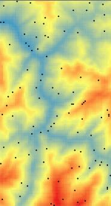

接上篇的计算原理，本篇主要介绍如何通过 C# 来实现这样的算法。

## 程序下载

[克里金插值及DEM等高线生成](/wp-content/uploads/2019/08/%E5%85%8B%E9%87%8C%E9%87%91%E6%8F%92%E5%80%BC%E5%8F%8ADEM%E7%AD%89%E9%AB%98%E7%BA%BF%E7%94%9F%E6%88%90.zip)[Download](/wp-content/uploads/2019/08/%E5%85%8B%E9%87%8C%E9%87%91%E6%8F%92%E5%80%BC%E5%8F%8ADEM%E7%AD%89%E9%AB%98%E7%BA%BF%E7%94%9F%E6%88%90.zip)

---

## 回顾算法流程

1. 求取已知点的距离以及点对的半方差
2. 筛选第一步求取的结果，计算出几个均值点，用于拟合
3. 选定拟合模型，为了方便代码实现，我选择了指数模型
4. 用指数模型去拟合第二步得出的均值点，得出偏基台值 $c$ 和主变程值 $r$
5. 根据拟合得到的模型，按照公式通过已知点高程计算位置点高程

---

## 通过C#实现的难点

在试图实现这个算法的过程中，首先碰到的难题是算法不懂，但是这个问题已经解决了。接下来的难题是，如何用C#进行离散点的拟合，以及如何高效的实现算法中公式的矩阵运算。

为了解决以上的问题，我利用了网络上的C#的数学库，比较好的有：开源的“**Math.NET**”，以及收费的“**ILNumerics**”，我选用了“**Math.NET**”。

如何将Math.NET加入到自己的项目中：参考网页：[Math.NET Numerics](https://www.nuget.org/packages/MathNet.Numerics/%20Math.NET%20Numerics)

在VS的主界面上，选择“工具”=>“NuGet程序包管理器”=>“程序包管理器控制台”，可以看到这样的界面：


输入“Install-Package MathNet.Numerics”后，回车，等待片刻即可。

---

## 算法实现

### 求取已知点的距离以及点对的半方差

点对的半方差计算公式：

$$
Semivariogram(distance_h)={1\over2}∗(value_i-value_j)^2
$$

计算结果为一堆横坐标为$distance_h$，纵坐标为$Semivariogram(distance_h)$的点。

将这些点按照横坐标分为约10份，（此处可按照实际情况修改），计算每个区间里的点的横坐标纵坐标均值，这样就能得到10个点代表刚刚的整个计算结果。

如果点数过多，拟合的效果以及效率会受到影响。

### 拟合刚刚计算得到的点

拟合的方法我参考了文章”使用Math.NET求解线性和非线性最小二乘问题“，原链接已失效，读者可以尝试下根据文章标题搜索一下。这篇文章翻译自” Linear And Nonlinear Least-Squares With Math.NET “，同样失效，自行搜索。

我提取了文章中的高斯牛顿法实现的拟合算法，主要由“GaussNewtonSolver”类和“PowerModel”类组成，读者也可以试着使用示例代码所提供的别的拟合算法来完成。

下图是我的DEM：



我在已知的DEM上选取随机点，再利用这些随机点进行插值，方便比较计算结果与原始值。

下图是这些随机点的半方差拟合结果：


红色的点是初始计算的结果，实际上已经做过一次筛选了，因为选取的随机点约100个，初步计算出来的半方差值约有9900个。蓝色的叉叉是再次筛选后的结果，每隔10个单位的区间计算一个平均点。深蓝色的线即为对蓝色叉叉的拟合。

**实际上，我用同样的离散点在ArcGIS中做一次插值，我的拟合结果与ArcGIS的拟合结果有一定差距，偏基台值基本一致，主变程值只有ArcGIS的拟合结果的一半，如果追求准确的插值结果，需要考虑对拟合算法的优化。**

### 根据拟合模型计算未知点高程

以下提到的数学参数请对照上篇《实现克里金(kriging)插值（一）计算原理》一文中的定义。

定义方法：

```csharp
private double CalCij(double x1, double y1, double x2, double y2)
{
	double distance = Math.Sqrt(
		Math.Pow(x1 - x2, 2) + Math.Pow(y1 - y2, 2));
	if (distance == 0)
	{
		return formula_c;
	}
	else
	{
		return formula_c* Math.Exp(-distance / formula_r);
	}
}
```

计算两点之间的$C_{ij}$值，$c_{ij}=c−r(h_{ij})$，其中 $r(h_{ij})$ 就是上一步中拟合得到的模型结果，$c$ 就是模型结果中的一个值。

计算矩阵 $K$：

```csharp
//size为已知点的个数
var K = new DenseMatrix(size, size);
for (int m = 0; m < size; m++)
		for (int n = 0; n < size; n++)
			K[m, n] = CalCij(
			 pointList[m].X,
			 pointList[m].Y, 
			 pointList[n].X,
			 pointList[n].Y);
```

计算矩阵 $K$ 的逆矩阵$K^{-1}$：

```csharp
Kn = K.Inverse();
```

假设求坐标为 $(m,n)$ 的未知点的高程：

1. 计算向量 $D$：

```csharp
var D = new DenseVector(size);
for (int p = 0; p < size; p++)
	D[p] = CalCij(randomPointList[p].point.X,
		randomPointList[p].point.Y, m, n);
```

2. 计算$λ(i)$，表示第 $i$ 个已知点对当前未知点的影响权重：

```csharp
var namuta = Kn.LeftMultiply(D);
```

3. 计算 $Z(x_i)$，即为第 $i$ 个点的高程值：

```csharp
for (int q = 0; q < size; q++)
	interpolationDEMData[m, n] += 
		namuta[q] * randomPointList[q].altitudeValue;
```

至此，坐标为 $(m,n)$ 的未知点的高程就求得了，存在了 $interpolationDEMData$ 数组中。

下图为插值结果：


结果与原始数据相比较，还是比较准确的。
