本文翻译自[《How to project decals》](http://blog.wolfire.com/2009/06/how-to-project-decals/)。

开头省略200字寒暄，作者介绍了自己在[编辑器](http://blog.wolfire.com/2009/06/decals-editor-part-three/)中如何实现贴花功能的。本文将对“如何对一个复杂几何体进行贴花投影”的算法做一个概览。以这样的一个场景为例：

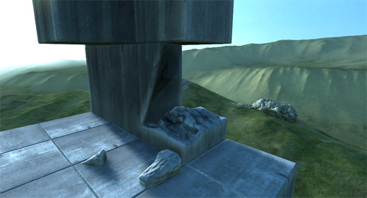

我想在这个模型的表面添加一些轻微的风化效果。为了将这样的效果以贴花的方式显示在模型的表面上，我需要指定一个投影的方式。投影方式实际上就是一个 3D 的立方体，包含 3 个属性：尺寸，位置，方向。方向属性可能会有点令人困惑，对于贴花投影而言，我将方向属性定义为基于正交坐标系下的三维向量。比如：使用一个有 xyz 轴的坐标系，分别表示“向前”，“向上”，“向右”的分量。这样足以表示一个三维空间的方向，并且比起矩阵或者四元组更容易理解。

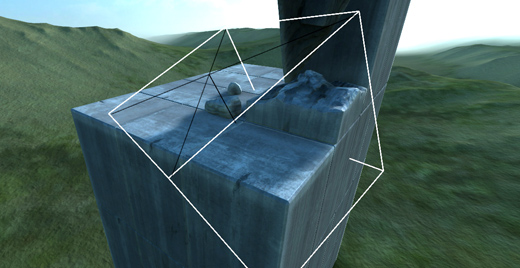

贴花投影的关键在于，要贴合模型的几何形状，你要“贴”上去。换个角度考虑，你可以再创建一个一样的模型，并切掉投影区域外的部分。这样考虑问题就简单多了，并且知道了该如何动手。所以我们可以首先计算整个场景中，与投影区域相交的三角面。可以先暴力实现，如果没问题再改成基于八叉树的实现。这样算法复杂度会从O(*n*) 降为 O(log*n*)。

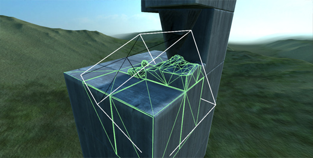

接下来是最难的部分：需要对三角形进行裁剪，避免它们超出投影区域。为什么这一点很重要？想象一下向一面由两个三角面组成的墙壁射击一千次，也就是渲染一千个弹孔贴花，如果不对三角形进行裁剪，就需要对整面墙大小的区域绘制一千次。由于屏幕上的墙要比弹孔大很多，会导致占用过多的填充率，并拖累帧率。因此，对三角形进行裁剪，可以最小化对帧率的影响。

既然确认裁剪贴花的三角形是值得一做的，那就动手吧。使用三维的立方体裁剪一个任意的三角形还是有点难度的。为了让这个问题简单一点，可以先从 2D 的角度考虑。我们可以先将三角形从世界坐标系变换为投影区域的本地坐标系，裁剪后再变换回去。对于投影区域的本地坐标系而言，投影区域可以看作是一个从 (0,0) 到 (1,1) 的矩形，像这样：

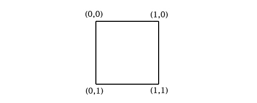

处于投影区域中的三角形看起来像这样：

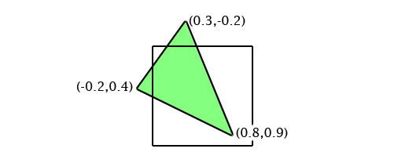

所以接下来要做的就是使用这个矩形来裁剪三角形。这个任务可以进一步分解。我们依次考虑投影区域的每一条边。那就从靠左的边开始。为了裁剪三角形，需要找出那些超出这条边的顶点，在上图的例子中，最左的顶点超出了这条边，我们对最左的顶点打个标记。接下来遍历每一条被标记的顶点和未被标记的顶点之间的连线，在这些连线与边的相交处添加新的顶点。

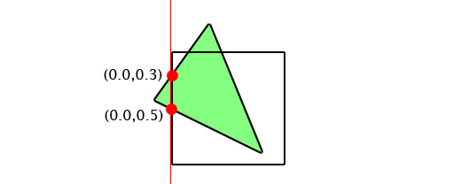

可以把被标记的顶点移除。再来看下一条边。

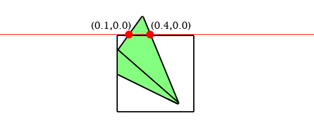

当我们检查完每一条边之后，我们就得到了一个裁剪后的三角形。

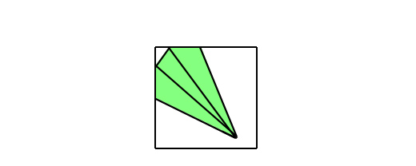

当处理完每个三角形后，再将它们变换回世界坐标系中，我们就可以得到裁剪后的贴花网格了。

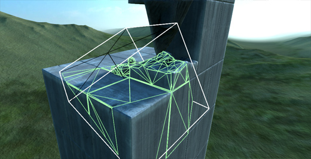

如果我们将这些三角形的顶点在投影区域的坐标系中的坐标保留下来，你会发现，这些坐标实际上就是纹理的坐标。这也是为什么，在上面的步骤中，将投影区域看作一个从 (0,0) 到 (1,1) 的矩形，这恰好是 OpenGL 中纹理的坐标区间。下图是将测试纹理加载到贴花网格上的效果。

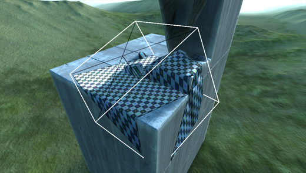

接下来就把真正的贴花纹理放上来，任务完成了！

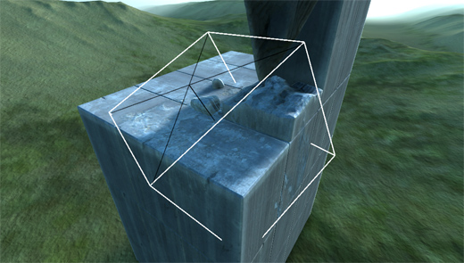

这是在最初的相机视角下的贴图效果。风化效果确实很轻微，但是我认为这样的额外细节能够让受风化的区域看起来更加的逼真。没有比这个更好的方式来将效果作用于一块区域了。

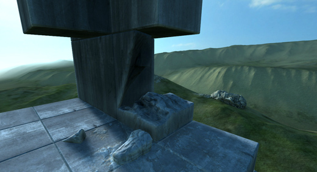

以上就是贴花投影在 Overgrowth 中的工作原理的概述。如果你不熟悉线性代数，可能会对如何将三角形从一个坐标系转换到另一个坐标系以及为什么拥有完善的方向表示方式很重要感到困惑。
