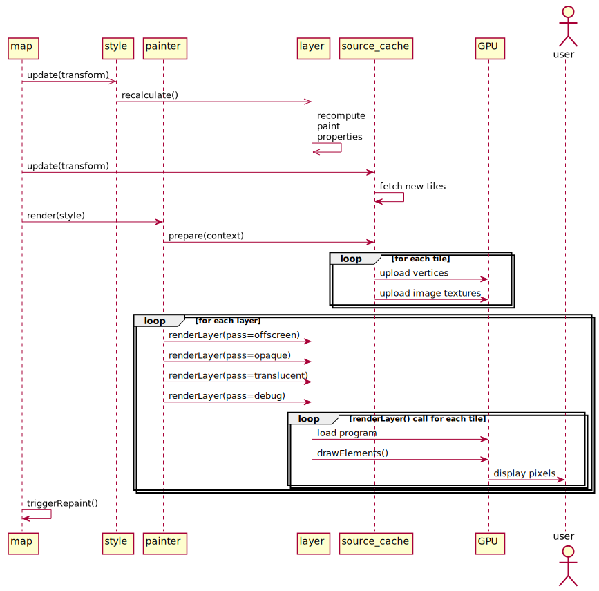

**本篇文章翻译自 [maplibre/maplibre-gl-js 项目的《life-of-a-tile》](https://github.com/maplibre/maplibre-gl-js/blob/main/docs/life-of-a-tile.md)。文中的超链接，对应到 Mapbox 的 v1.13.2 版本。**

本篇文章将说明在 Mapbox 中，一个瓦片的加载流程，整个过程可以分为3个部分：

- **Event loop：**由用户交互触发，并更新 map 内部的信息，例如 viewport，相机视角等。
- **Tile loading：**异步请求当前地图所需要的瓦片，图片，字体等数据。
- **Render loop：**将当前状态的地图渲染到屏幕上。

理想状况下，Event loop 和 Render loop 以60帧每秒的速度运转，类似 Tile loading 等重活，会放在 web worker 中异步执行。

---

## Event Loop

### Transform

[Transform](https://github.com/mapbox/mapbox-gl-js/blob/release-v1.13.2/src/geo/transform.js) 中保存了当前地图视角的信息（pitch, zoom, bearing, bounds 等）。代码中有2个地方能够直接更新 transform 的状态：

- [Camera](https://github.com/mapbox/mapbox-gl-js/blob/release-v1.13.2/src/ui/camera.js)（[Map](https://github.com/mapbox/mapbox-gl-js/blob/release-v1.13.2/src/ui/map.js) 的父类）中的 [Camera#panTo](https://github.com/mapbox/mapbox-gl-js/blob/release-v1.13.2/src/ui/camera.js#L211)，[Camera#setCenter](https://github.com/mapbox/mapbox-gl-js/blob/release-v1.13.2/src/ui/camera.js#L173) 等方法被调用时。
- [HandlerManager](https://github.com/mapbox/mapbox-gl-js/blob/release-v1.13.2/src/ui/handler_manager.js) 响应 DOM 事件。HandlerManager 将这些事件转发到 [src/ui/handler](https://github.com/mapbox/mapbox-gl-js/tree/release-v1.13.2/src/ui/handler) 中的交互处理模块，这些 handlers 的事件将合并为 [HandlerResult](https://github.com/mapbox/mapbox-gl-js/blob/release-v1.13.2/src/ui/handler_manager.js#L70) 并触发一次渲染。并结合 [HandlerInertia](https://github.com/mapbox/mapbox-gl-js/blob/release-v1.13.2/src/ui/handler_inertia.js) 来实现地图的惯性操作（比如快速拖动地图，松开鼠标后地图会出于惯性继续移动一段距离）。

### Camera 和 HandlerManager

Camera 和 HandlerManager 都可以在更新了 transform 的状态后，抛出 <mark>`move`</mark>，<mark>`zoom`</mark>，<mark>`movestart`</mark>，<mark>`moveend`</mark> 等事件。这些事件，包括其他的事件，例如样式更改或者数据加载完成的事件，都将触发对 [Map#_render()](https://github.com/mapbox/mapbox-gl-js/blob/release-v1.13.2/src/ui/map.js#L2439) 的调用，并渲染一帧地图画面。

---

## Tile loading

[Map#_render()](https://github.com/mapbox/mapbox-gl-js/blob/release-v1.13.2/src/ui/map.js#L2439) 会以2种不同的方式执行，取决于 `map._sourcesDirty` 的值。当 _sourcesDirty 为 true 时，_render() 首先要询问每个 source，是否需要请求新的数据。_sourcesDirty 为 false 时的情况将在下一节介绍。

### 请求

地图中的每个 source 对应着一个 sourceCache，调用这些 [https://github.com/mapbox/mapbox-gl-js/blob/release-v1.13.2/src/source/source_cache.js#L474](https://github.com/mapbox/mapbox-gl-js/blob/release-v1.13.2/src/source/source_cache.js#L474)[SourceCache#update(transform)](https://github.com/mapbox/mapbox-gl-js/blob/release-v1.13.2/src/source/source_cache.js#L474)，得到理想状况下可以覆盖整个地图窗口范围的瓦片编号，如果存在没有请求过的瓦片，则发出请求。如果当前编号对应的瓦片不存在，则请求涵盖当前区域并且 z 值更小的瓦片。

### 解析

调用 `Source#loadTile(tile, callback)` 来加载缺失的瓦片，不同类型的 source 加载方式不一样：

#### [RasterTileSource](https://github.com/mapbox/mapbox-gl-js/blob/release-v1.13.2/src/source/raster_tile_source.js)

通过 [src/util/ajax](https://github.com/mapbox/mapbox-gl-js/blob/release-v1.13.2/src/util/ajax.js) 来触发 getImage 请求，src/util/ajax 维护着一个请求队列，用于控制同时进行中的请求数量。

#### [RasterDEMTileSource](https://github.com/mapbox/mapbox-gl-js/blob/release-v1.13.2/src/source/raster_dem_tile_source.js)

和上面的一样，首先请求图像数据，接着向 web worker 发出 loadDEMTile 消息。因为需要从图像数据中读取像素的信息，必须要将图像绘制到 canvas 上，这一步的性能开销比较大，所以当浏览器支持 OffscreenCanvas 时，这一步将在 web worker 中执行，否则直接在主线程上执行。

在 web worker 内，通过 [RasterDEMTileWorkerSource#loadTile](https://github.com/mapbox/mapbox-gl-js/blob/release-v1.13.2/src/source/raster_dem_tile_source.js#L42) 将原始的 rgb 数据加载到一个 [DEMData](https://github.com/mapbox/mapbox-gl-js/blob/release-v1.13.2/src/data/dem_data.js) 实例中，并填充瓦片边缘 1px 的区域来避免闪烁的现象。最后将数据传回到主线程中。

#### [VectorTileSource](https://github.com/mapbox/mapbox-gl-js/blob/release-v1.13.2/src/source/vector_tile_source.js)

向 web worker 发出 loadTile 或者 reloadTile 的消息，在 web worker 内，[Worker#loadTile](https://github.com/mapbox/mapbox-gl-js/blob/release-v1.13.2/src/source/worker.js#L99) 收到消息并传递给 [VectorTileWorkerSource#loadTile](https://github.com/mapbox/mapbox-gl-js/blob/release-v1.13.2/src/source/vector_tile_source.js#L184)。

调用 [VectorTileWorkerSource#loadTile](https://github.com/mapbox/mapbox-gl-js/blob/release-v1.13.2/src/source/vector_tile_source.js#L184)，内部的处理逻辑为：

- 通过 [ajax#getArrayBuffer()](https://github.com/mapbox/mapbox-gl-js/blob/release-v1.13.2/src/util/ajax.js#L261) 获取二进制数据；
- 通过 [pbf](https://github.com/mapbox/pbf) 解码 protobuf；
- 通过 [@mapbox/vector-tile#VectorTile](https://github.com/mapbox/vector-tile) 解析矢量瓦片中的数据；
- 将结果传入到一个新的 [WorkerTile](https://github.com/mapbox/mapbox-gl-js/blob/release-v1.13.2/src/source/worker_tile.js) 实例中。

调用 [WorkerTile#parse()](https://github.com/mapbox/mapbox-gl-js/blob/release-v1.13.2/src/source/worker_tile.js#L66)。在 web worker 里，根据瓦片的 id 接收上面的处理结果：

- 对于每个矢量瓦片的 source layer，对应的 source layer 当前处于可见状态的图层：
  - 通过 recalculateLayers 方法计算 layout 相关的属性；
  - 调用 style.createBucket, 每种类型的图层的数据源都有一个对应的 bucket 类型的对象，bucket 类在 [src/data/bucket/*](https://github.com/mapbox/mapbox-gl-js/tree/release-v1.13.2/src/data/bucket) 目录中，它们都有同一个父类 [src/data/bucket](https://github.com/mapbox/mapbox-gl-js/blob/release-v1.13.2/src/data/bucket.js)。
  - 调用 [Bucket#populate()](https://github.com/mapbox/mapbox-gl-js/blob/release-v1.13.2/src/data/bucket.js#L78)，传入对应的 source layer 的矢量瓦片中的 features。这一步将预处理好需要从主线程加载到 GPU 的每一帧的数据。（例如：构成几何形状的三角形顶点的缓冲区）
- 到这里，大多数类型的图层已经对 features 数据做好了三角剖分的处理，不过有些图层还会有一些额外的数据依赖，所以需要等待主线程对这些数据完成处理：
  - 字体文件（Font PBFs），通过 getGlyphs 方法
    - 由运行在主线程上的 [GlyphManager](https://github.com/mapbox/mapbox-gl-js/blob/release-v1.13.2/src/render/glyph_manager.js)，管理已获取的全局文字缓存。当一个字符缺失时，要么使用 [tinysdf](https://github.com/mapbox/tiny-sdf) 在 canvas 上绘制这个字符，要么计算字符对应的 PBF 文件，并发起网络请求。
  - 图标（Icons）和图案（patterns），通过 getImages({type: ‘icon’ | ‘pattern’ }) 方法
    - 由运行在主线程上的 [ImageManager](https://github.com/mapbox/mapbox-gl-js/blob/release-v1.13.2/src/render/image_manager.js) 管理这些图像缓存，如果没有，则通过网络进行请求。

当所有的数据全都准备好时（通过 [WorkerTile#maybePrepare()](https://github.com/mapbox/mapbox-gl-js/blob/release-v1.13.2/src/source/worker_tile.js#L178) 判断），使用 [potpack](https://github.com/mapbox/potpack)，将用到的字体，图标和图像构建成一个可以加载到 GPU 的正方形矩阵，这个正方形矩阵保存在 [GlyphAtlas](https://github.com/mapbox/mapbox-gl-js/blob/release-v1.13.2/src/render/glyph_atlas.js) 和 [ImageAtlas](https://github.com/mapbox/mapbox-gl-js/blob/release-v1.13.2/src/render/image_atlas.js) 对象中。之后对每个等待以上这些数据的图层，调用 [StyleLayer#recalculate()](https://github.com/mapbox/mapbox-gl-js/blob/release-v1.13.2/src/style/style_layer.js#L198) 方法，并且：

- 在每个等待图案类资源加载的 buckets 上调用 addFeatures。
- 在每个等待 symbol 类资源的 buckets 上调用 [src/symbol/symbol_layout#performSymbolLayout()](https://github.com/mapbox/mapbox-gl-js/blob/release-v1.13.2/src/symbol/symbol_layout.js#L150)，计算得到文本图层在当前地图 zoom 级别的 layout 属性，以及根据字体形状的每个 symbol 的位置。同时保存这些 symbol 几何的三角剖分的结果。之后，每个 symbol 的碰撞盒（collision boxes）也将被计算好，用于文字和图标的碰撞检测。

将这些 buckets，featureIndex，collision boxes，glyphAtlas 和 imageAtlas 传回主线程。

#### [GeojsonSource](https://github.com/mapbox/mapbox-gl-js/blob/release-v1.13.2/src/source/geojson_worker_source.js)

和 VectorTileSource 几乎一样，向 web worker 发出 loadTile 或者 reloadTile 的消息，除了 GeojsonWorkerSource 继承 VectorTileWorkerSource 后重写了 <mark>`loadVectorData`</mark> 方法，因此不需要请求矢量瓦片并按照 pbf 规范解析，而是直接获取 geojson 数据并通过 [geojson-vt](https://github.com/mapbox/geojson-vt) 处理成类似矢量瓦片的格式，这样可以依旧使用 getTile 方法来获取主线程所需要的瓦片数据。

> 插一嘴：Mapbox 将 geojson 数据源这样处理后，一方面能够将 LOD 策略应用到 geojson 数据上，另一方面，底层的绘制逻辑只需要针对矢量瓦片这一种数据规范即可，而不需要同时考虑瓦片和 geojson 两种。

#### [ImageSource](https://github.com/mapbox/mapbox-gl-js/blob/release-v1.13.2/src/source/image_source.js)

计算出一个瓦片编号，要满足 zoom 值足够大，并且这个瓦片的边界包含了 ImageSource 的坐标范围。只有在主线程正在请求这个瓦片时，loadTile() 会返回 true。（在使用这个 source 的图层被添加到地图中时，就已经去请求这个图片了）

---

当 vector 或者 geojson 类型的 source 请求的数据返回到主线程时，会通过 [Tile#loadVectorData](https://github.com/mapbox/mapbox-gl-js/blob/release-v1.13.2/src/source/tile.js#L140) 来解析数据并存储到 buckets 中。

### 准备渲染

再回到 [SourceCache](https://github.com/mapbox/mapbox-gl-js/blob/release-v1.13.2/src/source/source_cache.js) 上，缺失的瓦片已经加载完成了，接下来就是：

- （插一嘴：应该是上面的 RasterDEMTileSource 中处理流程的后续）在 [SourceCache#_backfillDEM](https://github.com/mapbox/mapbox-gl-js/blob/release-v1.13.2/src/source/source_cache.js#L274) 中，对于每一块瓦片，复制相邻的瓦片的边缘的像素，从而避免瓦片边缘处的伪影。
- 在 source 对象层面，抛出 data {dataType: ‘source’} 事件。事件向上冒泡，经过 SourceCache，Style，Map，最终转换成为 sourcedata 事件，并且会调用 Map#_update()，进而触发 Map#triggerRepaint()，最终触发 Map#_render() 来渲染新的一帧，这一帧的渲染流程和用户手动触发相机视角变化导致的渲染是一样的。

---

## Render loop

当 _sourcesDirty 为 false 时，map#_render() 将会直接在主线程上渲染新的一帧：

- 调用 [Style#update()](https://github.com/mapbox/mapbox-gl-js/blob/release-v1.13.2/src/style/style.js#L381)，进而调用每个图层的 <mark>`recalculate()`</mark> 方法，根据当前的 zoom 和 transition 状态重新计算 paint 属性值。
- 通过 [SourceCache#update(transform)](https://github.com/mapbox/mapbox-gl-js/blob/release-v1.13.2/src/source/source_cache.js#L474) 请求新的瓦片，流程与上一节一致。
- 根据当前的图层样式，调用 [Painter#render(style)](https://github.com/mapbox/mapbox-gl-js/blob/release-v1.13.2/src/render/painter.js#L357)：
  - 对每个 source 调用 SourceCache#prepare(context)。
  - 对于 source 中的每个瓦片：
    - 调用 [Tile#upload(context)](https://github.com/mapbox/mapbox-gl-js/blob/release-v1.13.2/src/source/tile.js#L241)，进而调用每个图层的 bucket 对象的 [Bucket#upload(context)](https://github.com/mapbox/mapbox-gl-js/blob/release-v1.13.2/src/data/bucket.js#L82)，这样可以将 GPU 绘制所需的顶点属性加载到 GPU 中。
    - 调用 [Tile#prepare(imageManager)](https://github.com/mapbox/mapbox-gl-js/blob/release-v1.13.2/src/source/tile.js#L261)，将图像纹理等（patterns，icons）加载到 GPU 中。
  - 每个图层的绘制有4道处理通道，对于每个图层，都会调用 [src/render/draw_*](https://github.com/mapbox/mapbox-gl-js/blob/release-v1.13.2/src/render) 中的 renderLayer() 方法：
    - offscreen 通道。对于 custom，hillshading 和 heatmap 图层，需要借助 GPU 预计算并且缓存一些数据到离屏的帧缓冲上。
    - opaque 通道。按照从上到下的顺序，以不透明的方式预先渲染 fill 和 background 类型的图层。
    - translucent 通道。按照从下到上的顺序，渲染其他类型的图层。
    - debug 通道。在最上层绘制一些调试信息，例如碰撞盒（collision boxes），瓦片边界等。
  - 每个 renderLayer() 会遍历可见的瓦片进行绘制，绑定纹理，使用 [src/shaders](https://github.com/mapbox/mapbox-gl-js/blob/release-v1.13.2/src/shaders) 中定义的着色器，通过 [Program#draw()](https://github.com/mapbox/mapbox-gl-js/blob/release-v1.13.2/src/render/program.js#L123) 来配置 GPU 的绘制参数以及着色器的全局变量。最后，调用 [gl.drawElements()](https://github.com/mapbox/mapbox-gl-js/blob/release-v1.13.2/src/render/program.js#L179)，真正意义上的，将这个图层的一个瓦片绘制到屏幕上。
- 最终，如果还有其他的渲染任务，则继续执行 repaint 相关的流程；否则，地图渲染流程完成，抛出 idle 事件。
