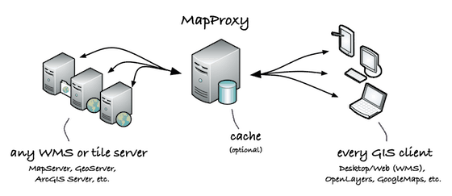

import Embed from "@/components/Embed.astro";
import Gallery from "@/components/Gallery.astro";

目前绝大多数的供公开使用的栅格瓦片都是基于墨卡托投影切片的，少数是基于经纬度投影的。这两种投影方式的解析比较简单，并且支持全球范围。但是，在某些情况下，尤其是在展示局部地区的场景中，会接触到一些不常见的投影，例如，在 maptiler 中，提供了捷克，荷兰，瑞士等国家的地方投影坐标系的栅格瓦片。

常常会有这样的需求：将不同投影坐标系的栅格瓦片叠加在一起显示。

## 可选方案

### MapProxy

其实 MapProxy 是这一类问题的首选解决方案，工作模式简单直接，利用服务器作为代理缓存，加速，转换地图服务，下图为 MapProxy 的功能示意图。



当然，在某些情况下，不方便使用服务器来解决，才会有了下面的这种方案，或者说，有了本文的解决方案。

### OpenLayers

OpenLayers 在前端 GIS 相关领域的解决方案算是比较全面了。下面是 OpenLayers 提供的重投影的示例。

<Embed src="https://codesandbox.io/embed/reprojection-smv675?fontsize=14&hidenavigation=1&theme=dark" height={600} title="reprojection" />

本文也部分参考了这个示例中的数据源，坐标系定义等。后端重投影的方案是最好的，无论在绘制效果，还是在加载效率上。前端的方案胜在灵活性上。

## 技术实现

想要在 Mapbox 中实现栅格瓦片的重投影，需要解决以下的几个问题：

- 栅格瓦片在任意相机视角下需要加载的数据范围
- 栅格瓦片的各个层级的比例尺与地图的 zoom 层级之间的映射
- 栅格瓦片如何重投影到特定的投影坐标系下

依次来处理这几个问题。首先是任意相机视角下需要加载的数据范围。这里借助 Mapbox 的一个没有公开的接口 CustomSource。开发者可以自己实现一个类，并实现其中的方法 loadTile，这样就能够自定义一个类似 raster 类型的数据源。关于这个类的详细信息可以参考源码中的 source/ custom_source.js。下面列出了示例用法：

```js
class CustomSource {
    constructor() {
        this.id = 'custom-source';
        this.type = 'custom';
        this.tileSize = 256;
        this.tilesUrl = 'https://stamen-tiles.a.ssl.fastly.net/watercolor/{z}/{x}/{y}.jpg';
        this.attribution = 'Map tiles by Stamen Design, under CC BY 3.0';
    }

    async loadTile(tile, {signal}) {
        const url = this.tilesUrl
            .replace('{z}', String(tile.z))
            .replace('{x}', String(tile.x))
            .replace('{y}', String(tile.y));

        const response = await fetch(url, {signal});
        const data = await response.arrayBuffer();

        const blob = new window.Blob([new Uint8Array(data)], {type: 'image/png'});
        const imageBitmap = await window.createImageBitmap(blob);

        return imageBitmap;
    }
}

map.on('load', () => {
    map.addSource('custom-source', new CustomSource());
    map.addLayer({
        id: 'layer',
        type: 'raster',
        source: 'custom-source'
    });
});
```

所以，这里通过 CustomSource 来知道哪些瓦片需要加载，既避免了自己计算，尤其是地图倾斜或者旋转这样的情况；又方便按照墨卡托投影下的瓦片划分来做缓存。

接下来是缩放级别的映射。WMTS 中的各个层级与 Web Mercator 中的层级定义并不一致。这里一个比较简单的处理方式就是依次计算 Web Mercator 中的层级与 WMTS 中的各个层级的对应值。参考这个问答《[What is WMTS’ ScaleDenominator?](https://gis.stackexchange.com/questions/315881/what-is-wmts-scaledenominator)》，WMTS 规范中默认每个像素对应 0.28 毫米。并且，通过 map 对象的 transform 对象，可以计算得到在各个层级下的每米对应的像素个数。比较两者即可得到 Web Mercator 中的层级与 WMTS 中的各个层级的对应关系。

最后是如何将每个瓦片重投影到 Web Mercator 中。这里需要注意的是，在不同的投影坐标系之间，变形是非线性的，所以不能简单的通过栅格瓦片的4个顶点做拉伸。需要对平面上的顶点做进一步的划分，下图分别是1等分，2等分，3等分，4等分的效果。可以看到，将 EPSG:27700 重投影到墨卡托时，实际的展示效果是一个扇形。

<Gallery
  images={[
    { src: "../../assets/wp-content/uploads/2023/01/image-1-885x1024.png", caption: "division = 1" },
    { src: "../../assets/wp-content/uploads/2023/01/image-2-885x1024.png", caption: "division = 2" },
    { src: "../../assets/wp-content/uploads/2023/01/image-3-885x1024.png", caption: "division = 3" },
    { src: "../../assets/wp-content/uploads/2023/01/image-4-885x1024.png", caption: "division = 4" },
  ]}
/>

这一点也很好理解，墨卡托投影的缺点之一就是南北两极被放大。地方投影规避了这样的问题。

## 细节优化

解决完以上的几个问题后，重投影为墨卡托投影的栅格瓦片就算叠加好了。但是，可以很明显的看到，在沿着原始瓦片的边界处，存在着很明显的“缝隙”，原因是原始图像被拉伸后，边缘的像素点在重采样之后无法计算出合适的像素值。

<Gallery
  images={[
    { src: "../../assets/wp-content/uploads/2022/12/image-21.png", caption: "不显示原始瓦片边界" },
    { src: "../../assets/wp-content/uploads/2022/12/image-22.png", caption: "显示原始瓦片边界" },
  ]}
/>

如果看过[《Mapbox 矢量瓦片的生命周期介绍》](https://littlepotato.me/2021/09/13/mapbox-life-of-a-tile/)这篇文章，可能会注意到其中的一个细节：Mapbox 在处理栅格数据的时候，会对栅格瓦片的边缘额外补充一个像素，以此来避免瓦片边缘的闪烁问题。因此，这里我们做一个简化的操作，将计算好的顶点的 uv 值略做调整，向内缩放1个像素值，这样，被变形的栅格瓦片边缘的像素值颜色计算看起来就不会有问题了。

```js
// draw_tile.js
for (let i = 0; i < uv.length; i++) {
    uv[i] = uv[i] * ((width - 2) / width) + 1 / width;
}
```

这么做会导致最终的结果少掉一行或者一列像素，仔细看还是看得出来的。但是完全按照 Mapbox 的方式去处理的话，就需要在 web worker 中去干这些事情了。直接在主线程里这么操作对性能的影响比较大。

## 最终效果

<Embed src="https://codesandbox.io/embed/mapbox-raster-reprojection-7h029b?autoresize=1&fontsize=12&hidenavigation=1&module=%2Fsrc%2Findex.js&theme=dark" height={600} title="Mapbox-Raster-Reprojection" />
