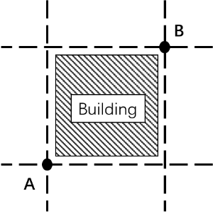
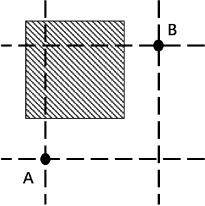
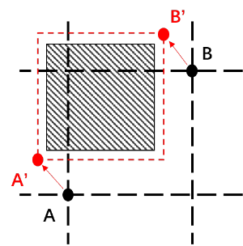
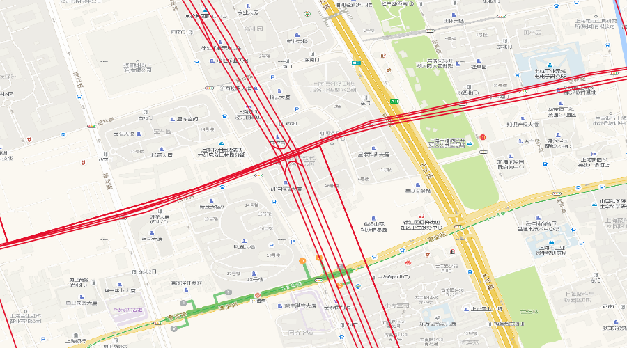
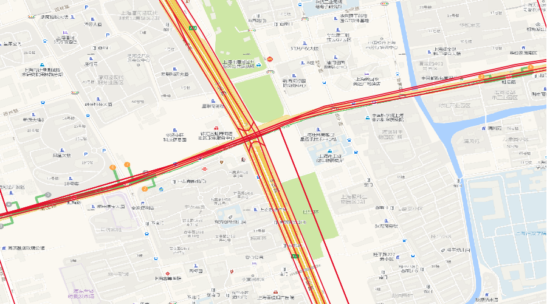

在开发一个将在线地图服务包装成 WMS 的程序时，无意中发现了一个可以将国内偏移后的栅格地图纠偏回来的办法。

## 项目简述

### 开发背景

当开发一个项目需要对比多家互联网地图的数据时，往往需要调用多家地图服务的接口，为了简化开发过程，需要能够将不同互联网地图服务以图层的形式方便的加载。

为此，本项目将其他地图服务包装成 WMS 的形式，以图层的形式加载到地图控件中。这样做能够在QGIS，ArcGIS等主流GIS软件中加载互联网地图，不过也就是能看看，除此之外没啥用。

### 实现流程

将互联网地图服务包装成WMS的流程就是：

1. 地图控件/GIS软件得到用户输入的WMS地址。
2. 地图控件/GIS软件向WMS请求切片，并发送参数。
3. 服务端收到请求，参数中包含了需要的切片的坐标，切片尺寸等信息。
4. 服务端根据坐标向地图服务商请求到对应的切片。
5. 将从地图服务商处得到的切片进行裁剪，拉伸等操作。
6. 返回图像给请求方。

程序开发不难。意外的是，在开发过程中的意外发现，使得将坐标加密后的栅格地图纠偏回来变得可行。

## 意外收获

对于真实世界中的建筑物，道路等要素，经过数据采集加工等一系列的流程后，最终被绘制成切片，展示在用户面前。

当地图服务商将数据加入偏移后，如果只是单独使用其中一家的数据源，偏移的影响不大，但如果将多家源的数据混合使用时，会存在数据集间偏移的问题。往往这样的偏移是非线性的，无法通过给坐标加上定值来解决。

但是地图服务商为了保证地图的可用性，在小范围内，偏移必然要能够近似线性。例如，在某一区域，对要素坐标进行加密后的效果如图。此时再根据A，B两点来获取切片时，就会获取到偏移后的切片。

那如何获取到加密前的数据绘制成的切片呢？获取不到。但是能够获取到的是：一张看起来近似于加密前的数据绘制成的切片。

办法就是：利用`将原始坐标转换为加密后的坐标的接口`，一般互联网地图服务是提供这样的接口的。将我们所需要的切片范围通过这样的接口转换为加密后的范围。

A点经加密接口转换后变为A’点，B点经加密接口转换后变为B’点，那么根据A’和B’所请求到的切片，也就是近似正确的切片了。

通过这样的方法，每次请求的切片坐标范围越小，效果越好。

## 已有结论

**当一家互联网地图服务提供接口1时，能够将其包装成WMS服务，接口1，2都提供时，可以将其加密后的地图切片近似还原到加密前：**

1. **提供根据指定的坐标范围返回地图切片的接口。**
2. **提供将原始坐标转换为加密后的坐标的接口。**

对于接口1而言，大多数互联网地图服务不会直接提供这样的接口，此时需要利用静态地图的接口或者通过抓包并分析来得到切片接口。

对于接口2而言，大多数互联网地图服务是提供这样的接口的。

## 最终效果

红色的线为`OSM`的数据，如何加载请自行解决。

上下两张截图中的红色线段为 OSM 的数据，第二幅截图中的瓦片在使用上述的纠偏方法后，瓦片已经能够与 OSM 的数据吻合上了。

项目地址：[https://github.com/BranZhang/WebMap2WMS](https://github.com/BranZhang/WebMap2WMS)

