在大规模处理和显示空间数据时，没有什么概念比**空间索引（Spatial Index）**更有用和重要。空间索引是一类算法，它们通过特定的方式组织几何数据，使搜索更加高效。例如，执行以下查询：

- 返回该区域内的所有建筑
- 找到距离该点最近的 1000 个加油站

即使面对数百万个对象，空间索引仍然可以在毫秒级的时间内返回结果。空间索引是**PostGIS**等数据库的基础，而 PostGIS 本身也是大部分GIS平台的核心组件。例如，**处理遥测数据**：将数百万个 GPS 速度样本与道路网络匹配，从而为导航服务生成实时交通数据。在客户端，常见的应用场景包括**实时在地图上放置标签**，以及**在鼠标悬停时查找地图对象**。

Mapbox的开发者已经构建了一系列高效的 JavaScript 空间搜索库，包括 **rbush、rbush-knn、kdbush、geokdbush**。本文接下来将尝试解析这些库的底层工作原理。

## 空间搜索问题

空间数据有两种基本的查询类型：最近邻查询（Nearest Neighbors）和范围查询（Range Queries）。这两种查询方式都是众多几何和 GIS 问题的基础。

### K 近邻（K Nearest Neighbors, KNN）

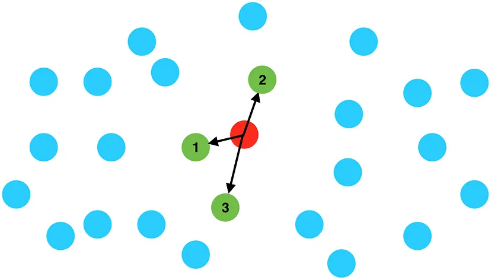

给定数千个点，例如城市位置，我们如何检索离给定查询点最近的点？一种直观的方法是：

- 计算查询点与每个其他点之间的距离。
- 按距离对这些点进行排序。
- 返回前 K 个点。

如果只有几百个点，这种方法是可以的。但如果我们有数百万个点，这种查询在实际使用中会变得太慢。

### 范围查询和半径查询

我们如何检索所有位于以下范围内的点……

- 一个矩形内？（范围查询）
- 一个圆内？（半径查询）

最直接的方法是遍历所有点。但如果数据库很大，并且每秒要处理数千次查询，这种方法就会失效。

## 空间索引树是如何工作的

要大规模解决这两个问题，需要将点放入空间索引中。数据变更的频率通常远低于查询的频率，因此将数据处理成索引的初始成本是值得的，因为之后可以实现即时搜索。

几乎所有的空间数据结构都遵循相同的原则来实现高效搜索：**分支定界法**。这意味着将数据组织成树状结构，如果某个分支不符合搜索条件，就可以立即将其丢弃。

### **R 树（R-tree）**

为了理解这是如何工作的，让我们从一堆输入点开始，并将它们排序到9个矩形框中，每个框中包含大致相同数量的点：

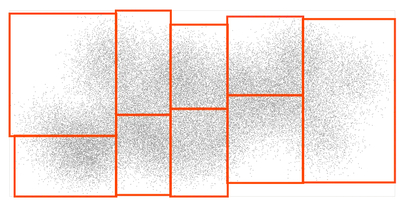

现在，让我们将每个框进一步排序到9个更小的框中：

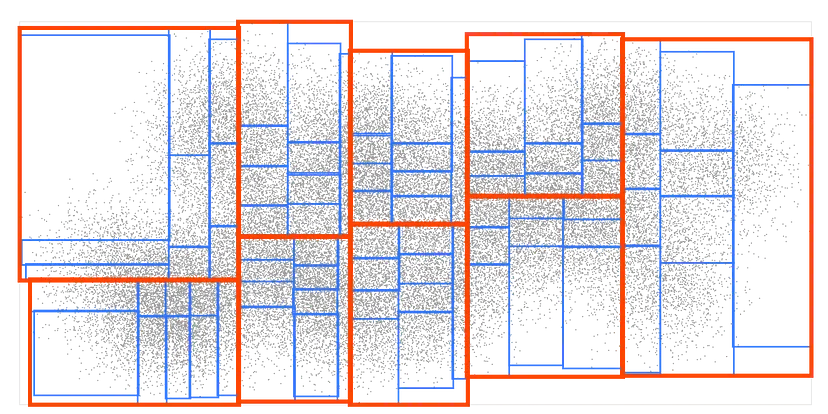

我们将重复这个过程几次，直到最终的框最多包含9个点：

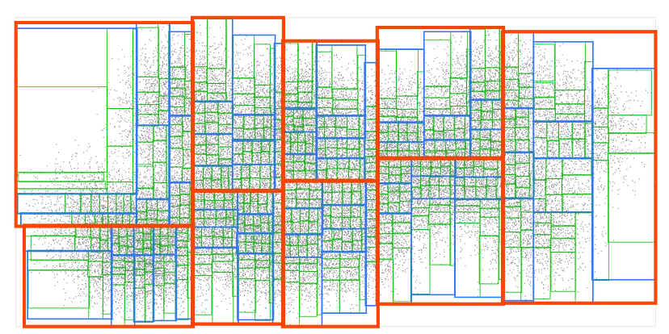

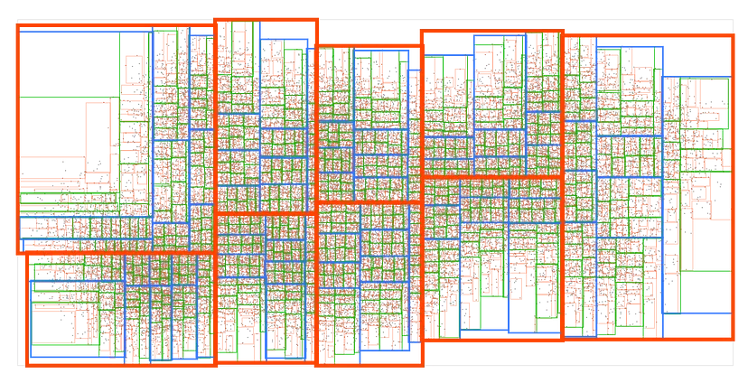

现在我们有了一个 **R 树（R-tree）**！这可以说是最常见的空间数据结构。它被所有现代空间数据库和许多游戏引擎使用。

除了点，R 树还可以包含矩形，而这些矩形可以代表任何类型的几何对象。它还可以扩展到三维或更多维度。但为了简便起见，接下来的文章中我们将讨论 2D 点。

### **K-d 树**（K-d tree）

**K-d 树**是另一种流行的空间数据结构。K-d 树与 R 树类似，但它的不同之处在于，它不是将点在每个树层级划分成多个区域，而是将点划分成两个半区（围绕中位数点）——要么是左半区和右半区，要么是上半区和下半区，每一层交替在 x 和 y 轴上进行划分。示例如下：

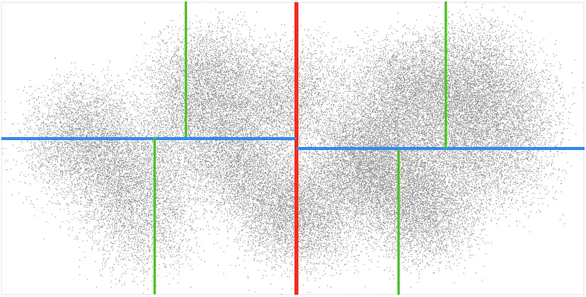

与 R 树相比，K-d 树通常只能包含点（而不是矩形），并且不处理添加和删除点。但它的实现要简单得多，且执行速度非常快。R 树和 K-d 树都有一个共同的原理：**将数据划分到轴对齐的树节点**。因此，下面讨论的搜索算法对于这两种树来说是相同的。

## 树中的范围查询

一个典型的空间树看起来是这样的：

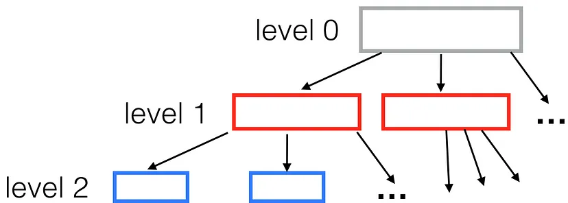

每个节点有一个固定数量的子节点（在我们 R 树的例子中是 9 个）。那么，生成的树有多深呢？对于一百万个点，树的高度将是 **ceil(log(1000000) / log(9)) = 7**。

在这样的树上执行范围查询时，我们可以从树的顶层开始逐层向下，忽略所有与查询框不相交的区域。对于一个小的查询框，这意味着在每层树的过程中，只保留少数几个与查询框相交的区域。因此，获取结果时，我们只需要进行大约 60 次框比较（**7 * 9 = 63**），而不是一百万次。这样，这种方法比直接循环搜索快约 16000 倍。

用学术术语来说，R 树中的范围查询平均需要 **O(K log(N))** 时间（其中 K 是结果的数量），而线性搜索则是 **O(N)**。所以效率很高。

我们选择 9 作为节点大小是因为它是一个良好的默认值，但一般来说，节点值越大，索引速度越快，但查询速度越慢，反之亦然。

## **K 最近邻（kNN）查询**

近邻搜索稍微复杂一些。对于一个特定的查询点，我们如何知道应该搜索哪些树节点来找到最接近的点？我们可以进行半径查询，但我们不知道应该选择哪个半径——最接近的点可能相当远。而且，以不断增大的半径进行多个查询，希望能得到一些结果，这样做效率很低。

为了在空间树中搜索最近邻，我们将利用另一种巧妙的数据结构——**优先队列（Priority Queue）**。它允许保持一个有序的项列表，并提供非常快速的方法来提取出“最小”的一个。让我们再来看一下 R 树示例：

一个直观的观察是：当我们在一组特定的区域（盒子）中搜索 K 个最近的点时，与查询点更接近的盒子更有可能包含我们要找的点。为了利用这一点，我们从树的顶层开始搜索，将最大的盒子按从近到远的顺序排列到一个队列中：

接下来，我们“打开”离查询点最近的盒子，将其从队列中移除，并将它的所有子节点（较小的盒子）放回队列，与较大的盒子一起排序。

我们就这样继续，每次打开离查询点最近的盒子，并将它的子节点放回队列。当从队列中移除的最近项是一个实际的点时，它保证是最近的点。队列中第二个被移除的点将是第二近的点，依此类推。

这一点源于这样的事实：我们尚未打开的所有盒子只包含那些距离该盒子更远的点，因此我们从队列中拉取的任何点都会比剩余盒子中的点更近。换句话说，一旦我们打开了一个盒子，并将其包含的点添加到结果中，接下来从队列中提取的点将会是比当前找到的点更近的，因为它们来自已知的较近区域，而剩余的盒子则包含更远的点。

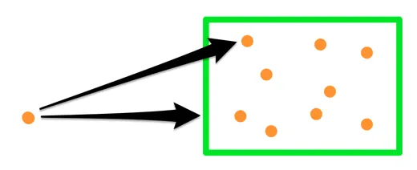

如果我们的空间树是平衡的（即树的分支大致相同大小），我们只需要处理少量的盒子——在搜索过程中，其他的盒子都可以保持未打开状态。这使得这个算法极其快速。

## 自定义 kNN 距离度量

这种盒子展开（box-unpacking）方法非常灵活，除了点对点距离外，它也适用于其他类型的距离。该算法依赖于查询点与盒子内部所有对象之间的距离下界。如果我们能够为自定义度量定义这个下界，那么我们就可以用相同的算法来处理自定义度量。

这意味着，我们可以修改算法来搜索离某个线段最近的 K 个点（而不是一个点）：

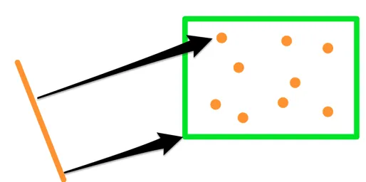

我们只需要对算法进行一个修改，即将点对点和点对盒子的距离计算替换为线段对点和线段对盒子的距离计算。这种方法在2D 凹包计算库 **Concaveman** 中，也得到了运用。它接受一组点并生成如下所示的轮廓：

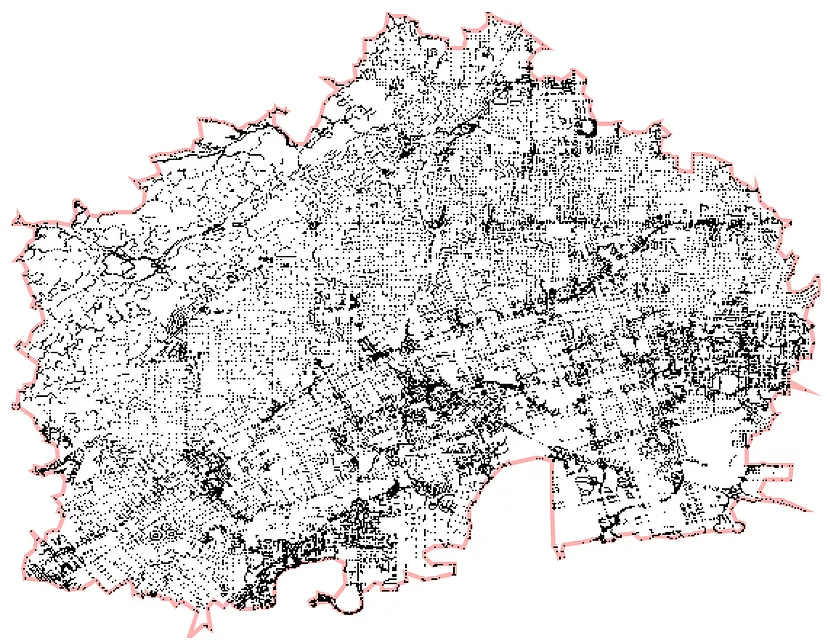

该算法从计算凸包开始（凸包的计算非常快速），然后通过将凸包的边段向内弯曲，通过连接最近的点来逐步形成凹包：

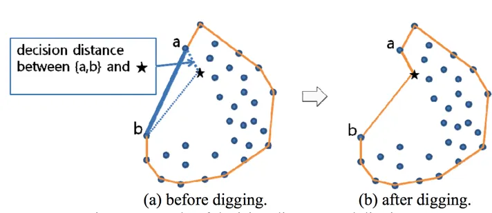

在一篇提出的凹包算法的论文中，从边界边缘寻找最近的内部点——这些点是挖掘目标位置的候选点——是一个耗时的过程。开发一个更高效的方法来优化这个过程是未来的研究课题。

这个问题的挑战在于，当数据点较多时，查找每个边界边缘附近的内部点会变得非常耗时。因此，未来的研究可以集中在改进搜索算法上，例如通过更高效的空间索引结构（如 K-d 树或 R 树）来加速邻近点的查找过程，从而提高整体的算法效率。

## 空间索引的其他提升

在小规模的简单场景下，R树或者K-d 树足以应付。在面对复杂场景时，还可以考虑从以下的方面来提升算法：

- **自适应树节点分裂策略**： 目前，R 树和 K-d 树都使用固定的分裂策略（例如，R 树通常基于预设的节点数进行分裂）。可以引入自适应策略，根据数据分布动态调整节点分裂方式，减少树的高度和重叠，从而提升查询性能。
- **自定义距离度量的优化**： 文章中提到自定义距离度量（例如，线段到盒子的距离）可以用于不同类型的查询。可以进一步优化自定义度量的计算方法，使其在计算距离时更加高效，特别是在复杂的地理数据场景中。
- **改进的索引压缩与打包策略**： R 树和 K-d 树在空间上对数据的打包和压缩可以进一步优化。例如，使用更高效的空间索引打包算法来减少内存占用，同时保持高效的查询响应速度。

## 参考资料

- [A dive into spatial search algorithms](https://blog.mapbox.com/a-dive-into-spatial-search-algorithms-ebd0c5e39d2a)
- [A New Concave Hull Algorithm and Concaveness Measure for n-dimensional Datasets](http://www.iis.sinica.edu.tw/page/jise/2012/201205_10.pdf)
